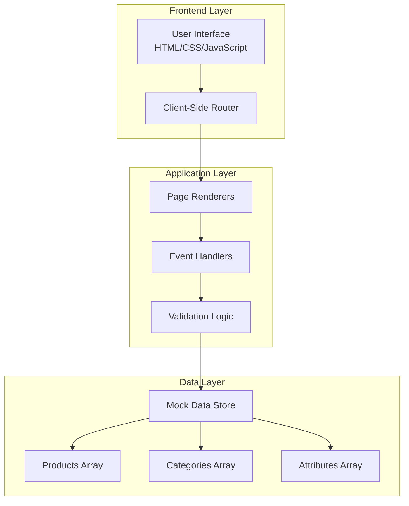
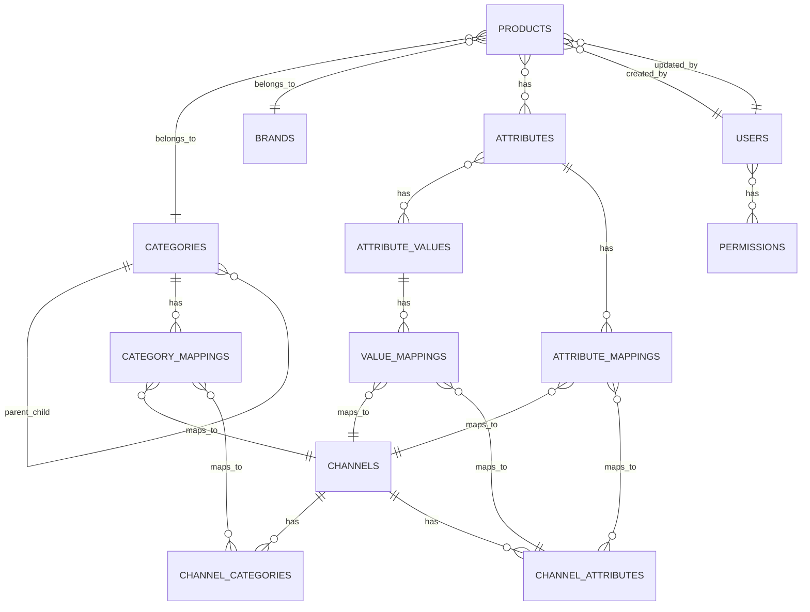
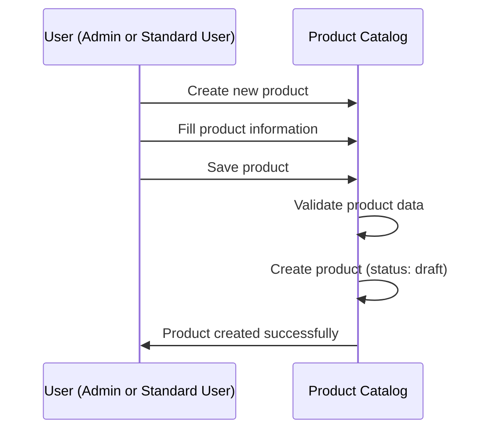
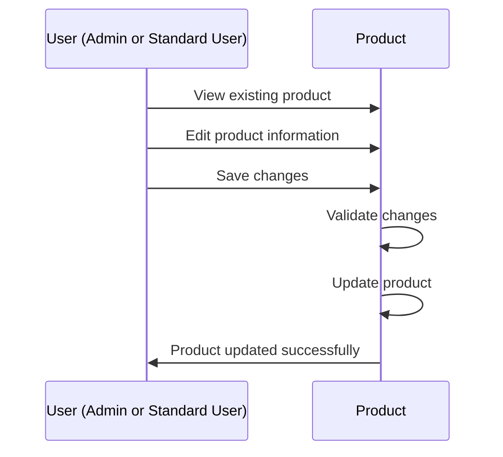

# PRD-00: System Overview

**Version:** 1.0  
**Date:** 2025-01-20  
**Author:** Product Team  
**Related Documents:** PRD-01 through PRD-10

---

## 1. Document Information

### Version History
| Version | Date | Author | Changes |
|---------|------|--------|---------|
| 1.0 | 2025-01-20 | Product Team | Initial PRD creation |

### Related Documents
- PRD-01: Product Management
- PRD-06: Category Management
- PRD-07: Attribute Management
- PRD-09: User Management & Permissions
- PRD-10: Settings & Configuration

---

## 2. Overview

### Purpose
Product Hub is a comprehensive Product Information Management (PIM) system designed for Vakko, enabling centralized product data management and product information workflows. The system facilitates the complete product lifecycle from creation to publication and maintenance.

### Scope
This document provides a high-level overview of the Product Hub PIM system, including:
- System architecture and design principles
- User roles and personas
- Core workflows
- Technology stack
- Multi-language support

### Business Goals
1. **Centralized Product Management**: Single source of truth for all product information
2. **Quality Control**: Ensure product data quality through validation and approval workflows
3. **Operational Efficiency**: Streamline product management workflows
4. **Scalability**: Support growing product catalogs
5. **Data Consistency**: Maintain accurate and consistent product information

### Success Metrics
- Reduction in product data inconsistencies
- Faster time-to-market for new products
- Improved product management efficiency
- Higher data quality scores
- Increased product catalog accuracy

---

## 3. User Roles & Personas

The system supports two types of users: **Admin** and **Standard User**.

### Admin
**Role**: System Administrator  
**Primary Responsibilities**:
- Manage product catalog
- Create and update products
- Manage categories, attributes, and system settings
- Manage users and permissions
- Configure system settings

**Key Goals**:
- Maintain data quality and consistency
- Ensure compliance with business rules
- Optimize operational workflows
- Monitor system performance

### Standard User
**Role**: Standard User  
**Primary Responsibilities**:
- Create and update products
- Change product statuses
- View products (based on permissions)
- Manage product information

**Key Goals**:
- Maintain accurate product information
- Efficient product management
- Access product information as permitted

---

## 4. Standard Features & UI Patterns

### 4.1 Pagination Standard

All listing pages in the system must implement pagination to handle large datasets efficiently and provide a consistent user experience.

#### Standard Pagination Requirements

**Configuration**:
- **Items Per Page**: Configurable dropdown with options: 10, 20, 25, 50, 100
- **Default Items Per Page**: Varies by page type (10 for Products/Attributes/Users, 20 for Categories)
- **Page Navigation**: Previous, Page Numbers (with ellipsis), Next buttons
- **Current Page Display**: Shows "Page X of Y" format
- **Total Count Display**: Shows total number of items and current range (e.g., "Showing 1-10 of 50")

**Behavior**:
- Pagination state resets to page 1 when:
  - Search query changes
  - Filter values change
  - Sort order changes
- Pagination persists during session (optional enhancement)
- Works seamlessly with search, filter, and sort operations
- Only displays pagination controls when total items exceed items per page

**Visual Design**:
- Previous/Next buttons disabled when at first/last page
- Current page highlighted in primary color
- Ellipsis (...) shown when there are many pages
- Responsive design for mobile devices
- Items per page selector prominently displayed

**Performance**:
- Efficiently handles large datasets (1000+ items)
- Pagination controls render quickly
- Smooth page transitions

**Pages Requiring Pagination**:
- Products Page (list view)
- Categories Page (list view)
- Attributes Page
- Users Page
- Product listings in Category Detail Page (Products tab)
- Any other listing/table views with potential for large datasets

#### Pagination Component Structure

```typescript
interface PaginationProps {
  currentPage: number;
  totalPages: number;
  itemsPerPage: number;
  totalItems: number;
  startIndex: number;
  endIndex: number;
  onPageChange: (page: number) => void;
  onItemsPerPageChange: (itemsPerPage: number) => void;
  itemsPerPageOptions: number[];
}
```

## 5. System Architecture

### High-Level Architecture



### Core Data Model



### Key Design Principles

1. **Separation of Concerns**
   - Products represent published, active items in the system
   - Products are created and updated directly by users
   - Clear distinction prevents data conflicts

2. **Request-Centric Workflow**
   - All product changes flow through request system
   - Admin approval required before product changes take effect
   - Complete audit trail of all changes

3. **Multi-Language Support**
   - Turkish (TR) as primary language
   - English (EN) as secondary language
   - Language switching without page reload

4. **Role-Based Access Control**
   - Admin: Fixed and identical permissions for all admins (full system access)
   - Standard User: Customizable permissions set by admins
   - Permission types: View, Edit, Update, Page Access
   - Permissions can be assigned per page/feature for Standard Users
   - Page-level permission system
   - Two user types: Admin and Standard User

5. **Master-Channel Mapping Architecture**
   - Master categories and attributes used internally
   - Channel-specific categories and attributes mapped to master
   - Channel value mappings translate master values to channel values
   - Enables multi-channel product publishing with single source of truth

---

## 5. Technology Stack

### Frontend
- **HTML5**: Structure and semantic markup
- **CSS3**: Styling with Tailwind CSS framework
- **JavaScript (ES6+)**: Client-side logic and interactivity
- **Font Awesome**: Icon library
- **Google Fonts**: Typography (Inter font family)

### Libraries & Frameworks
- **Tailwind CSS**: Utility-first CSS framework
- **Client-Side Routing**: Hash-based navigation (#dashboard, #products, etc.)

### Design System
- **Primary Color**: Green (#2EAD5F)
- **Primary Hover**: #25984F
- **Primary Light**: #E8F5EE
- **Sidebar Background**: #F9FAFB
- **Border Color**: #E5E7EB

### Browser Support
- Modern browsers (Chrome, Firefox, Safari, Edge)
- Responsive design for desktop and tablet
- Mobile-friendly interface

---

## 6. Core Workflows

### Product Creation Workflow



### Product Update Workflow



---

## 7. Key Features Overview

### Product Management
- Product CRUD operations
- Multi-language product data (localization)
- Product status management (draft, complete)
- Advanced search and filtering
- Product detail pages with tabs
- Image management

### Request System
- Product creation requests
- Product update requests
- Stock and price update requests
- Side-by-side comparison view
- Approval/rejection workflow
- Revision request process

### Category Management
- Hierarchical category tree (master categories)
- Category CRUD operations
- Multi-language category names (localization)
- Category picker component
- Channel category mapping (master to channel-specific categories)

### Attribute Management
- Attribute definitions (master attributes)
- Attribute types and validation
- Product attribute assignment
- Channel attribute mapping (master to channel-specific attributes)
- Channel attribute value mapping (master values to channel-specific values)


### User Management
- Two user types: Admin and Standard User
- Admin permissions: Fixed and identical for all admins
- Standard User permissions: Customizable by admins (View, Edit, Update, Page Access)
- Permission assignment interface for Standard Users
- Page-level permissions
- User switching functionality

### Settings & Configuration
- API key management
- Validation rules
- System preferences

---

## 8. Localization & Multi-Language Support

### Overview
The system supports comprehensive localization (L10n) and internationalization (i18n) to enable multi-language operation. All user-facing content, product data, and system messages can be displayed in multiple languages.

### Supported Languages
- **Turkish (TR)**: Primary language (default)
- **English (EN)**: Secondary language

### Localization Scope

#### 8.1 Product Data Localization
- **Product Names**: Stored and displayed in both TR and EN
- **Product Descriptions**: Full descriptions in both languages
- **Product Keywords**: Search keywords in both languages
- **Product Attributes**: Attribute values can be localized (where applicable)

#### 8.2 Category Data Localization
- **Category Names**: Hierarchical category names in both TR and EN
- **Category Descriptions**: Category descriptions in multiple languages (if applicable)

#### 8.3 Attribute Localization
- **Attribute Names**: Attribute labels in both languages
- **Attribute Values**: Select/enum values can have translations
- **Attribute Descriptions**: Help text and descriptions in multiple languages

#### 8.4 User Interface Localization
- **UI Labels**: All buttons, labels, and navigation items
  - Button text (Save, Cancel, Delete, Edit, etc.)
  - Navigation menu items
  - Tab labels
  - Section headers
- **Form Labels**: Input field labels and placeholders
  - Field labels (Name, Description, Price, etc.)
  - Placeholder text
  - Helper text
  - Required field indicators
- **Messages**: Success, error, and information messages
  - Success notifications
  - Error messages
  - Warning messages
  - Info messages
- **Validation Messages**: Form validation error messages
  - Field validation errors
  - Form-level validation errors
  - Required field messages
- **Tooltips**: Help tooltips and hints
  - Icon tooltips
  - Help text on hover
  - Information icons
- **Page Titles**: All page and section titles
  - Page titles
  - Section headers
  - Modal titles
  - Dialog titles
- **Table Headers**: Column headers in data tables
- **Dropdown Options**: Option labels in dropdowns and selects
- **Empty States**: Messages when no data is available
- **Loading States**: Loading messages and spinners

#### 8.5 System Messages Localization
- **Notifications**: System notifications and alerts
- **Error Messages**: Error messages and warnings
- **Confirmation Dialogs**: Dialog messages and button labels
- **Status Messages**: Status indicators and messages

### Language Configuration

#### Default Language
- Turkish (TR) is the primary/default language
- All content defaults to Turkish if no translation is available
- System preferences allow changing default language per user

#### Language Priority
1. User's selected language (if available)
2. User's default language preference
3. System default language (Turkish)
4. Primary language fallback

### Language Switching

#### User Interface
- **Language Switcher**: Available in header/navigation bar
- **Instant Switching**: Content updates immediately without page reload
- **Visual Indicator**: Current language displayed in switcher
- **Language Flags/Icons**: Visual representation of available languages

#### Behavior
- **Persistent Preference**: User's language selection is saved and remembered
- **Session Persistence**: Language preference persists across sessions
- **Dynamic Updates**: All content updates when language changes
- **No Data Loss**: Switching languages does not affect unsaved form data

### Localization Data Model

#### Product Data Structure
```javascript
{
  name: {
    tr: "Ürün Adı",
    en: "Product Name"
  },
  description: {
    tr: "Ürün açıklaması",
    en: "Product description"
  },
  keywords: {
    tr: "anahtar, kelimeler",
    en: "keyword, words"
  }
}
```

#### Category Data Structure
```javascript
{
  name: {
    tr: "Kategori Adı",
    en: "Category Name"
  }
}
```

#### Attribute Data Structure
```javascript
{
  name: {
    tr: "Özellik Adı",
    en: "Attribute Name"
  },
  values: [
    {
      value: "large",
      label: {
        tr: "Büyük",
        en: "Large"
      }
    }
  ]
}
```

### Localization Implementation

#### Client-Side Translation
- **Translation Files**: JSON files containing translations
- **Translation Keys**: Structured key-value pairs for UI elements
- **Dynamic Loading**: Translations loaded based on selected language
- **Fallback Mechanism**: Falls back to primary language if translation missing

#### Translation Keys Structure
```javascript
{
  "common": {
    "save": {
      "tr": "Kaydet",
      "en": "Save"
    },
    "cancel": {
      "tr": "İptal",
      "en": "Cancel"
    }
  },
  "products": {
    "title": {
      "tr": "Ürünler",
      "en": "Products"
    }
  }
}
```

#### Data Storage
- **Product Data**: Multi-language fields stored as objects with language keys
- **Category Data**: Category names stored with language variants
- **UI Translations**: Stored in translation files/database
- **User Preferences**: Language preference stored in user profile

### Localization Requirements

#### Completeness
- All user-facing text must have translations
- Product data should be complete in primary language
- Secondary language translations are recommended but not always required
- Missing translations fall back to primary language

#### Quality
- Translations should be accurate and contextually appropriate
- Terminology should be consistent across the system
- Professional translation for all user-facing content
- Cultural appropriateness for target markets

#### Maintenance
- Translation updates should not require code changes
- Easy addition of new languages
- Translation management interface (future consideration)
- Version control for translations

### Localization Best Practices

1. **Content Separation**: Keep translatable content separate from code
2. **Key Naming**: Use descriptive, hierarchical translation keys
3. **Context Preservation**: Include context for translators
4. **String Externalization**: No hardcoded user-facing strings
5. **Fallback Handling**: Always provide fallback for missing translations
6. **RTL Support**: Future consideration for right-to-left languages
7. **Date/Time Formatting**: Use locale-appropriate formats
8. **Number Formatting**: Use locale-appropriate number formats

### Future Localization Enhancements

1. **Additional Languages**: Support for more languages
2. **Translation Management**: Admin interface for managing translations
3. **Translation Workflow**: Approval process for translations
4. **Translation Memory**: Reuse of existing translations
5. **Right-to-Left (RTL)**: Support for RTL languages (Arabic, Hebrew)
6. **Regional Variants**: Support for regional language variants (e.g., en-US, en-GB)
7. **Automatic Translation**: Integration with translation services (for suggestions)
8. **Translation Quality Indicators**: Show completeness of translations per language

---

## 9. Security & Access Control

### Authentication
- User-based authentication (mock implementation)
- User role assignment
- Session management

### Authorization
- Role-based access control (RBAC)
- Page-level permissions
- Feature-level restrictions
- User data isolation

### Data Validation
- Input validation on all forms
- SKU uniqueness validation
- Required field validation

---

## 10. Future Considerations

### Potential Enhancements
1. **Real Backend Integration**: Replace mock data with API integration
2. **Advanced Search**: Full-text search with Elasticsearch
3. **Bulk Operations**: Bulk product import/export
4. **Workflow Engine**: Configurable approval workflows
5. **Analytics Dashboard**: Advanced reporting and analytics
6. **Mobile App**: Native mobile application
7. **API Integration**: RESTful API for third-party integrations
8. **Audit Logging**: Comprehensive audit trail
9. **Notification System**: Real-time notifications
10. **Multi-Channel Support**: Support for multiple sales channels (already implemented - channel category and attribute mapping)

### Scalability Notes
- Current implementation uses client-side data storage
- Future architecture should support:
  - Database backend (PostgreSQL/MongoDB)
  - Caching layer (Redis)
  - CDN for static assets
  - Load balancing for high availability
  - Microservices architecture for scalability

---

## 11. Acceptance Criteria

### System-Level Requirements
- [ ] All user roles can access appropriate features
- [ ] Multi-language switching works across all pages
- [ ] Request workflow functions end-to-end
- [ ] Product data remains consistent
- [ ] System is responsive and performant

### Quality Metrics
- Page load time < 2 seconds
- Form submission response < 1 second
- Zero data inconsistencies
- 100% feature coverage for core workflows
- Cross-browser compatibility

---

## 12. Glossary

- **PIM**: Product Information Management
- **SKU**: Stock Keeping Unit
- **CRUD**: Create, Read, Update, Delete
- **RBAC**: Role-Based Access Control
- **Product**: Published, active item in the system
- **Category**: Product classification hierarchy
- **Attribute**: Product specification or property
- **Admin**: User type with fixed, identical permissions for all admins (full system access)
- **Standard User**: User type with customizable permissions set by admins
- **Fixed Permissions**: Admin permissions that are the same for all admins and cannot be changed
- **Customizable Permissions**: Standard User permissions that can be set and modified by admins
- **View Permission**: Permission to view content (read-only access)
- **Edit Permission**: Permission to edit content (modify existing content)
- **Update Permission**: Permission to update content (including status changes, stock updates, etc.)
- **Page Access Permission**: Permission to access a specific page/feature
- **Localization (L10n)**: Process of adapting software for a specific locale or language
- **Internationalization (i18n)**: Design and development of software to support multiple languages and regions
- **Translation Key**: Unique identifier for a translatable string in the codebase
- **Primary Language**: Default language of the system (Turkish - TR)
- **Secondary Language**: Additional supported language (English - EN)
- **Language Fallback**: Mechanism to display primary language when translation is missing

---

## 13. PRD Document Structure

All PRD documents follow this structure:
1. Document Information (version, date, related docs)
2. Overview (purpose, scope, goals, metrics)
3. User Roles & Personas
4. User Stories (high-level)
5. Functional Requirements (detailed)
6. Non-Functional Requirements
7. User Interface Requirements
8. Data Model
9. Workflows
10. Acceptance Criteria
11. Future Considerations
12. User Stories (Detailed) - with acceptance criteria
13. Implementation Tasks - broken down by phase
14. Glossary

### PRD Files Location
All PRD documents are located in: `docs/PRDs/`

- `PRD-00-System-Overview.md` - High-level system overview
- `PRD-01-Product-Management.md` - Product CRUD and management
- `PRD-02-Request-System.md` - Request workflow and approval
- `PRD-06-Category-Management.md` - Category hierarchy management
- `PRD-07-Attribute-Management.md` - Product attributes and specifications
- `PRD-09-User-Management-Permissions.md` - User accounts and access control
- `PRD-10-Settings-Configuration.md` - System settings and configuration

---

## 14. References

### Codebase References
- Main HTML file: `clean.html`
- JavaScript logic: `script.js`
- Styles: `styles.css`
- Documentation: Various `.md` files in project root

### Related Documentation
- Design Update Summary: `DESIGN_UPDATE_SUMMARY.md`
- Request Detail Comparison View: `REQUEST_DETAIL_COMPARISON_VIEW.md`
- Data Consistency Analysis: `DATA_CONSISTENCY_ANALYSIS.md`
- Cleanup Summary: `CLEANUP_SUMMARY.txt`

