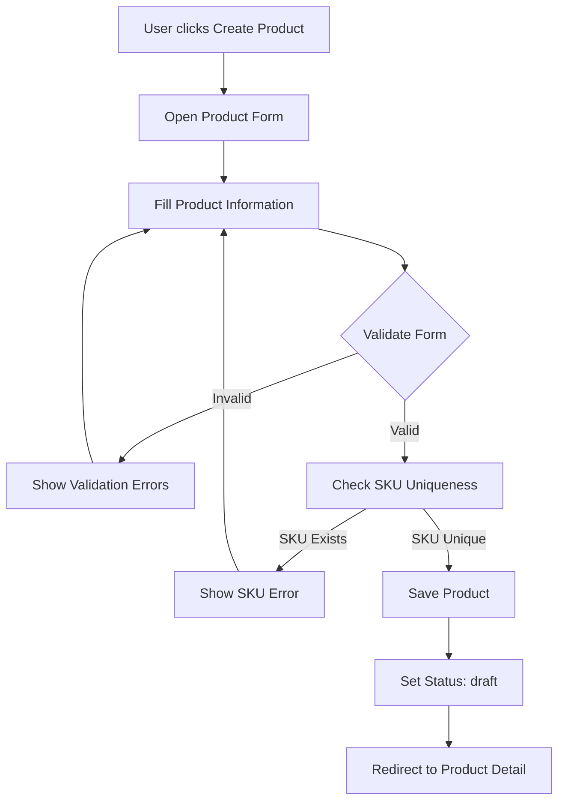
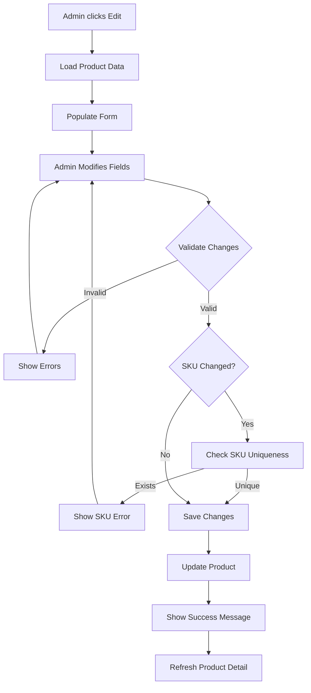
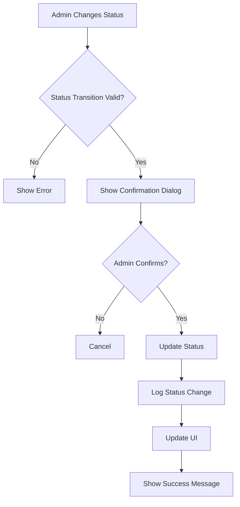
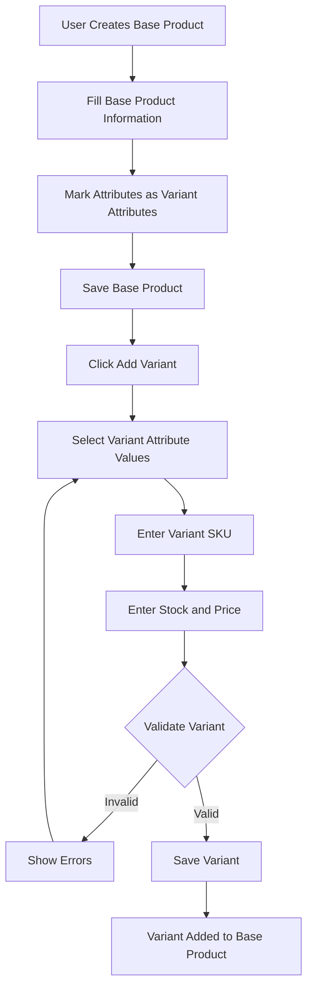
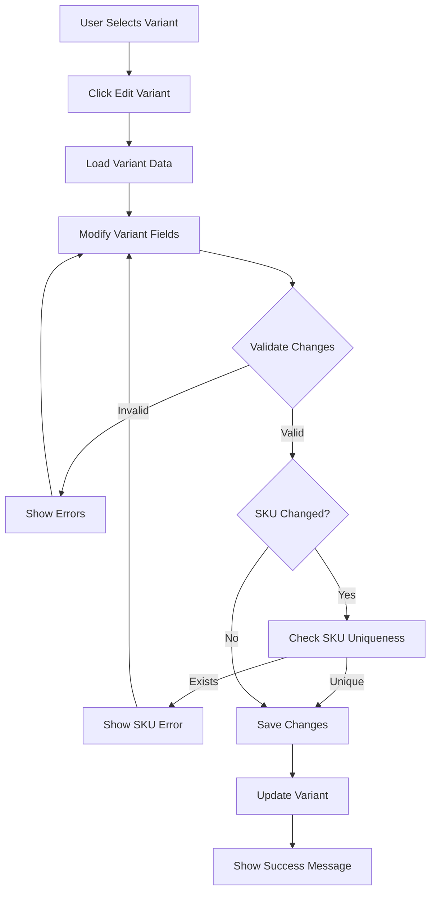
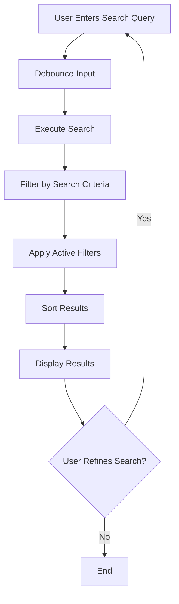

# PRD-01: Product Management

**Version:** 1.2  
**Date:** 2025-01-23  
**Author:** Product Team  
**Related Documents:** PRD-00, PRD-06, PRD-07

---

## 1. Document Information

### Version History
| Version | Date | Author | Changes |
|---------|------|--------|---------|
| 1.0 | 2025-01-20 | Product Team | Initial PRD creation |
| 1.1 | 2025-12-22 | Product Team | Enhanced Image Management (FR-7.1) with drag-and-drop reordering, visual feedback, and inline "Add Images" button. Updated Pagination (FR-5.4) to be always visible by default. |
| 1.2 | 2025-01-23 | Product Team | Removed multi-language support (English only), removed Convert to Base Product feature, added inline editing for stock and price on listing page, changed stock filter to range (min/max), made attributes editable in edit mode, removed tab navigation from ProductDetailPage |

### Related Documents
- PRD-00: System Overview
- PRD-06: Category Management
- PRD-07: Attribute Management

---

## 2. Overview

### Purpose
The Product Management module enables comprehensive management of product information throughout its lifecycle, from creation to publication and maintenance. This module serves as the core of the PIM system, providing a centralized repository for all product data.

### Scope
This PRD covers:
- Product creation, editing, and deletion
- Product status management
- Product search and filtering
- Product detail pages
- Product images and media
- SKU management
- Product attributes and metadata
- Inline editing of stock and price on listing page

### Business Goals
1. Maintain accurate and complete product information
2. Enable efficient product catalog management
3. Ensure product data quality and consistency
4. Facilitate product discovery through search and filtering and listing
5. Enable quick updates to stock and price directly from listing page

### Success Metrics
- Product data completeness > 95%
- Search response time < 500ms
- Product update time < 2 minutes
- Data quality score > 90%

---

## 3. User Roles & Personas

The system supports two types of users: **Admin** and **Standard User**.

### Admin
**Primary Use Cases**:
- Create new products directly
- Edit existing products
- Manage product statuses
- Search, and filter, and list products
- View comprehensive product details
- Delete products

**Key Goals**:
- Maintain product catalog accuracy
- Ensure data quality
- Efficient product management

### Standard User
**Primary Use Cases**:
- Create new products directly
- Edit existing products
- Manage product statuses
- Search and filter products
- View comprehensive product details
- Delete products

**Key Goals**:
- Maintain product catalog accuracy
- Ensure data quality
- Efficient product management

---

## 4. User Stories

### Admin Stories
1. **As an admin**, I want to create new products so that I can add items to the catalog
2. **As an admin**, I want to edit product information so that I can keep data up to date
3. **As an admin**, I want to filter products by status so that I can manage draft and complete products
4. **As an admin**, I want to search products by name, SKU, or brand so that I can quickly find specific items
5. **As an admin**, I want to view detailed product information so that I can review all product data
6. **As an admin**, I want to manage product images so that products have proper visual representation
7. **As an admin**, I want to assign products to categories so that products are properly organized
8. **As an admin**, I want to create product variants so that I can manage different versions (sizes, colors, etc.) of the same product
9. **As an admin**, I want to view and manage all variants of a product so that I can update variant-specific information
10. **As an admin**, I want to edit variant attributes, stock, and prices so that I can keep variant data up to date

### Standard User Stories
1. **As a standard user**, I want to create new products so that I can add items to the catalog
2. **As a standard user**, I want to edit product information so that I can keep data up to date
3. **As a standard user**, I want to filter products by status so that I can manage draft and complete products
4. **As a standard user**, I want to search products by name, SKU, or brand so that I can quickly find specific items
5. **As a standard user**, I want to view detailed product information so that I can review all product data
6. **As a standard user**, I want to manage product images so that products have proper visual representation
7. **As a standard user**, I want to create and manage product variants so that I can handle different product versions


---

## 5. Functional Requirements

### 5.1 Product Creation

#### FR-1.1: Create Product Form
- **Description**: Users (Admin and Standard User) can create new products through a comprehensive form
- **Fields Required**:
  - Product name (EN only)
  - SKU (unique, required)
  - Category (required) - Master category, channel mappings applied during export
  - Brand (required)
  - Description (EN only)
  - Images (multiple, upload via file input)
  - Attributes (category-specific, editable in edit mode) - Master attributes, channel mappings applied during export
- **Validation**:
  - SKU must be unique
  - Required fields must be filled
  - Price must be positive number, if not provided it should be 0
  - Stock must be non-negative integer, if not provided it should be 0
- **Success Criteria**: Product created and added to catalog with status 'draft'
- **Channel Considerations**: 
  - Product uses master category and master attributes
  - Channel category and attribute mappings are applied when exporting to channels
  - Channel-specific values are translated using value mappings

#### FR-1.2: Product Status Assignment
- **Description**: New products are assigned a status upon creation
- **Default Status**: 'draft'
- **Status Options**: draft, complete
- **Business Rules**:
  - Users can change status at any time
  - Status change is immediate
  - Status history may be tracked
  - Draft products are work-in-progress
  - Complete products are finalized and ready for use
  - Products missing required info cannot be assigned complete status

### 5.2 Product Editing

#### FR-2.1: Edit Product Information
- **Description**: Users (Admin and Standard User) can edit all product fields
- **Editable Fields**: All product fields
- **Validation**: Same as creation validation
- **Success Criteria**: Changes saved and reflected immediately

#### FR-2.2: Product Status Management
- **Description**: Users (Admin and Standard User) can change product status
- **Status Transitions**:
  - draft → complete (mark as complete)
  - complete → draft (revert to draft)
- **Business Rules**:
  - Status change requires confirmation
  - Status change is logged
  - Draft products are work-in-progress and may be incomplete
  - Complete products are finalized and ready for use

### 5.3 Product Deletion

#### FR-3.1: Delete Product
- **Description**: Users (Admin and Standard User) can delete products from catalog (subject to permissions)
- **Requirements**:
  - Confirmation dialog required
  - Check for associated orders
- **Business Rules**:
  - Products with orders cannot be deleted (soft delete)
  - Deletion is permanent (or soft delete with archive)

### 5.4 Bulk Actions

#### FR-3.5: Bulk Product Selection
- **Description**: Users can select multiple products for bulk operations
- **Selection Methods**:
  - Individual checkbox selection
  - Select all on page
  - Select all matching current filters (with confirmation for large selections)
  - Deselect all
  - Range selection (Shift+Click)
- **UI Requirements**:
  - Selection count displayed
  - Clear selection button
  - Selected products highlighted
  - Bulk action toolbar appears when products selected
- **Performance**: Handle selection of large product sets efficiently

#### FR-3.6: Bulk Delete Products
- **Description**: Delete multiple products at once
- **Process**:
  1. Select products
  2. Click "Bulk Delete" button
  3. System checks for orders on any selected product
  4. Show confirmation dialog with count
  5. Display list of products that cannot be deleted (have orders)
  6. Confirm deletion of eligible products
  7. Execute deletion
  8. Show success/failure summary
- **Business Rules**:
  - Products with orders cannot be deleted
  - Confirmation required with product count
  - Show detailed results after operation
  - Allow partial deletion if some products have orders
- **User Feedback**:
  - Progress indicator for large operations
  - Success count and failure count
  - List of products that couldn't be deleted with reasons

#### FR-3.7: Bulk Status Change
- **Description**: Change status of multiple products at once
- **Supported Status Changes**:
  - Bulk mark as complete (draft → complete)
  - Bulk revert to draft (complete → draft)
- **Process**:
  1. Select products
  2. Click "Change Status" dropdown
  3. Select target status
  4. System validates each product
  5. Show confirmation with count
  6. Display list of products that don't meet criteria for status change
  7. Confirm status change for eligible products
  8. Execute status change
  9. Show success/failure summary
- **Business Rules**:
  - Only products meeting status criteria can be changed
  - Draft → Complete requires all required fields filled
  - Complete → Draft always allowed
  - Confirmation required
- **Validation**:
  - Check required fields for complete status
  - Show which products fail validation
  - Allow partial status change

#### FR-3.9: Bulk Attribute Update
- **Status**: ❌ **REMOVED** - This feature has been removed from the system.
- ~~**Description**: Update attribute values for multiple products at once~~
- ~~**Process**:~~
  ~~1. Select products~~
  ~~2. Click "Update Attributes" button~~
  ~~3. Open bulk attribute editor~~
  ~~4. Select attribute to update~~
  ~~5. Enter new value~~
  ~~6. Option to add more attributes~~
  ~~7. Show confirmation with product count and changes~~
  ~~8. Execute attribute updates~~
  ~~9. Show success summary~~
- ~~**Business Rules**:~~
  ~~- Only common attributes across selected products shown~~
  ~~- Attribute value must be valid for attribute type~~
  ~~- Updates only specified attributes, leaves others unchanged~~
  ~~- Validation applied per product~~
- ~~**UI Features**:~~
  ~~- Show only attributes common to selected products~~
  ~~- Indicate how many products have each attribute~~
  ~~- Allow multiple attribute updates in one operation~~
  ~~- Preview changes before applying~~

#### FR-3.10: Bulk Price Update
- **Description**: Update prices for multiple products at once
- **Process**:
  1. Select products
  2. Click "Update Prices" button
  3. Choose update method:
     - Set fixed price
     - Increase by amount or percentage
     - Decrease by amount or percentage
  4. Enter value
  5. Preview price changes
  6. Show confirmation with product count
  7. Execute price updates
  8. Show success summary
- **Update Methods**:
  - **Set Price**: Set all products to same price
  - **Increase by Amount**: Add fixed amount to each price
  - **Increase by Percentage**: Increase each price by %
  - **Decrease by Amount**: Subtract fixed amount from each price
  - **Decrease by Percentage**: Decrease each price by %
- **Validation**:
  - Price must be positive number
  - Show price preview before applying
  - Allow decimal places per currency configuration

#### FR-3.11: Bulk Stock Update
- **Description**: Update stock quantities for multiple products at once
- **Process**:
  1. Select products
  2. Click "Update Stock" button
  3. Choose update method:
     - Set fixed stock quantity
     - Increase by amount
     - Decrease by amount
  4. Enter value
  5. Preview stock changes
  6. Show confirmation with product count
  7. Execute stock updates
  8. Show success summary
- **Update Methods**:
  - **Set Stock**: Set all products to same stock quantity
  - **Increase by Amount**: Add to each product's stock
  - **Decrease by Amount**: Subtract from each product's stock
- **Validation**:
  - Stock must be non-negative integer
  - Show stock preview before applying
  - Warn if any product would go negative

#### FR-3.12: Bulk Export
- **Status**: ❌ **REMOVED** - This feature has been removed from the system.
- ~~**Description**: Export multiple products at once to one or more channels~~
- ~~**Process**:~~
  ~~1. Select products~~
  ~~2. Click "Export to Channel" button~~
  ~~3. Select target channel(s)~~
  ~~4. Select export format (if applicable)~~
  ~~5. System validates products and mappings~~
  ~~6. Show validation results~~
  ~~7. Show products that can't be exported with reasons~~
  ~~8. Confirm export for eligible products~~
  ~~9. Execute export~~
  ~~10. Show export summary with success/failure counts~~
- ~~**Business Rules**:~~
  ~~- Only complete products can be exported~~
  ~~- Required channel mappings must exist~~
  ~~- Validation must pass for each product~~
  ~~- Can export to multiple channels simultaneously~~
- ~~**Validation**:~~
  ~~- Check product status (must be complete)~~
  ~~- Check category mappings exist~~
  ~~- Check attribute mappings exist~~
  ~~- Check value mappings exist (where required)~~
  ~~- Show validation errors per product~~
- ~~**Export Options**:~~
  ~~- Export to single channel or multiple channels~~
  ~~- Select export format (API, CSV, JSON, XML)~~
  ~~- Preview export data before sending~~
  ~~- Schedule export for later (optional)~~

#### FR-3.14: Bulk Duplicate Products
- **Status**: ❌ **REMOVED** - This feature has been removed from the system.
- ~~**Description**: Create copies of multiple products at once~~
- ~~**Process**:~~
  ~~1. Select products~~
  ~~2. Click "Duplicate Products" button~~
  ~~3. Choose duplication options:~~
    ~~- Include images (yes/no)~~
    ~~- Include attributes (yes/no)~~
    ~~- SKU generation method (auto/manual)~~
  ~~4. Show confirmation with product count~~
  ~~5. Execute duplication~~
  ~~6. Show success summary with new product IDs~~
- ~~**Business Rules**:~~
  ~~- New SKUs must be generated (add suffix or prompt for pattern)~~
  ~~- New products created with draft status~~
  ~~- All product data copied except ID and SKU~~
  ~~- Timestamps set to current date/time~~
- ~~**SKU Generation Options**:~~
  ~~- Auto-generate with suffix (e.g., "-copy", "-1", "-2")~~
  ~~- Prompt for SKU pattern~~
  ~~- Manual entry after creation~~

#### FR-3.15: Bulk Product Import
- **Description**: Import multiple products from CSV/Excel file
- **Process**:
  1. Click "Import Products" button
  2. Download CSV template
  3. Fill in product data
  4. Upload filled CSV
  5. System validates data
  6. Show validation results
  7. Display errors and warnings
  8. Confirm import for valid products
  9. Execute import
  10. Show import summary
- **CSV Format**:
  - Required columns: SKU, Name (TR), Name (EN), Brand, Category
  - Optional columns: Description, Price, Stock, Images, Attributes
  - Multi-language support (TR/EN columns)
  - Image URLs or paths
  - Attribute values as columns
- **Validation**:
  - Check required fields
  - Validate SKU uniqueness
  - Validate data types
  - Check category exists
  - Check brand exists
  - Validate attribute values
- **Import Options**:
  - Create only (skip existing SKUs)
  - Update only (skip new SKUs)
  - Create and Update (upsert)
- **Error Handling**:
  - Show row-by-row validation results
  - Allow partial import (skip failed rows)
  - Download error report

### 5.5 Product Search & Filtering

#### FR-5.1: Product Search
- **Description**: Users can search products by multiple criteria
- **Search Fields**:
  - Product name (TR/EN)
  - SKU
  - Brand
  - Model
  - Description keywords
- **Search Behavior**:
  - Case-insensitive
  - Partial matching
  - Multi-field search
- **Performance**: Results returned in < 500ms

#### FR-5.2: Product Filtering
- **Description**: Users can filter products by various attributes
- **Filter Options**:
  - Status (draft, complete)
  - Category
  - Brand
  - Supplier
  - Price range (min/max)
  - Stock range (min/max)
  - Date range (created date, updated date)
- **Filter Behavior**:
  - Multiple filters can be applied simultaneously
  - Filters are additive (AND logic)
  - Filter state persists during session
- **UI**: Filter panel with clear/reset options

#### FR-5.3: Product Sorting
- **Description**: Users can sort product lists
- **Sort Options**:
  - Name (A-Z, Z-A)
  - SKU
  - Price (low to high, high to low)
  - Stock quantity
  - Created date (newest, oldest)
  - Updated date (newest, oldest)
- **Default Sort**: Name (A-Z)

#### FR-5.4: Product Pagination
- **Description**: Product lists are paginated for performance
- **Configuration**:
  - Items per page: Configurable (default 20, options: 10, 20, 50, 100)
  - Page navigation: First, Previous, Page numbers, Next, Last
  - Total count display
  - Jump to page functionality
- **Behavior**:
  - Pagination always visible by default (even with one page)
  - Pagination state persists during session
  - Pagination works with search, filter, and sort
  - Shows current page and total pages
  - Shows "(No items)" when list is empty
  - Navigation buttons disabled when on first/last page
- **Display**:
  - Light gray background for visibility
  - Page info on left: "Page X of Y"
  - Navigation controls on right
  - Ellipsis for large page ranges
- **Performance**: Handles large product catalogs efficiently

### 5.6 Product Detail Pages

#### FR-6.1: Product Detail View
- **Description**: Comprehensive product information display
- **Sections** (displayed sequentially, no tabs):
  - Product header (name, SKU, status)
  - Product images gallery
  - Basic information (brand, model, category)
  - Description (EN)
  - Attributes table
  - Pricing and stock information
  - Activity timeline


### 5.7 Inline Editing on Product List

#### FR-7.1: Inline Stock and Price Editing
- **Description**: Users can edit product stock and price directly from the product listing page
- **Functionality**:
  - Click on stock or price value to enter edit mode
  - Input field appears in place of the value
  - Save on blur or Enter key
  - Cancel on Escape key
  - Validation applied (stock: non-negative integer, price: positive number)
- **User Experience**:
  - Visual feedback when entering edit mode
  - Changes saved immediately
  - Error messages displayed if validation fails

### 5.8 Product Images

#### FR-8.1: Image Management
- **Description**: Products can have multiple images with drag-and-drop reordering
- **Requirements**:
  - Primary image (first image in list)
  - Multiple secondary images
  - Image URL input
  - Image reordering via drag-and-drop
  - Image deletion with confirmation
- **Drag-and-Drop Reordering**:
  - Each image is draggable
  - Drop target shows visual ring indicator
  - Dragged image becomes semi-transparent
  - Position numbers displayed on each image (1, 2, 3...)
  - Drag handle (grip icon) visible on hover
  - "Drag to reorder" hint text displayed
- **Image Actions**:
  - Remove image (X button on hover)
  - Set as Primary (button on non-primary images)
  - Add more images (inline button in grid)
- **Image Specifications**:
  - Supported formats: JPG, PNG, WebP
  - Max file size: 5MB per image
  - Recommended dimensions: 800x800px minimum
- **Display**:
  - Grid layout (2-3 columns responsive)
  - Thumbnail preview (h-32)
  - Primary badge on first image
  - Hover state reveals actions
- **Add Images**:
  - Add image URLs directly in the input field
  - Multiple URLs can be added (comma-separated or one per line)
  - New images appended to existing list

### 5.9 SKU Management

#### FR-9.1: SKU Uniqueness
- **Description**: SKU must be unique across all products
- **Validation**: Real-time SKU uniqueness check
- **Error Handling**: Clear error message if SKU exists
- **Format**: Alphanumeric, no spaces (recommended)

### 5.10 Product Attributes

#### FR-10.1: Attribute Assignment
- **Description**: Products have category-specific attributes
- **Requirements**:
  - Attributes defined at category level
  - Products inherit category attributes
  - Attribute values can be set per product
  - Attributes are editable in edit mode (not read-only)
- **Attribute Types**:
  - Text
  - Number
  - Select (dropdown)
  - Boolean
  - Date
- **See PRD-07**: Attribute Management for details

### 5.11 Product Variant Management

#### FR-10.1: Product Variant Concept
- **Description**: Products can have variants representing different versions (e.g., sizes, colors, materials)
- **Variant Types**:
  - **Standalone Product**: Product without variants (current behavior)
  - **Base Product**: Product that has variants (parent product)
  - **Variant Product**: A specific variant of a base product (child product)
- **Shared Attributes**: Variants share common attributes from base product:
  - Brand
  - Category
  - Product name (base name)
  - Description
  - Keywords
  - Common attributes (non-variant attributes)
- **Variant-Specific Attributes**: Each variant can have different values for variant attributes:
  - Size (S, M, L, XL)
  - Color (Red, Blue, Green)
  - Material
  - Other variant-defining attributes
- **Variant-Specific Data**: Each variant has its own:
  - SKU (unique per variant)
  - Stock quantity
  - Price (can be same or different per variant)
  - Images (can be shared or variant-specific)
  - Status (draft/complete)

#### FR-10.2: Creating Base Products with Variants
- **Description**: Create a base product and define its variants
- **Process**:
  1. Create base product with common information
  2. Define variant attributes (e.g., Size, Color) - these are marked as variant attributes
  3. Create variant products linked to base product
  4. Set variant-specific values (SKU, stock, price, variant attribute values)
- **Variant Attributes**: Attributes that can differ between variants are marked as "variant attributes"
  - Variant attributes must be select/enum type (to ensure consistent values)
  - Examples: Size, Color, Material, Pattern
- **Base Product Behavior**:
  - Base product cannot be sold directly (no stock/price at base level)
  - Base product serves as container for variants
  - Base product displays all variants
  - Base product name is used as prefix (e.g., "T-Shirt - Red, Large")

#### FR-10.3: Creating Variant Products
- **Description**: Create individual variant products linked to a base product
- **Process**:
  1. Select base product
  2. Click "Add Variant"
  3. Fill variant-specific information:
     - Variant attribute values (Size: L, Color: Red)
     - SKU (unique)
     - Stock quantity
     - Price
     - Variant-specific images (optional, can inherit from base)
  4. Save variant
- **Validation**:
  - SKU must be unique across all products (including variants)
  - All variant attributes must have values
  - Combination of variant attribute values must be unique within base product
  - Price must be positive number
  - Stock must be non-negative integer

#### FR-10.4: Variant Display and Management
- **Description**: Display and manage variants for a base product
- **Variant List View**:
  - Show all variants in a table/grid
  - Display variant attribute values (Size, Color, etc.)
  - Show SKU, stock, price for each variant
  - Show status badge
  - Allow bulk operations (edit, delete, status change)
- **Variant Detail View**:
  - Show variant-specific information
  - Display inherited base product information
  - Allow editing variant-specific fields
  - Show variant images
- **Base Product View**:
  - Display base product information
  - Show list of all variants
  - Summary statistics (total stock, price range)
  - Quick actions to add/edit variants

#### FR-10.5: Variant Editing
- **Description**: Edit variant products individually or in bulk
- **Editable Fields per Variant**:
  - Variant attribute values (if not yet created)
  - SKU
  - Stock quantity
  - Price
  - Images
  - Status
- **Bulk Editing**:
  - Select multiple variants
  - Update common fields (price, status)
  - Bulk update variant attributes (e.g., change all "Red" to "Crimson")
- **Base Product Editing**:
  - Edit shared attributes (name, description, brand, category)
  - Changes reflect to all variants
  - Edit common attributes (non-variant attributes)

#### FR-10.6: Variant Search and Filtering
- **Description**: Search and filter products including variants
- **Search Behavior**:
  - Search base product name includes all variants
  - Search variant SKU finds specific variant
  - Search variant attributes (e.g., "Large Red") finds matching variants
- **Filter Options**:
  - Filter by variant attributes (Size: L, Color: Red)
  - Filter by base product
  - Filter variants with low stock
  - Filter by price range
- **Display Options**:
  - View base products with variant summary
  - View all variants as individual products
  - Expand base product to show variants (see FR-10.8 for hierarchical display implementation)

#### FR-10.7: Variant Deletion
- **Description**: Delete individual variants or base product with all variants
- **Delete Variant**:
  - Delete individual variant product
  - Check for orders before deletion
  - Base product remains if other variants exist
- **Delete Base Product**:
  - Delete base product and all its variants
  - Check for orders on any variant
  - Confirmation required for bulk deletion
- **Last Variant Deletion**:
  - If last variant is deleted, base product can become standalone or be deleted
  - Option to convert base product to standalone product

#### FR-10.8: Hierarchical Variant Display in Products List
- **Description**: Display variants as a sub-list under their base products in the products list page
- **Display Structure**:
  - Base products are shown as top-level rows in the products table
  - Variants are displayed as nested sub-rows under their base product
  - Variants are visually indented with a tree-like indicator (└─)
  - Variants have a lighter background color to distinguish them from base products
- **Expand/Collapse Functionality**:
  - Base products with variants show a chevron icon (▶ when collapsed, ▼ when expanded)
  - Clicking the chevron expands/collapses the variants list
  - Variants are collapsed by default
  - Base products show variant count badge: "(X variants)"
- **Visual Indicators**:
  - Variant rows use slightly smaller text and lighter styling
  - Variant rows have a subtle background color (`bg-gray-50/50`)
  - Base products maintain normal styling
  - Expand/collapse icons are clearly visible and accessible
- **Controls**:
  - "Expand All" button expands all base products with variants
  - "Collapse All" button collapses all expanded variants
  - Expand/collapse controls are always visible in the toolbar
- **Functionality**:
  - All existing features work with hierarchical display:
    - Product selection (checkbox) works for both base products and variants
    - Filtering and sorting work correctly with grouped structure
    - Pagination accounts for expanded variants in item count
    - Bulk actions work on selected base products and variants
    - View, Edit, Delete actions work for variants
  - Search results maintain hierarchical structure
  - Filtering by variant attributes shows matching variants under their base products
- **Grouping Logic**:
  - Products are automatically grouped by base product relationship
  - Base products (`isBaseProduct: true` or `parentProductId: null`) appear as top-level items
  - Variants (`parentProductId` pointing to a base product) are nested under their base
  - Orphaned variants (base product not in filtered results) are still displayed
- **User Experience**:
  - Clear visual hierarchy makes it easy to understand product relationships
  - Users can quickly see which products have variants
  - Expand/collapse allows users to focus on base products or see all variants
  - Variant count badge provides quick overview without expanding
- **Technical Requirements**:
  - Grouping is performed client-side using `useMemo` for performance
  - Expand/collapse state is managed per base product
  - Pagination works with the flattened display structure (base products + expanded variants)
  - All existing product operations remain functional

---

## 6. Non-Functional Requirements

### Performance
- Product list page load: < 2 seconds
- Search results: < 500ms
- Product detail page load: < 1 second
- Image loading: Lazy loading for large galleries

### Security
- Admin-only product creation/editing
- Supplier can only view assigned products
- Input validation on all fields
- XSS prevention in product descriptions

### Usability
- Intuitive product creation form
- Clear error messages
- Confirmation dialogs for destructive actions
- Responsive design for tablet/desktop

### Accessibility
- Keyboard navigation support
- Screen reader compatibility
- High contrast mode support
- ARIA labels for form fields

---

## 7. User Interface Requirements

### 7.1 Product List Page

#### Layout
- Header with title and action buttons
- Search bar (prominent, always visible)
- Filter panel (collapsible, with clear filters button)
- Sort controls (dropdown or column headers)
- Product table/grid view
- Pagination controls (bottom of page with item count)

#### Product Table Columns
- Checkbox (for bulk actions)
- Expand/Collapse icon (for base products with variants)
- Image thumbnail
- Product name (with variant indicator for variants)
- SKU
- Brand
- Category
- Status badge
- Stock quantity
- Price
- Actions (View, Edit, Delete)

#### Variant Display in Products List
- Base products with variants show expand/collapse chevron icon
- Variants are displayed as nested rows under base products
- Variants are visually indented with tree indicator (└─)
- Variants have lighter background color for distinction
- Base products show variant count badge: "(X variants)"
- "Expand All" and "Collapse All" buttons in toolbar
- Variants collapsed by default

#### Actions
- Create Product button (admin only)
- Search bar
- Filter button (opens filter panel)
- Sort dropdown
- Export button
- Bulk actions dropdown
- Items per page selector
- Pagination controls

### 7.2 Product Detail Page

#### Header Section
- Product name (large, prominent)
- Status badge
- SKU
- Action buttons (Edit, Delete, etc.)

#### Tab Navigation
- Overview (default)
- Attributes
- Images
- History

#### Content Sections
- Product images gallery (left side)
- Product information (right side)
- Attributes table
- Related information

### 7.3 Product Creation/Edit Form

#### Form Layout
- Multi-step form or single scrollable form
- Field grouping:
  - Basic Information
  - Product Details
  - Pricing & Stock
  - Images
  - Attributes
- Save/Cancel buttons
- Validation error display

### 7.4 Product Variant Management Interface

#### Variant Creation Interface
- **Base Product View**:
  - "Manage Variants" button/section
  - Variant list/grid display
  - "Add Variant" button
  - Summary statistics (total variants, stock summary, price range)
- **Add Variant Form**:
  - Variant attribute selectors (Size, Color, etc.)
  - SKU input field
  - Stock quantity input
  - Price input
  - Variant-specific images upload (optional)
  - Variant preview showing combination of attributes
  - Save/Cancel buttons

#### Variant List/Grid View
- **Display Options**:
  - Table view with columns: Variant attributes, SKU, Stock, Price, Status, Actions
  - Grid view showing variant images with attribute badges
- **Variant Row/Card**:
  - Variant attribute values displayed as badges (e.g., "Size: L", "Color: Red")
  - SKU displayed prominently
  - Stock quantity with low stock warning
  - Price
  - Status badge
  - Actions: Edit, Delete, Duplicate
- **Bulk Actions**:
  - Select multiple variants
  - Bulk edit (price, status, stock)
  - Bulk delete

#### Variant Editing Interface
- **Variant Edit Form**:
  - Pre-filled with current variant data
  - Editable fields: SKU, Stock, Price, Images, Status
  - Variant attributes read-only (or changeable if no orders)
  - Show inherited base product information (read-only)
  - Save/Cancel buttons

#### Base Product Variant Summary
- **Display on Base Product Detail Page**:
  - Variant summary section
  - Quick stats: Total variants, Total stock, Price range
  - Variant matrix/grid showing all combinations
  - Quick actions: Add variant, Manage variants, Export variants

---

## 8. Data Model

### Product Object Structure

```javascript
{
  id: number,                    // Unique product ID
  sku: string,                   // Unique SKU (required)
  name: string | {                // Product name (required) - EN only
    tr: string,                    // Legacy support (empty for new products)
    en: string
  },
  brand: string,                 // Brand name (required)
  brandId: number,               // Brand ID reference (required)
  model: string | null,          // Model name (optional)
  categoryId: number,            // Category ID reference (required) - Master category
  description: string | {         // Product description (required) - EN only
    tr: string,                   // Legacy support (empty for new products)
    en: string
  },
  keywords: string | {            // Keywords (optional) - EN only
    tr: string,                   // Legacy support (empty for new products)
    en: string
  } | null,
  stock: number,                 // Stock quantity (required, non-negative integer)
  price: number,                 // Product price (required, positive number)
  images: string[],              // Array of image URLs (multiple images supported)
  imageUrl: string,              // Primary image URL (first image in images array)
  attributes: {                   // Product attributes (category-specific master attributes)
    [attributeId: string]: {
      value: string | number | boolean,
      status?: string
    }
  },
  status: 'draft' | 'complete',  // Product status (default: 'draft')
  // Variant Management Fields
  parentProductId: number | null, // Parent product ID if this is a variant (null if standalone or base product)
  variantAttributes: {             // Variant attribute values (only for variant products)
    [attributeId: string]: string | number  // Variant attribute ID -> value (e.g., Size: "L", Color: "Red")
  } | null,
  isBaseProduct: boolean,          // True if this product has variants
  channelData?: {                 // Channel-specific data (computed during export, not stored in product)
    [channelId: string]: {        // Only present when product is exported or viewed with channel context
      categoryId: number,         // Channel category ID (from category mapping)
      attributes: {               // Channel-specific attributes (from attribute mapping)
        [channelAttributeId: string]: {
          value: string | number | boolean  // Channel-specific value (from value mapping)
        }
      }
    }
  },
  createdBy: string,             // User ID who created the product
  updatedBy: string,             // User ID who last updated the product
  createdAt: string,             // ISO date string
  updatedAt: string              // ISO date string
}
```


### Channel Mapping Notes
- Products store master category and master attributes
- Channel category mappings are stored in category objects
- Channel attribute mappings are stored in attribute objects
- Channel value mappings are stored separately
- Channel-specific data is computed during export using mappings

### Product Status Values
- **draft**: Product is work-in-progress, may be incomplete
- **complete**: Product is finalized and ready for use

### Relationships
- Product → Category (many-to-one)
- Product → Brand (many-to-one)
- Product → Attributes (many-to-many)
- Product → User (created_by, updated_by)
- Product → Product (parent-child variant relationship: Base Product → Variant Products)

---

## 9. Workflows

### 9.1 Product Creation Workflow



### 9.2 Product Editing Workflow



### 9.3 Product Status Change Workflow



### 9.4 Product Variant Creation Workflow



### 9.5 Product Variant Editing Workflow



### 9.6 Product Search & Filter Workflow



---

## 10. Acceptance Criteria

### Product Creation
- [ ] Admin can create product with all required fields
- [ ] SKU uniqueness is validated
- [ ] Product is created with 'draft' status by default
- [ ] Product appears in product list after creation
- [ ] Product fields are saved correctly

### Product Editing
- [ ] Admin can edit all product fields
- [ ] Changes are saved and reflected immediately
- [ ] Validation errors are shown for invalid data
- [ ] SKU uniqueness is checked if SKU is changed

### Product Status Management
- [ ] Admin can change product status
- [ ] Status change requires confirmation
- [ ] Status change is reflected immediately
- [ ] Status badge displays correctly

### Product Search
- [ ] Search works across name (EN), SKU, brand, model
- [ ] Search is case-insensitive
- [ ] Search results update as user types (debounced)
- [ ] Empty search shows all products
- [ ] Stock and price can be edited inline on listing page

### Product Filtering
- [ ] Multiple filters can be applied simultaneously
- [ ] Filter state persists during session
- [ ] Clear filters button resets all filters
- [ ] Active filter count is displayed
- [ ] Stock filter uses range (min/max) instead of status dropdown

### Product Detail Page
- [ ] All product information is displayed
- [ ] Images are shown in gallery format
- [ ] Attributes are displayed in table
- [ ] Tabs navigate correctly
- [ ] Multi-language content displays correctly

### Channel Export
- [ ] Product export functionality is accessible
- [ ] Target channel can be selected
- [ ] Master category is mapped to channel category
- [ ] Master attributes are mapped to channel attributes
- [ ] Attribute values are translated to channel values
- [ ] Export includes channel-specific data
- [ ] Export validation checks for required mappings

### Product Variant Management
- [ ] Base products can be created with variant attributes defined
- [ ] Variant products can be created and linked to base products
- [ ] Each variant has unique SKU (unique across all products)
- [ ] Variant attribute combinations are unique within base product
- [ ] Variants display correctly in variant list/grid view
- [ ] Variant editing works for variant-specific fields (SKU, stock, price, images)
- [ ] Base product shared attributes can be edited (changes reflect to all variants)
- [ ] Variant deletion works correctly with order checking
- [ ] Base product deletion deletes all variants (with confirmation)
- [ ] Variant search and filtering works correctly
- [ ] Variant attributes are validated (must be select/enum type)
- [ ] Variants display as hierarchical sub-list under base products in products list
- [ ] Expand/collapse functionality works for base products with variants
- [ ] Variant rows are visually distinguished from base product rows
- [ ] "Expand All" and "Collapse All" buttons function correctly
- [ ] Product selection, filtering, sorting, and pagination work with hierarchical display
- [ ] All product actions (view, edit, delete) work correctly for variants in hierarchical view

---

## 11. Future Considerations

### Potential Enhancements
1. **Bulk Product Operations**: Import/export products via CSV
2. ~~**Product Variants**: Support for product variants (size, color, etc.)~~ - Implemented (see FR-10)
3. **Product Templates**: Pre-filled forms for common product types
4. **Advanced Search**: Full-text search with Elasticsearch
5. **Product Relationships**: Related products, upsells, cross-sells
6. **Product Reviews**: Customer review integration
7. **Product Analytics**: View counts, conversion rates
8. **Product Versioning**: Track product data changes over time
9. **Product Cloning**: Duplicate products with modifications

### Scalability Notes
- Current implementation uses in-memory data
- Future should support:
  - Database indexing for fast search
  - Caching layer for frequently accessed products
  - CDN for product images
  - Pagination for large product catalogs
  - Lazy loading for product lists

---

## 12. User Stories (Detailed)

### Story 1: Create New Product
**As an** admin  
**I want to** create a new product with all required information  
**So that** I can add products to the catalog

**Acceptance Criteria:**
- [ ] Product creation form is accessible
- [ ] All required fields are marked
- [ ] SKU uniqueness is validated in real-time
- [ ] Product name and description fields are in English only
- [ ] Category picker works correctly
- [ ] Image upload functionality works (file input)
- [ ] Attributes are loaded based on selected category
- [ ] Attributes are editable in edit mode
- [ ] Form validation prevents invalid submissions
- [ ] Success message displays after creation
- [ ] Product appears in product list immediately

**Tasks:**
1. Design product creation form layout
2. Implement form fields with validation
3. Add SKU uniqueness check API/service
4. Integrate category picker component
5. Implement image upload functionality
6. Add attribute loading based on category
7. Create product save API/service
8. Add form validation logic
9. Implement success/error messaging
10. Update product list after creation

### Story 2: Edit Existing Product
**As an** admin  
**I want to** edit product information  
**So that** I can keep product data up to date

**Acceptance Criteria:**
- [ ] Edit button is accessible from product list and detail page
- [ ] Form is pre-filled with current product data
- [ ] All fields are editable
- [ ] Changes are validated before saving
- [ ] SKU change triggers uniqueness check
- [ ] Changes are saved successfully
- [ ] Success message displays
- [ ] Product detail page reflects changes immediately

**Tasks:**
1. Add edit button to product list and detail page
2. Create product edit form component
3. Implement data loading for edit form
4. Add form pre-population logic
5. Implement update API/service
6. Add change detection logic
7. Implement save functionality
8. Add success/error handling

### Story 3: Search Products
**As an** admin  
**I want to** search products by name, SKU, or brand  
**So that** I can quickly find specific products

**Acceptance Criteria:**
- [ ] Search input is available on product list page
- [ ] Search works across name (EN), SKU, and brand
- [ ] Search is case-insensitive
- [ ] Search results update as user types (debounced)
- [ ] Search highlights matching text
- [ ] Empty search shows all products
- [ ] Search works with filters combined
- [ ] Stock and price can be edited inline

**Tasks:**
1. Add search input to product list page
2. Implement search API/service
3. Add debouncing for search input
4. Implement multi-field search logic
5. Add search result highlighting
6. Integrate search with filter system
7. Add search state management

### Story 4: Filter Products
**As an** admin  
**I want to** filter products by status, category, brand, and other criteria  
**So that** I can focus on specific product sets

**Acceptance Criteria:**
- [ ] Filter panel is accessible
- [ ] Multiple filters can be applied simultaneously
- [ ] Filter state persists during session
- [ ] Active filter count is displayed
- [ ] Clear filters button resets all filters
- [ ] Filters work with search combined
- [ ] Filter results update immediately

**Tasks:**
1. Design filter panel UI
2. Implement filter state management
3. Add filter options (status, category, brand, etc.)
4. Implement filter application logic
5. Add active filter display
6. Implement clear filters functionality
7. Integrate filters with search
8. Add filter persistence

### Story 5: View Product Details
**As an** admin  
**I want to** view comprehensive product information  
**So that** I can see all product data in one place

**Acceptance Criteria:**
- [ ] Product detail page displays all information
- [ ] Product images are shown in gallery format
- [ ] Attributes are displayed in organized table
- [ ] All sections display sequentially (no tabs)
- [ ] Related information is accessible
- [ ] Page loads quickly

**Tasks:**
1. Design product detail page layout
2. Implement product detail API/service
3. Create image gallery component
4. Create attributes table component
5. Implement tab navigation
6. Add multi-language content display
7. Optimize page load performance

### Story 6: Change Product Status
**As an** admin  
**I want to** change product status  
**So that** I can activate or deactivate products

**Acceptance Criteria:**
- [ ] Status dropdown/selector is accessible
- [ ] Status transitions are validated
- [ ] Confirmation dialog appears for status changes
- [ ] Status change is saved successfully
- [ ] Status badge updates immediately
- [ ] Status change is logged

**Tasks:**
1. Add status selector component
2. Implement status transition validation
3. Add confirmation dialog
4. Implement status update API/service
5. Add status change logging
6. Update UI after status change

### Story 7: Delete Product
**As an** admin  
**I want to** delete products  
**So that** I can remove unwanted products from catalog

**Acceptance Criteria:**
- [ ] Delete button is accessible
- [ ] Confirmation dialog appears before deletion
- [ ] Products with orders cannot be deleted (if applicable)
- [ ] Deletion is successful
- [ ] Product is removed from list
- [ ] Success message displays

**Tasks:**
1. Add delete button
2. Implement deletion confirmation dialog
3. Add deletion validation (check for dependencies)
4. Implement delete API/service
5. Update product list after deletion
6. Add success/error messaging

### Story 8: Manage Product Images
**As an** admin  
**I want to** add, remove, and reorder product images  
**So that** products have proper visual representation

**Acceptance Criteria:**
- [ ] Image upload functionality works
- [ ] Multiple images can be uploaded
- [ ] Images can be reordered
- [ ] Images can be deleted
- [ ] Primary image is clearly indicated
- [ ] Image gallery displays correctly

**Tasks:**
1. Implement image upload component
2. Add image reordering functionality
3. Implement image deletion
4. Add primary image selection
5. Create image gallery component
6. Integrate with product save/update

### Story 9: Create Product with Variants
**As an** admin  
**I want to** create a base product with variants  
**So that** I can manage different versions (sizes, colors, etc.) of the same product

**Acceptance Criteria:**
- [ ] Base product creation form allows marking attributes as variant attributes
- [ ] Variant attributes must be select/enum type attributes
- [ ] After creating base product, "Add Variant" option is available
- [ ] Variant creation form allows selecting variant attribute values
- [ ] Each variant must have unique SKU
- [ ] Variant attribute value combinations must be unique within base product
- [ ] Variants can have different stock, price, and images
- [ ] Variants are linked to base product correctly
- [ ] Variant list displays all variants for base product

**Tasks:**
1. Add variant attribute marking in attribute management
2. Create variant creation form/interface
3. Implement variant attribute value selection
4. Add variant SKU uniqueness validation
5. Add variant combination uniqueness validation
6. Implement variant save logic
7. Create variant list display component
8. Add variant management UI to base product detail page

### Story 10: Manage Product Variants
**As an** admin  
**I want to** view and manage all variants of a product  
**So that** I can update variant-specific information efficiently

**Acceptance Criteria:**
- [ ] Variant list/grid displays all variants for base product
- [ ] Variant attributes, SKU, stock, price are displayed for each variant
- [ ] Variants can be edited individually
- [ ] Variants can be deleted (with order checking)
- [ ] Bulk edit allows updating multiple variants at once
- [ ] Base product shared attributes can be edited (affects all variants)
- [ ] Variant summary statistics are displayed (total stock, price range)

**Tasks:**
1. Create variant list/grid component
2. Implement variant display with all relevant fields
3. Add variant edit functionality
4. Implement variant deletion with validation
5. Add bulk edit interface
6. Implement base product shared attribute editing
7. Add variant summary statistics display

---

## 13. Implementation Tasks

### Phase 1: Core Product CRUD (Week 1-2)
- [ ] **Task 1.1**: Set up product data model and storage
- [ ] **Task 1.2**: Create product list page with basic table
- [ ] **Task 1.3**: Implement product creation form
- [ ] **Task 1.4**: Implement product edit form
- [ ] **Task 1.5**: Implement product deletion
- [ ] **Task 1.6**: Add basic product detail page

### Phase 2: Search and Filtering (Week 3)
- [ ] **Task 2.1**: Implement product search functionality
- [ ] **Task 2.2**: Create filter panel component
- [ ] **Task 2.3**: Implement filter logic (status, category, brand)
- [ ] **Task 2.4**: Add filter state management
- [ ] **Task 2.5**: Integrate search with filters

### Phase 3: Product Detail Enhancement (Week 4)
- [ ] **Task 3.1**: Enhance product detail page layout
- [ ] **Task 3.2**: Implement tab navigation
- [ ] **Task 3.3**: Create image gallery component
- [ ] **Task 3.4**: Create attributes display component
- [ ] **Task 3.5**: Add product history/activity timeline

### Phase 4: Status Management (Week 5)
- [ ] **Task 4.1**: Implement status change functionality
- [ ] **Task 4.2**: Add status transition validation
- [ ] **Task 4.3**: Create status change confirmation dialog
- [ ] **Task 4.4**: Add status change logging

### Phase 5: Multi-Language Support (Week 6)
- [ ] **Task 5.1**: Implement multi-language data structure
- [ ] **Task 5.2**: Add language switching to forms
- [ ] **Task 5.3**: Update display components for multi-language
- [ ] **Task 5.4**: Add language fallback logic

### Phase 6: Image Management (Week 7)
- [ ] **Task 6.1**: Implement image upload component
- [ ] **Task 6.2**: Add image reordering functionality
- [ ] **Task 6.3**: Implement image deletion
- [ ] **Task 6.4**: Add image validation (size, format)

### Phase 7: Product Variant Management (Week 8-9)
- [ ] **Task 7.1**: Extend product data model to support variants (parentProductId, variantAttributes, isBaseProduct)
- [ ] **Task 7.2**: Add variant attribute marking in attribute management
- [ ] **Task 7.3**: Create variant creation form/interface
- [ ] **Task 7.4**: Implement variant attribute value selection
- [ ] **Task 7.5**: Add variant SKU uniqueness validation
- [ ] **Task 7.6**: Add variant combination uniqueness validation
- [ ] **Task 7.7**: Implement variant save logic
- [ ] **Task 7.8**: Create variant list/grid component
- [ ] **Task 7.9**: Add variant management UI to base product detail page
- [ ] **Task 7.10**: Implement variant editing functionality
- [ ] **Task 7.11**: Implement variant deletion with validation
- [ ] **Task 7.12**: Add bulk edit interface for variants
- [ ] **Task 7.13**: Implement base product shared attribute editing (affects all variants)
- [ ] **Task 7.14**: Add variant summary statistics display
- [ ] **Task 7.15**: Update search and filtering to include variants

### Phase 8: Validation and Error Handling (Week 10)
- [ ] **Task 7.1**: Implement comprehensive form validation
- [ ] **Task 7.2**: Add SKU uniqueness validation
- [ ] **Task 7.3**: Add error message display
- [ ] **Task 7.4**: Implement success messaging
- [ ] **Task 7.5**: Add loading states

### Phase 9: Performance Optimization (Week 11)
- [ ] **Task 8.1**: Optimize product list loading
- [ ] **Task 8.2**: Implement pagination (if needed)
- [ ] **Task 8.3**: Add lazy loading for images
- [ ] **Task 8.4**: Optimize search performance

### Phase 10: Channel Export Integration (Week 12)
- [ ] **Task 9.1**: Integrate channel category mapping lookup
- [ ] **Task 9.2**: Integrate channel attribute mapping lookup
- [ ] **Task 9.3**: Integrate channel value mapping translation
- [ ] **Task 9.4**: Create product export functionality
- [ ] **Task 9.5**: Add export validation
- [ ] **Task 9.6**: Generate channel-specific product data

### Phase 11: Testing and Polish (Week 13)
- [ ] **Task 10.1**: Write unit tests for product operations
- [ ] **Task 10.2**: Write integration tests
- [ ] **Task 10.3**: Test channel export functionality
- [ ] **Task 10.4**: Perform user acceptance testing
- [ ] **Task 10.5**: Fix bugs and polish UI

---

## 14. Glossary

- **SKU**: Stock Keeping Unit - unique identifier for products
- **Product Status**: Current state of product (draft, complete)
- **Product Attributes**: Specifications or properties of a product
- **Product Variant**: Different version of same product (e.g., different sizes)
- **Product Catalog**: Collection of all products in the system

