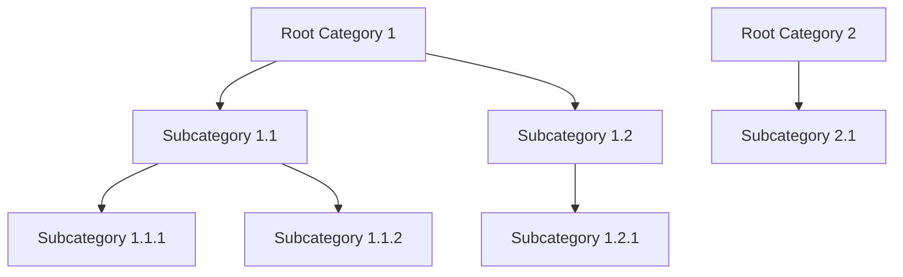
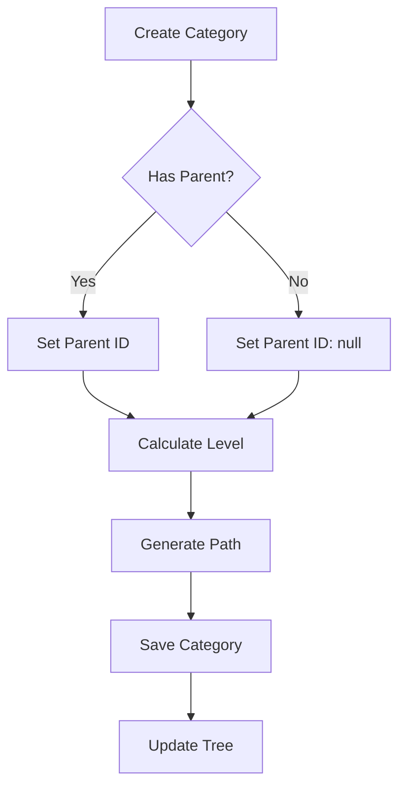
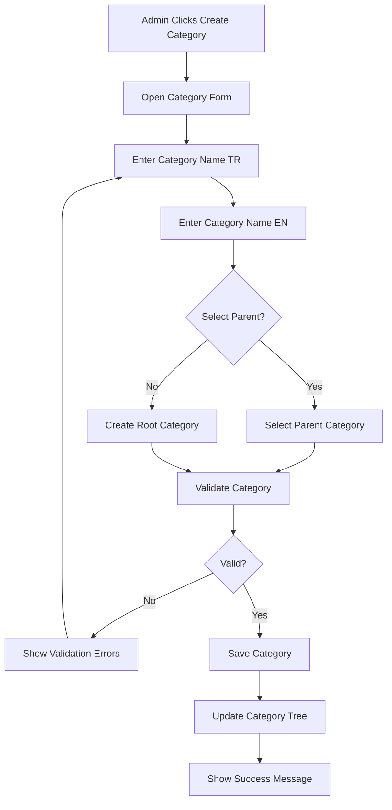
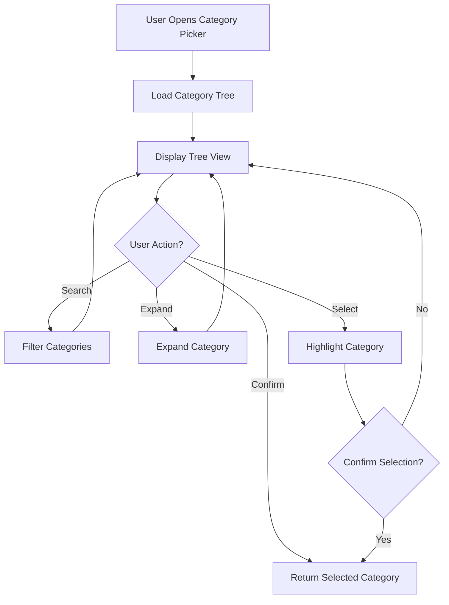
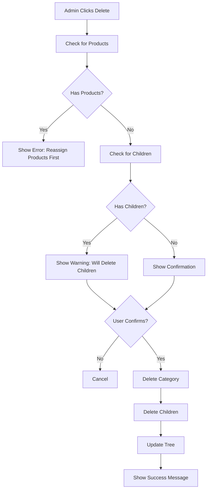

# PRD-06: Category Management

**Version:** 1.1  
**Date:** 2025-01-23  
**Author:** Product Team  
**Related Documents:** PRD-00, PRD-01, PRD-07

---

## 1. Document Information

### Version History
| Version | Date | Author | Changes |
|---------|------|--------|---------|
| 1.0 | 2025-01-20 | Product Team | Initial PRD creation |
| 1.1 | 2025-01-23 | Product Team | Removed Category Tree section, removed filters section, removed product/attribute count displays, removed action buttons (Manage Attributes, Create Subcategory, Move Category), removed tab navigation from CategoryDetailPage, removed Products and Hierarchy sections, removed product count from header, made attribute names clickable links |

### Related Documents
- PRD-00: System Overview
- PRD-01: Product Management
- PRD-07: Attribute Management

---

## 2. Overview

### Purpose
The Category Management module enables hierarchical organization of products through a category tree structure. It supports multi-language category names, category creation and editing, and provides a category picker component for product assignment.

### Scope
This PRD covers:
- Category tree structure (master categories)
- Category creation and editing
- Category hierarchy management
- Category picker component
- Multi-language category names
- Category deletion
- Channel category mapping (mapping master categories to channel-specific categories)

### Business Goals
1. Organize products into logical categories
2. Support flexible category hierarchies
3. Enable easy category assignment to products
4. Maintain category consistency
5. Support multi-language category names
6. Enable multi-channel category mapping for different sales channels

### Success Metrics
- Category tree depth manageable (< 5 levels recommended)
- Category assignment time < 30 seconds
- Category data consistency > 99%
- Multi-language coverage > 90%

---

## 3. User Roles & Personas

The system supports two types of users: **Admin** and **Standard User**.

### Admin
**Primary Use Cases**:
- Create new categories
- Edit category information
- Manage category hierarchy
- Delete categories
- Assign categories to products
- Map categories to channel categories

**Key Goals**:
- Maintain organized category structure
- Ensure category consistency
- Support product organization

### Standard User
**Primary Use Cases**:
- View categories (based on permissions)
- View products by category

**Key Goals**:
- Access category information as permitted
- Navigate products through categories

---

## 4. User Stories

### Admin Stories
1. **As an admin**, I want to create categories so that I can organize products
2. **As an admin**, I want to create subcategories so that I can create category hierarchies
3. **As an admin**, I want to edit category names so that I can update category information
4. **As an admin**, I want to move categories so that I can reorganize the hierarchy
5. **As an admin**, I want to delete categories so that I can remove unused categories
6. **As an admin**, I want to see category tree so that I can understand category structure
7. **As an admin**, I want to use category picker so that I can assign categories to products
8. **As an admin**, I want to map master categories to channel categories so that products can be published to different channels
9. **As an admin**, I want to manage channel category mappings so that category mapping stays up to date

---

## 5. Functional Requirements

### 5.1 Category Tree Structure

#### FR-1.1: Hierarchical Categories
- **Description**: Categories support parent-child relationships
- **Structure**:
  - Root categories (no parent)
  - Subcategories (have parent)
  - Multiple levels of nesting supported
- **Display**: Tree view with expand/collapse
- **Business Rules**:
  - Categories can have multiple children
  - Categories have single parent (or none)
  - Circular references prevented

#### FR-1.2: Category List Display
- **Description**: Visual representation of categories in a list format
- **Display Format**:
  - List view with hierarchy indentation
  - Category names
  - Pagination for large category lists
- **Functionality**:
  - Search categories
  - Sort categories
  - Pagination for large category lists

#### FR-1.3: Category Search
- **Description**: Search categories by name
- **Search Fields**:
  - Category name (TR/EN)
  - Category path
- **Search Behavior**:
  - Case-insensitive
  - Partial matching
  - Real-time search results
  - Highlights matching categories in tree
- **Performance**: Results returned in < 300ms

#### FR-1.4: Category Filtering
- **Status**: ❌ **REMOVED** - Filtering functionality has been removed from the category management page.

#### FR-1.5: Category Sorting
- **Description**: Sort categories in list/table view
- **Sort Options**:
  - Name (A-Z, Z-A)
  - Product count (most, least)
  - Created date (newest, oldest)
  - Level (root first, deepest first)
- **Default Sort**: Name (A-Z)
- **Tree View**: Maintains hierarchy while sorting siblings

#### FR-1.6: Category Pagination
- **Description**: Paginate category lists for performance
- **Configuration**:
  - Items per page: Configurable (default 50, options: 25, 50, 100, All)
  - Page navigation: First, Previous, Page numbers, Next, Last
  - Total count display
- **Behavior**:
  - Pagination applies to list/table view (not tree view)
  - Works with search, filter, and sort
  - Tree view uses lazy loading instead of pagination

### 5.2 Category Creation

#### FR-2.1: Create Root Category
- **Description**: Create top-level category
- **Required Fields**:
  - Category name (TR and EN)
- **Optional Fields**:
  - Parent category
  - Required attributes (attributes that must be filled for products in this category)
  - Variant attributes (attributes used for product variants in this category)
- **Process**:
  1. Click "Create Category"
  2. Enter category name (TR)
  3. Enter category name (EN)
  4. Select parent (none for root)
  5. Assign required attributes (optional)
  6. Assign variant attributes (optional)
  7. Save category
- **Validation**:
  - Category name required
  - Category name unique within same parent level
  - Attributes must exist in the system
- **Success Criteria**: Category created with assigned attributes and visible in tree

#### FR-2.2: Create Subcategory
- **Description**: Create category under parent category
- **Required Fields**:
  - Category name (TR and EN)
  - Parent category
- **Optional Fields**:
  - Required attributes (attributes that must be filled for products in this category)
  - Variant attributes (attributes used for product variants in this category)
- **Process**:
  1. Select parent category
  2. Click "Create Subcategory"
  3. Enter category name (TR)
  4. Enter category name (EN)
  5. Assign required attributes (optional)
  6. Assign variant attributes (optional)
  7. Save category
- **Validation**: Same as root category
- **Success Criteria**: Subcategory created under parent with assigned attributes

### 5.3 Category Editing

#### FR-3.1: Edit Category
- **Description**: Update category information
- **Editable Fields**:
  - Category name (TR)
  - Category name (EN)
  - Required attributes (attributes that must be filled for products in this category)
  - Variant attributes (attributes used for product variants in this category)
- **Process**:
  1. Select category
  2. Click "Edit"
  3. Modify category names
  4. Update required attributes (add/remove)
  5. Update variant attributes (add/remove)
  6. Save changes
- **Validation**:
  - Category name required
  - Name uniqueness within same parent level
  - Attributes must exist in the system
- **Business Rules**:
  - Editing name updates all product references
  - Category ID remains unchanged
  - Changing required attributes affects validation for products in this category
  - Changing variant attributes affects variant creation for products in this category

#### FR-3.2: Move Category
- **Description**: Change category parent
- **Process**:
  1. Select category
  2. Click "Move"
  3. Select new parent category
  4. Confirm move
- **Validation**:
  - Cannot move category to its own descendant
  - New parent must exist
- **Business Rules**:
  - Moving category moves all descendants
  - Products maintain category assignment

### 5.4 Category Deletion

#### FR-4.1: Delete Category
- **Description**: Remove category from system
- **Process**:
  1. Select category
  2. Click "Delete"
  3. System checks for:
     - Products assigned to category
     - Child categories
  4. Show confirmation dialog
  5. Confirm deletion
- **Business Rules**:
  - Cannot delete category with products (must reassign first)
  - Deleting category deletes all descendants
  - Deletion requires confirmation
- **Validation**:
  - Check for product assignments
  - Check for child categories
  - Warn user of impact

### 5.5 Category Picker Component

#### FR-5.1: Category Picker
- **Description**: Component for selecting category when creating/editing products
- **Display**:
  - Tree view of categories
  - Search functionality
  - Expand/collapse
  - Selected category highlighted
- **Functionality**:
  - Click category to select
  - Search filters tree
  - Selected category displayed
  - Confirm selection
- **Use Cases**:
  - Product creation form
  - Product edit form
  - Category assignment

#### FR-5.2: Category Search in Picker
- **Description**: Search categories within picker
- **Functionality**:
  - Search input field
  - Filters tree to matching categories
  - Highlights matching categories
  - Shows parent path for matches
- **Search Behavior**:
  - Case-insensitive
  - Partial matching
  - Searches both TR and EN names

### 5.6 Category Attribute Assignment

#### FR-6.1: Assign Required Attributes
- **Description**: Assign attributes that are required for products in this category
- **Functionality**:
  - Attribute selector in category form
  - Multi-select from available attributes
  - Visual indication of selected attributes
  - Search and filter attributes in selector
- **Business Rules**:
  - Required attributes must be filled when creating/editing products in this category
  - Required attributes enforce validation on product forms
  - Can assign multiple required attributes per category
  - Required attributes are category-specific (same attribute can be required in one category, optional in another)
- **Process**:
  1. Open category create/edit form
  2. Navigate to "Attributes" section
  3. Select attributes from "Required Attributes" multi-select
  4. Selected attributes appear in the list
  5. Save category
- **Display**:
  - Selected required attributes listed with checkboxes
  - Attribute name, type, and description shown
  - Remove option for each selected attribute
  - Search/filter functionality

#### FR-6.2: Assign Variant Attributes
- **Description**: Assign attributes that are used for product variants in this category
- **Functionality**:
  - Attribute selector in category form
  - Multi-select from available attributes
  - Visual indication of selected variant attributes
  - Search and filter attributes in selector
- **Business Rules**:
  - Variant attributes define which attributes can vary between product variants
  - Products in this category can have variants based on these attributes
  - Common variant attributes: Size, Color, Material, etc.
  - Can assign multiple variant attributes per category
  - Variant attributes are category-specific
- **Process**:
  1. Open category create/edit form
  2. Navigate to "Attributes" section
  3. Select attributes from "Variant Attributes" multi-select
  4. Selected attributes appear in the list
  5. Save category
- **Display**:
  - Selected variant attributes listed with checkboxes
  - Attribute name, type, and description shown
  - Remove option for each selected attribute
  - Search/filter functionality
  - Visual distinction from required attributes

#### FR-6.3: Attribute Assignment UI
- **Description**: User interface for assigning attributes to categories
- **Form Section**:
  - "Attributes" section in category form
  - Separate multi-select dropdowns for required and variant attributes
  - Search functionality within each dropdown
  - Selected attributes displayed as removable tags or list items
- **Visual Design**:
  - Clear separation between required and variant attributes
  - Icons or badges to distinguish attribute types
  - Drag-and-drop reordering (optional, future enhancement)
- **Validation**:
  - Attributes must exist in the system
  - Can select same attribute as both required and variant (allowed)
  - No limit on number of attributes (performance considerations)

#### FR-6.4: Attribute Inheritance (Future Consideration)
- **Description**: Subcategories can inherit attributes from parent categories
- **Status**: Future enhancement - not required for initial implementation
- **Notes**: Current implementation allows manual assignment per category level

### 5.7 Localization & Multi-Language Support

#### FR-6.1: Multi-Language Category Names
- **Description**: Categories support multiple languages (Turkish and English)
- **Fields**:
  - Category name (TR) - primary, required
  - Category name (EN) - secondary, recommended
- **Data Structure**:
  - Category names stored as objects: `{ tr: string, en: string }`
  - Single string also supported (treats as TR)
- **Display**:
  - Category tree displays names in current language
  - Category picker shows names in current language
  - Category detail pages show names in current language
  - Falls back to TR if EN missing
- **Language Switching**: 
  - Category names update dynamically when language changes
  - Category tree refreshes with new language
  - No data loss when switching languages

#### FR-6.2: Category Form Localization
- **Description**: Category creation and editing forms support multi-language input
- **Requirements**:
  - Form has fields for both TR and EN category names
  - Language switcher available in form
  - Both languages can be edited in same form
  - Validation ensures TR name is provided
- **User Experience**:
  - Clear indication of required vs optional translations
  - Real-time preview of category name in both languages
  - Form validation messages in current language

#### FR-6.3: Category Display Localization
- **Description**: Category information displays in user's selected language
- **Display Behavior**:
  - Category tree shows names in current language
  - Category picker displays names in current language
  - Breadcrumb navigation shows names in current language
  - Filter dropdowns show category names in current language

### 5.8 Category Detail Page

#### FR-8.1: Category Detail View
- **Description**: Dedicated page for viewing comprehensive category information
- **Navigation**: 
  - Accessible by clicking on category name or "View Details" button
  - Route: `/categories/:id`
- **Header Section**:
  - Category name (EN)
  - Category path (breadcrumb)
  - Edit and Delete buttons (for admins)
- **Content Sections** (displayed sequentially, no tabs):
  - Overview section
  - Attributes section

#### FR-8.2: Overview Section
- **Description**: General category information
- **Content**:
  - Category name (TR) - Basic Information section
  - Level
  - Created date and updated date - Metadata section

#### FR-8.3: Attributes Section
- **Description**: Display assigned attributes for category
- **Content**:
  - Required attributes list:
    - Attribute name (clickable link to attribute detail page)
  - Variant attributes list:
    - Attribute name (clickable link to attribute detail page)
- **Display**:
  - No badges (no type badge, no System Required/Variant badges)
  - Attribute names are clickable links that navigate to `/attributes#${attr.id}`

#### FR-8.4: Category Detail Page Actions
- **Edit Category**: Opens category edit form
- **Delete Category**: Deletes category with confirmation
- **Note**: Create Subcategory, View Products, and Manage Attributes buttons have been removed

### 5.9 Category Product Count

#### FR-9.1: Product Count Display
- **Status**: ❌ **REMOVED** - Product count display has been removed from category detail page header and category list.

### 5.10 Channel Category Mapping

#### FR-10.1: Channel Definition
- **Description**: Define sales channels (e.g., Amazon, eBay, Shopify, etc.)
- **Channel Properties**:
  - Channel ID
  - Channel name
  - Channel type
  - Channel-specific category structure
- **Business Rules**:
  - Channels must be defined before mapping
  - Each channel has its own category taxonomy
  - Channels can be enabled/disabled

#### FR-10.2: Map Master Category to Channel Categories
- **Description**: Map master category to a single channel-specific category per channel
- **Mapping Structure**:
  - One master category maps to exactly one channel category per channel
  - Each master category can map to different channel categories across different channels
  - Mapping is one-to-one per channel (one master category = one channel category per channel)
- **Process**:
  1. Select master category
  2. Select target channel
  3. Browse/select channel category tree
  4. Select one channel category
  5. Save mapping
- **Display**: Show mapped channel category per master category per channel
- **Business Rules**:
  - Master category must exist
  - Channel must be defined
  - Channel category must exist in channel taxonomy
  - Only one mapping allowed per master category per channel
  - Mapping a master category to a new channel category replaces any existing mapping for that channel

#### FR-10.3: Channel Category Tree Management
- **Description**: Manage channel-specific category trees
- **Functionality**:
  - Import channel category taxonomy (if available via API)
  - Manual entry of channel categories
  - Channel category hierarchy management
  - Channel category search
- **Use Case**: Different channels have different category structures (e.g., Amazon vs eBay)

#### FR-10.4: View Category Mappings
- **Description**: View all mappings for a master category
- **Display**:
  - Master category name
  - List of channels
  - Mapped channel category per channel (one per channel)
  - Mapping status (active, inactive)
- **Functionality**: Edit or delete mappings
- **Note**: Each channel shows exactly one mapped category (or none if not mapped)

#### FR-10.5: Bulk Category Mapping
- **Description**: Map multiple master categories at once
- **Process**:
  1. Select multiple master categories
  2. Select target channel
  3. Apply mapping rule or individual mapping
  4. Save all mappings
- **Use Case**: Initial setup or bulk updates

#### FR-10.6: Category Mapping Validation
- **Description**: Validate category mappings
- **Validation Rules**:
  - Master category exists
  - Channel exists and is active
  - Channel category exists in channel taxonomy
  - Only one channel category can be mapped per master category per channel
  - If mapping already exists for a master category and channel, it will be replaced
- **Display**: Show validation errors/warnings

#### FR-10.7: Category Mapping for Product Export
- **Description**: Use category mappings when exporting products to channels
- **Process**:
  1. Product has master category assigned
  2. System looks up channel category mapping for that master category and target channel
  3. Product is assigned the single mapped channel category for export
  4. Product exported with channel-specific category
- **Business Rules**:
  - If no mapping exists, product may not be exportable (or use default)
  - Exactly one channel category is assigned per product per channel (one-to-one mapping)

---

## 6. Non-Functional Requirements

### Performance
- Category tree load: < 1 second
- Category creation: < 500ms
- Category picker render: < 500ms
- Category search: < 300ms

### Security
- Only admin can manage categories
- Category data validation
- Prevent circular category references

### Usability
- Intuitive tree navigation
- Easy category creation
- Clear hierarchy visualization
- Responsive category picker

### Data Integrity
- Category hierarchy consistency
- No circular references
- Category references maintained

---

## 7. User Interface Requirements

### 7.1 Category Management Page

#### Header Section
- Page title
- Create Category button

#### Category List Section
- List view with categories
- Hierarchy indentation
- Category actions (Edit, Delete)
- Pagination controls

#### Category Form Section
- Category name input (TR)
- Category name input (EN)
- Parent category selector
- Attributes Section:
  - Required attributes multi-select
  - Variant attributes multi-select
  - Search functionality for attributes
  - Selected attributes display with remove option
- Save/Cancel buttons

#### Category Detail Page Section
- Header with category name and actions (Edit, Delete)
- Sequential sections (no tabs):
  - Overview section: Basic Information and Metadata
  - Attributes section: Required and variant attributes (clickable links)

### 7.2 Category Picker Component

#### Picker Modal/Dropdown
- Category tree view
- Search input
- Selected category display
- Confirm/Cancel buttons

#### Tree Display
- Indented hierarchy
- Expand/collapse icons
- Category names
- Selection highlighting

### 7.3 Channel Category Mapping Interface

#### Channel Management Section
- Channel list display
- Create/Edit channel button
- Channel status toggle
- Channel category tree import (if API available)

#### Category Mapping Section
- Master category selector
- Channel selector dropdown
- Channel category tree browser
- Mapping display (showing current mappings)
- Add/Edit/Delete mapping buttons
- Bulk mapping interface

#### Mapping Display
- List of mappings per master category
- Channel name
- Mapped channel category (one per channel)
- Mapping status badge
- Actions (Edit, Delete, Activate/Deactivate)

---

## 8. Data Model

### Category Object Structure

```javascript
{
  id: number,                    // Unique category ID
  name: string | {                // Category name
    tr: string,
    en: string
  },
  parentId: number | null,       // Parent category ID (null for root)
  level: number,                  // Depth level (0 for root)
  path: string,                   // Full path (e.g., "Electronics > Phones > Smartphones")
  productCount: number,           // Number of products in category
  children: Category[] | null,    // Child categories (for tree structure)
  requiredAttributeIds: number[], // IDs of attributes required for products in this category
  variantAttributeIds: number[],  // IDs of attributes used for product variants in this category
  channelMappings: {              // Channel category mappings
    [channelId: string]: {
      channelCategoryId: number,   // Channel-specific category ID (one per channel)
      isActive: boolean,
      mappedAt: string,           // ISO date string
      mappedBy: number            // User ID who created mapping
    }
  },
  createdAt: string,              // ISO date string
  updatedAt: string               // ISO date string
}
```

### Channel Object Structure

```javascript
{
  id: string,                    // Unique channel ID (e.g., 'amazon', 'ebay')
  name: string,                  // Channel name
  type: string,                  // Channel type
  isActive: boolean,              // Channel active status
  categoryTree: ChannelCategory[], // Channel-specific category tree
  createdAt: string,              // ISO date string
  updatedAt: string              // ISO date string
}
```

### Channel Category Object Structure

```javascript
{
  id: number,                    // Channel category ID (unique within channel)
  channelId: string,             // Channel ID
  name: string,                  // Channel category name
  parentId: number | null,       // Parent channel category ID
  level: number,                 // Depth level
  path: string,                  // Full path in channel taxonomy
  externalId: string | null,     // External category ID from channel API
  children: ChannelCategory[] | null
}
```

### Category Mapping Object Structure

```javascript
{
  id: number,                    // Unique mapping ID
  masterCategoryId: number,      // Master category ID
  channelId: string,             // Channel ID
  channelCategoryId: number,     // Channel category ID (one per master category per channel)
  isActive: boolean,             // Mapping active status
  mappedAt: string,              // ISO date string
  mappedBy: number,              // User ID
  updatedAt: string              // ISO date string
}
```

### Category Tree Structure



### Category Hierarchy Rules



---

## 9. Workflows

### 9.1 Category Creation Workflow



### 9.2 Category Picker Workflow



### 9.3 Category Deletion Workflow



---

## 10. Acceptance Criteria

### Category Creation
- [ ] Admin can create root categories
- [ ] Admin can create subcategories
- [ ] Category names are required
- [ ] Category names are unique within same parent level
- [ ] Category appears in list after creation
- [ ] Category names are saved correctly

### Category Editing
- [ ] Admin can edit category names
- [ ] Admin can update required attributes
- [ ] Admin can update variant attributes
- [ ] Category name updates reflect in products
- [ ] Category ID remains unchanged
- [ ] Validation works correctly
- [ ] Attribute assignments are saved correctly

### Category Deletion
- [ ] Admin can delete categories
- [ ] Cannot delete category with products
- [ ] Deleting category deletes children
- [ ] Confirmation dialog shown
- [ ] Category removed from tree

### Category List
- [ ] Category list displays correctly
- [ ] Hierarchy is clear with indentation
- [ ] Search filters list correctly

### Category Picker
- [ ] Category picker opens correctly
- [ ] Tree view displays
- [ ] Category selection works
- [ ] Search filters categories
- [ ] Selected category is returned

### Category Detail Page
- [ ] Category detail page displays Overview and Attributes sections sequentially
- [ ] No tabs are shown
- [ ] Attribute names are clickable links
- [ ] No badges are displayed on attributes

---

## 11. Future Considerations

### Potential Enhancements
1. **Category Images**: Add images to categories
2. **Category Descriptions**: Add descriptions to categories
3. **Category SEO**: SEO fields for categories
4. **Category Templates**: Template categories for quick setup
5. **Bulk Category Operations**: Import/export categories
6. **Category Analytics**: Product count trends per category
7. **Category Permissions**: Restrict category access
8. **Category Ordering**: Custom sort order for categories
9. **Category Attributes**: Category-specific attributes
10. **Category Merging**: Merge categories together

### Scalability Notes
- Current implementation uses in-memory data
- Future should support:
  - Database for category storage
  - Caching for category tree
  - Lazy loading for large trees
  - Category indexing for fast lookup
  - Category versioning for history

---

## 12. User Stories (Detailed)

### Story 1: Create Category
**As an** admin  
**I want to** create new categories  
**So that** I can organize products

**Acceptance Criteria:**
- [ ] Category creation form is accessible
- [ ] Category name (TR/EN) fields are available
- [ ] Parent category can be selected (optional)
- [ ] Category is created successfully
- [ ] Category appears in category tree
- [ ] Multi-language names are saved

**Tasks:**
1. Create category form component
2. Add parent category selector
3. Implement category save API/service
4. Update category tree after creation
5. Add multi-language support

### Story 2: Create Subcategory
**As an** admin  
**I want to** create subcategories under parent categories  
**So that** I can build category hierarchies

**Acceptance Criteria:**
- [ ] Subcategory creation is accessible from parent category
- [ ] Parent is pre-selected
- [ ] Category level is calculated correctly
- [ ] Category path is generated
- [ ] Subcategory appears under parent in tree

**Tasks:**
1. Add subcategory creation option
2. Implement parent pre-selection
3. Calculate category level
4. Generate category path
5. Update tree structure

### Story 3: Edit Category
**As an** admin  
**I want to** edit category names  
**So that** I can update category information

**Acceptance Criteria:**
- [ ] Edit button is accessible
- [ ] Category form is pre-filled
- [ ] Names can be updated
- [ ] Changes are saved successfully
- [ ] Category tree updates immediately
- [ ] Product references remain valid

**Tasks:**
1. Add edit functionality
2. Pre-fill category form
3. Implement category update API/service
4. Update category tree
5. Maintain product references

### Story 4: Delete Category
**As an** admin  
**I want to** delete categories  
**So that** I can remove unused categories

**Acceptance Criteria:**
- [ ] Delete button is accessible
- [ ] System checks for products assigned to category
- [ ] System checks for child categories
- [ ] Confirmation dialog appears
- [ ] Category is deleted successfully
- [ ] Child categories are deleted (if confirmed)

**Tasks:**
1. Add delete functionality
2. Implement dependency checking
3. Create confirmation dialog
4. Implement deletion logic
5. Handle child category deletion

### Story 5: View Category Tree
**As an** admin  
**I want to** see the category hierarchy  
**So that** I can understand category structure

**Acceptance Criteria:**
- [ ] Category tree displays correctly
- [ ] Hierarchy is clear with indentation
- [ ] Expand/collapse works
- [ ] Product counts display
- [ ] Tree is searchable

**Tasks:**
1. Create category tree component
2. Implement tree rendering
3. Add expand/collapse functionality
4. Display product counts
5. Add tree search

### Story 6: Use Category Picker
**As an** admin  
**I want to** select categories when creating/editing products  
**So that** products are properly categorized

**Acceptance Criteria:**
- [ ] Category picker opens correctly
- [ ] Category tree displays
- [ ] Categories can be selected
- [ ] Selected category is displayed
- [ ] Search filters categories
- [ ] Selection is confirmed

**Tasks:**
1. Create category picker component
2. Integrate with product forms
3. Add category selection logic
4. Implement search in picker
5. Add selection confirmation

---

## 13. Implementation Tasks

### Phase 1: Category Data Model (Week 1)
- [ ] **Task 1.1**: Design category data structure
- [ ] **Task 1.2**: Implement category storage
- [ ] **Task 1.3**: Add parent-child relationships
- [ ] **Task 1.4**: Implement category path generation

### Phase 2: Category CRUD (Week 2)
- [ ] **Task 2.1**: Create category creation form
- [ ] **Task 2.2**: Implement category save API/service
- [ ] **Task 2.3**: Create category edit form
- [ ] **Task 2.4**: Implement category update API/service
- [ ] **Task 2.5**: Implement category deletion
- [ ] **Task 2.6**: Add dependency checking

### Phase 3: Category Tree (Week 3)
- [ ] **Task 3.1**: Create category tree component
- [ ] **Task 3.2**: Implement tree rendering
- [ ] **Task 3.3**: Add expand/collapse functionality
- [ ] **Task 3.4**: Display product counts
- [ ] **Task 3.5**: Add tree search

### Phase 4: Category Picker (Week 4)
- [ ] **Task 4.1**: Create category picker component
- [ ] **Task 4.2**: Integrate with product forms
- [ ] **Task 4.3**: Add category selection logic
- [ ] **Task 4.4**: Implement search in picker
- [ ] **Task 4.5**: Add selection confirmation

### Phase 5: Multi-Language Support (Week 5)
- [ ] **Task 5.1**: Implement multi-language category names
- [ ] **Task 5.2**: Add language switching
- [ ] **Task 5.3**: Update display components
- [ ] **Task 5.4**: Add language fallback

### Phase 6: Channel Category Mapping (Week 6-7)
- [ ] **Task 6.1**: Design channel data model
- [ ] **Task 6.2**: Create channel management interface
- [ ] **Task 6.3**: Implement channel category tree structure
- [ ] **Task 6.4**: Create category mapping UI
- [ ] **Task 6.5**: Implement mapping save/update logic
- [ ] **Task 6.6**: Add mapping validation
- [ ] **Task 6.7**: Display mappings per category
- [ ] **Task 6.8**: Implement bulk mapping functionality
- [ ] **Task 6.9**: Add channel category import (if API available)

### Phase 7: Testing and Polish (Week 8)
- [ ] **Task 7.1**: Write unit tests
- [ ] **Task 7.2**: Write integration tests
- [ ] **Task 7.3**: Test category hierarchy
- [ ] **Task 7.4**: Test channel category mapping
- [ ] **Task 7.5**: Perform user acceptance testing
- [ ] **Task 7.6**: Fix bugs and polish UI

---

## 14. Glossary

- **Category**: Classification for products
- **Root Category**: Top-level category with no parent
- **Subcategory**: Category with a parent category
- **Category Tree**: Hierarchical structure of categories
- **Category Picker**: Component for selecting categories
- **Category Path**: Full path from root to category
- **Category Level**: Depth of category in tree (0 for root)

