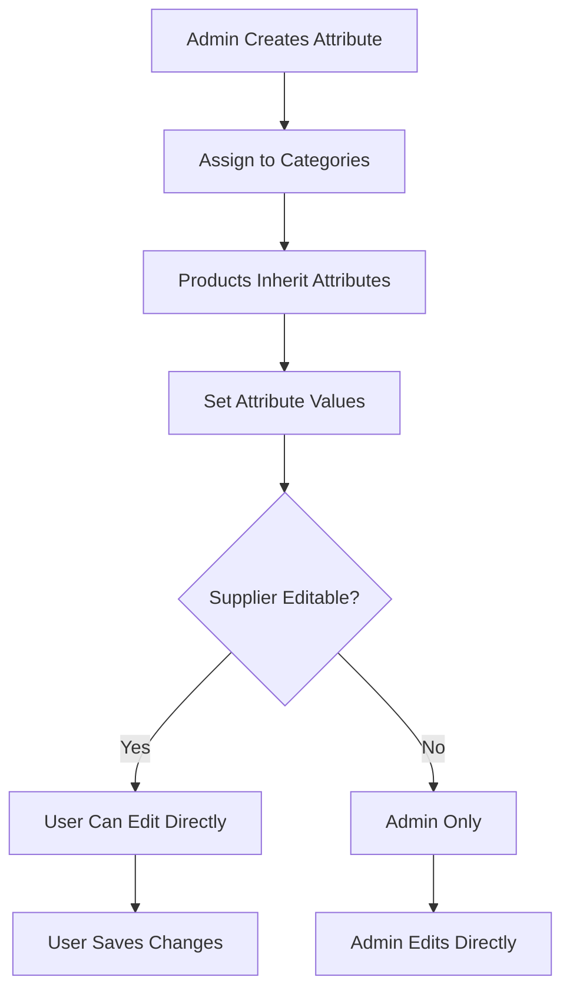
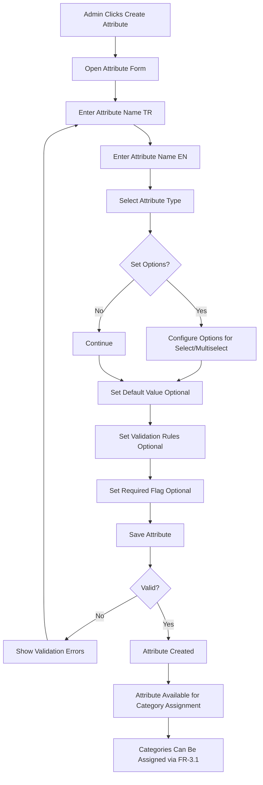
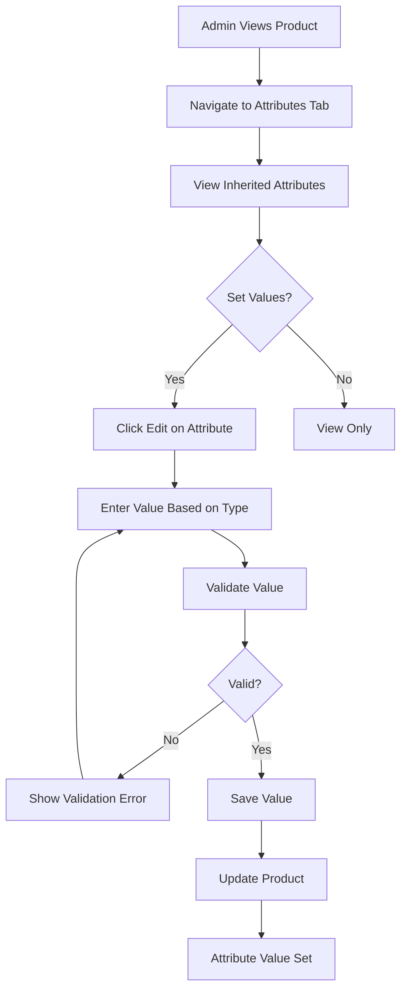
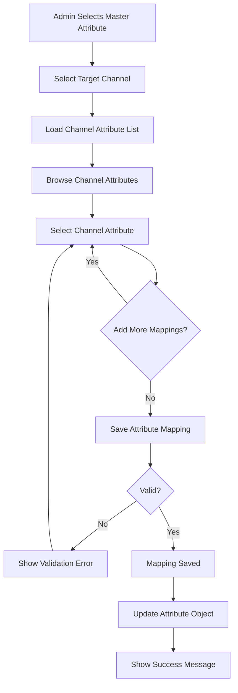
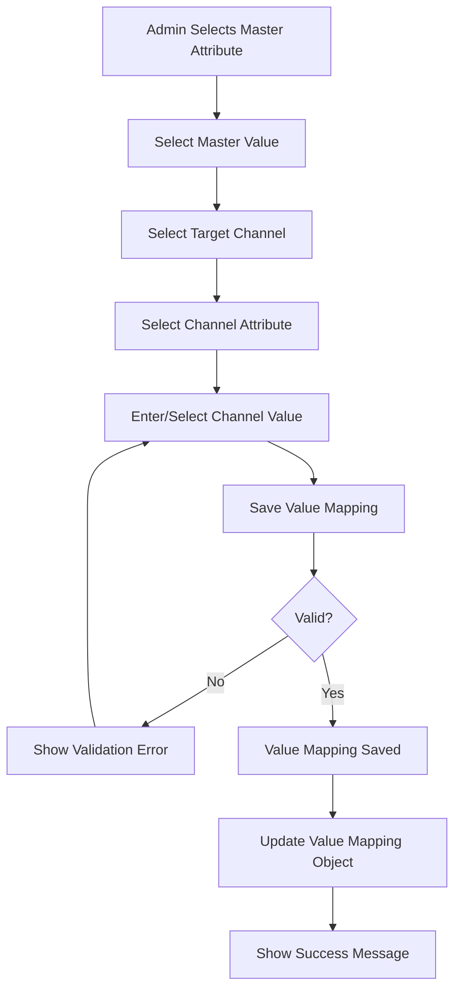
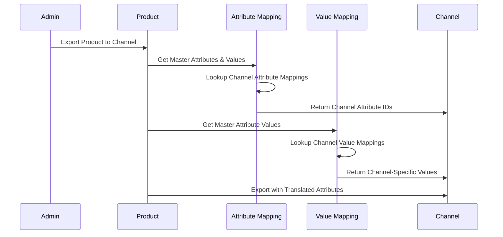

# PRD-07: Attribute Management

**Version:** 1.1  
**Date:** 2025-01-23  
**Author:** Product Team  
**Related Documents:** PRD-00, PRD-01, PRD-06

---

## 1. Document Information

### Version History
| Version | Date | Author | Changes |
|---------|------|--------|---------|
| 1.0 | 2025-01-20 | Product Team | Initial PRD creation |
| 1.1 | 2025-01-23 | Product Team | Updated table headers to use plain text instead of translation keys |

### Related Documents
- PRD-00: System Overview
- PRD-01: Product Management
- PRD-06: Category Management

---

## 2. Overview

### Purpose
The Attribute Management module enables definition and management of product attributes (specifications). It supports various attribute types, category-specific attribute assignment, supplier-editable attributes, and attribute value validation.

### Scope
This PRD covers:
- Attribute definition and types (master attributes)
- Attribute value management
- Attribute assignment to categories
- Product attribute assignment
- Attribute validation
- Channel attribute mapping (mapping master attributes to channel-specific attributes)
- Channel attribute value mapping (mapping master attribute values to channel-specific values)

### Business Goals
1. Enable flexible product specifications
2. Support category-specific attributes
3. Ensure attribute data quality
4. Maintain attribute consistency
5. Enable multi-channel attribute mapping for different sales channels
6. Support channel-specific attribute value translation

### Success Metrics
- Attribute coverage > 90% of products
- Attribute data completeness > 85%
- Supplier attribute update rate > 70%
- Attribute validation accuracy > 99%

---

## 3. User Roles & Personas

The system supports two types of users: **Admin** and **Standard User**.

### Admin
**Primary Use Cases**:
- Create and manage attributes
- Assign attributes to categories
- Set attribute types and validation
- View attribute usage
- Map attributes to channel attributes

**Key Goals**:
- Maintain attribute definitions
- Ensure data quality
- Enable user collaboration

### Standard User
**Primary Use Cases**:
- View product attributes

**Key Goals**:
- View product specifications

---

## 4. User Stories

### Admin Stories
1. **As an admin**, I want to create attributes so that I can define product specifications
2. **As an admin**, I want to set attribute types so that I can control input format
3. **As an admin**, I want to assign attributes to categories so that products inherit attributes
4. **As an admin**, I want to set attribute validation so that data quality is maintained
5. **As an admin**, I want to view attribute usage so that I can see which attributes are used
6. **As an admin**, I want to map master attributes to channel attributes so that products can be published to different channels
7. **As an admin**, I want to map attribute values to channel-specific values so that attribute values are correctly translated per channel

### Standard User Stories
1. **As a standard user**, I want to see product attributes so that I can view specifications

---

## 5. Functional Requirements

### 5.1 Attribute Definition

#### FR-1.1: Create Attribute
- **Description**: Define new product attribute
- **Required Fields**:
  - Attribute name (TR and EN)
  - Attribute type
- **Optional Fields**:
  - Default value
  - Validation rules
  - Required flag
- **Process**:
  1. Click "Create Attribute"
  2. Enter attribute name (TR)
  3. Enter attribute name (EN)
  4. Select attribute type
  5. Set default value (optional)
  6. Configure validation rules (optional)
  7. Set required flag (optional)
  8. Save attribute
- **Validation**:
  - Attribute name required
  - Attribute name unique
  - Attribute type required
- **Note**: Category assignment is managed separately through FR-3.1 (Assign Attributes to Categories)

#### FR-1.2: Attribute Types
- **Description**: Attribute type system with two dimensions
- **Attribute Type** (attributeType): Determines if value is selected from options or free text input
  - **select**: User selects from predefined options (dropdown)
  - **freeText**: User can enter free text input
- **Attribute Variable Type** (attributeVariableType): Determines the variable type of the attribute value
  - **string**: Text values (for freeText attributeType)
  - **number**: Numeric values only (for freeText attributeType)
  - **boolean**: Only true or false values (for freeText attributeType)
- **Display**: Appropriate input control based on attributeType and attributeVariableType combination
- **Examples**:
  - `attributeType: 'select'` with options → Dropdown with predefined options
  - `attributeType: 'freeText', attributeVariableType: 'string'` → Text input
  - `attributeType: 'freeText', attributeVariableType: 'number'` → Number input
  - `attributeType: 'freeText', attributeVariableType: 'boolean'` → Boolean checkbox/select

### 5.2 Attribute List Management

#### FR-2.1: Attribute Search
- **Description**: Search attributes by name or properties
- **Search Fields**:
  - Attribute name (TR/EN)
  - Attribute type
  - Category name
- **Search Behavior**:
  - Case-insensitive
  - Partial matching
  - Real-time search results
- **Performance**: Results returned in < 300ms

#### FR-2.2: Attribute Filtering
- **Description**: Filter attributes by various criteria
- **Filter Options**:
  - By type (text, number, select, boolean, date, url, etc.)
  - By category assignment (specific category, unassigned)
  - By required status (required, optional)
  - By usage (used in products, unused)
- **Filter Behavior**:
  - Multiple filters can be applied simultaneously
  - Filters are additive (AND logic)
  - Filter state persists during session
  - Clear filters button resets all filters

#### FR-2.3: Attribute Sorting
- **Description**: Sort attribute lists
- **Sort Options**:
  - Name (A-Z, Z-A)
  - Type
  - Created date (newest, oldest)
  - Usage count (most used, least used)
  - Category count (most categories, least categories)
- **Default Sort**: Name (A-Z)

#### FR-2.4: Attribute Pagination
- **Description**: Paginate attribute lists for performance
- **Configuration**:
  - Items per page: Configurable (default 20, options: 10, 20, 50, 100)
  - Page navigation: First, Previous, Page numbers, Next, Last
  - Total count display
  - Jump to page functionality
- **Behavior**:
  - Pagination state persists during session
  - Works with search, filter, and sort
  - Shows current page and total pages

### 5.3 Attribute Assignment

#### FR-3.1: Assign Attributes to Categories
- **Description**: Attributes assigned to categories, products inherit
- **Process**:
  1. Select category
  2. View category attributes
  3. Add attribute to category
  4. Attribute available to all products in category
- **Business Rules**:
  - Products inherit category attributes
  - Attributes can be assigned to multiple categories
  - Product-specific attributes can override category attributes

#### FR-3.2: Product Attribute Assignment
- **Description**: Assign attribute values to products
- **Process**:
  1. View product detail page
  2. Navigate to Attributes tab
  3. View inherited attributes from category
  4. Set attribute values
  5. Save product
- **Display**: Table format with attribute name and value columns

### 5.4 Attribute Validation

#### FR-5.1: Attribute Validation Rules
- **Description**: Validate attribute values based on type
- **Validation Types**:
  - **Required**: Attribute must have value
  - **Min/Max**: Numeric range validation
  - **Pattern**: Regex pattern validation (for text)
  - **Options**: Value must be from predefined list (for select)
  - **Format**: Date format, URL format, etc.
- **Display**: Validation errors shown on form submission

#### FR-5.2: Attribute Value Validation
- **Description**: Validate attribute values when set
- **Process**:
  1. User enters attribute value
  2. System validates based on attribute type and rules
  3. Show validation errors if invalid
  4. Prevent save if validation fails
- **Validation Timing**: On blur or on submit

### 5.6 Attribute Value Management

#### FR-6.1: Set Attribute Values
- **Description**: Assign values to product attributes
- **Process**:
  1. View product attributes
  2. Click edit on attribute
  3. Enter value based on attribute type
  4. Save value
- **Value Storage**: Stored per product per attribute

#### FR-6.2: Attribute Value Types
- **Description**: Values stored based on attributeVariableType
- **Storage**:
  - String: string (for attributeVariableType: 'string')
  - Number: number (for attributeVariableType: 'number')
  - Boolean: boolean (for attributeVariableType: 'boolean')
  - Select: string (selected option value, for attributeType: 'select')
- **Display**: Formatted based on attributeType and attributeVariableType combination

### 5.7 Attribute Display

#### FR-7.1: Attribute Table Display
- **Description**: Display product attributes in table
- **Columns**:
  - Attribute name
  - Attribute value
  - Attribute type (optional)
  - Edit button (if editable)
- **Format**: Clean table layout

#### FR-7.2: Attribute Form Display
- **Description**: Form for editing attributes
- **Fields**: Dynamic based on attribute type
- **Layout**: Label and input per attribute
- **Validation**: Real-time validation feedback

### 5.8 Localization & Multi-Language Support

#### FR-8.1: Multi-Language Attribute Names
- **Description**: Attribute names support multiple languages (Turkish and English)
- **Fields**:
  - Attribute name (TR) - primary, required
  - Attribute name (EN) - secondary, recommended
- **Data Structure**:
  - Attribute names stored as objects: `{ tr: string, en: string }`
- **Display**:
  - Attribute labels display in current language
  - Attribute forms show names in current language
  - Attribute tables display names in current language
  - Falls back to TR if EN missing

#### FR-8.2: Multi-Language Attribute Values
- **Description**: Select/enum attribute values can have translations
- **Applicable Types**: Select, Multiselect attribute types
- **Data Structure**:
  - Values stored with labels: `{ value: string, label: { tr: string, en: string } }`
- **Display**:
  - Dropdown options show labels in current language
  - Selected values display labels in current language
  - Form selects show options in current language
- **Text Attributes**:
  - Text attribute values stored as entered (not translated)
  - Users can enter values in any language

#### FR-8.3: Multi-Language Attribute Descriptions
- **Description**: Attribute descriptions and help text support multiple languages
- **Fields**:
  - Description (TR) - primary
  - Description (EN) - secondary
- **Display**:
  - Help text and tooltips show in current language
  - Attribute detail pages show descriptions in current language
  - Form placeholders and hints in current language

#### FR-8.4: Attribute Form Localization
- **Description**: Attribute creation and editing forms support multi-language input
- **Requirements**:
  - Form has fields for both TR and EN attribute names
  - Select value options can have translations
  - Both languages can be edited in same form
  - Validation ensures TR name is provided
- **User Experience**:
  - Clear indication of required vs optional translations
  - Real-time preview of attribute name in both languages
  - Form validation messages in current language

### 5.9 Channel Attribute Mapping

#### FR-9.1: Map Master Attribute to Channel Attributes
- **Description**: Map master attribute to channel-specific attributes
- **Mapping Structure**:
  - One master attribute can map to one or more channel attributes
  - Different channels can have different attribute names for same master attribute
  - Mapping can be one-to-one or one-to-many
- **Process**:
  1. Select master attribute
  2. Select target channel
  3. Browse/select channel attribute list
  4. Select channel attribute(s)
  5. Save mapping
- **Display**: Show mapped channel attributes per master attribute
- **Business Rules**:
  - Master attribute must exist
  - Channel must be defined
  - Channel attribute must exist in channel attribute list
  - Attribute types should be compatible (text to text, number to number, etc.)

#### FR-9.2: Channel Attribute Value Mapping
- **Description**: Map master attribute values to channel-specific values
- **Use Case**: Different channels may use different value formats or terminology
  - Example: Master value "Large" → Amazon "L", eBay "Large Size"
  - Example: Master value "Cotton" → Channel A "100% Cotton", Channel B "Cotton Blend"
- **Mapping Structure**:
  - Master attribute value → Channel attribute value(s)
  - One master value can map to different channel values per channel
  - Value mapping can be one-to-one or one-to-many
- **Process**:
  1. Select master attribute
  2. Select master attribute value
  3. Select target channel
  4. Enter/select channel-specific value
  5. Save value mapping
- **Display**: Show mapped channel values per master value
- **Business Rules**:
  - Master attribute value must exist
  - Channel must be defined
  - Channel attribute mapping must exist first
  - Value types must be compatible

#### FR-9.3: Channel Attribute List Management
- **Description**: Manage channel-specific attribute lists
- **Functionality**:
  - Import channel attributes (if available via API)
  - Manual entry of channel attributes
  - Channel attribute type management
  - Channel attribute search
- **Use Case**: Different channels have different attribute requirements

#### FR-9.4: View Attribute Mappings
- **Description**: View all mappings for a master attribute
- **Display**:
  - Master attribute name
  - List of channels
  - Mapped channel attributes per channel
  - Mapped attribute values per channel
  - Mapping status (active, inactive)
- **Functionality**: Edit or delete mappings

#### FR-9.5: Bulk Attribute Mapping
- **Description**: Map multiple master attributes at once
- **Process**:
  1. Select multiple master attributes
  2. Select target channel
  3. Apply mapping rule or individual mapping
  4. Save all mappings
- **Use Case**: Initial setup or bulk updates

#### FR-9.6: Attribute Mapping Validation
- **Description**: Validate attribute mappings
- **Validation Rules**:
  - Master attribute exists
  - Channel exists and is active
  - Channel attribute exists in channel attribute list
  - Attribute types are compatible
  - Value mappings are valid
- **Display**: Show validation errors/warnings

#### FR-9.7: Attribute Mapping for Product Export
- **Description**: Use attribute mappings when exporting products to channels
- **Process**:
  1. Product has master attributes with values
  2. System looks up channel attribute mapping
  3. System looks up channel attribute value mapping
  4. Product attributes are translated to channel-specific attributes/values
  5. Product exported with channel-specific attributes
- **Business Rules**:
  - If no attribute mapping exists, attribute may be skipped (or use default)
  - If no value mapping exists, use master value (or skip)
  - Multiple channel attributes can be assigned if mapping is one-to-many

---

## 6. Non-Functional Requirements

### Performance
- Attribute list load: < 1 second
- Attribute assignment: < 500ms
- Attribute validation: < 100ms
- Product attribute display: < 500ms

### Security
- Only admin can create/edit attribute definitions
- Suppliers can only edit supplier-editable attributes
- Attribute data validation
- Input sanitization

### Usability
- Intuitive attribute creation
- Clear attribute type selection
- Easy attribute assignment
- Clear validation feedback

### Data Integrity
- Attribute definitions consistent
- Attribute values validated
- Attribute assignments maintained
- No orphaned attribute values

---

## 7. User Interface Requirements

### 7.1 Attribute Management Page

#### Header Section
- Page title
- Create Attribute button

#### Search & Filter Section
- Search bar (prominent, always visible)
- Filter button (opens filter panel)
- Sort dropdown
- Clear filters button
- Items per page selector

#### Attribute List Section
- Table with attributes
- Columns: Name, Type, Categories, Required, Variant Attribute, Actions
- Column headers use plain text (not translation keys)
- Sortable column headers
- Edit/Delete actions
- Pagination controls (bottom of page)

#### Attribute Form Section
- Attribute name inputs (TR/EN)
- Attribute type selector
- Category assignment (multi-select)
- Required checkbox
- Validation rules section
- Save/Cancel buttons

### 7.2 Product Attributes Tab

#### Attributes Table
- Attribute name column
- Value column (editable)
- Type column (optional)

#### Edit Mode
- Inline editing for values
- Type-specific input controls
- Validation feedback
- Save button

---

## 8. Data Model

### Attribute Object Structure

```javascript
{
  id: number,                    // Unique attribute ID
  name: string | {                // Attribute name
    tr: string,
    en: string
  },
  attributeType: 'select' | 'freeText',  // Determines if value is selected from options or free text
  attributeVariableType: 'boolean' | 'string' | 'number',  // Variable type of the attribute value
  categoryIds: number[],         // Categories this attribute is assigned to
  required: boolean,              // Is this attribute required?
  validation: {                   // Validation rules
    min?: number,                 // For number variable type
    max?: number,                 // For number variable type
    pattern?: string,             // For string variable type
    options?: Array<{              // For select attribute type
      value: string,
      label: { tr: string, en: string }
    }>
  },
  defaultValue: string | number | boolean | null,
  channelMappings: {              // Channel attribute mappings
    [channelId: string]: {
      channelAttributeIds: string[], // Channel-specific attribute IDs
      isActive: boolean,
      mappedAt: string,           // ISO date string
      mappedBy: number            // User ID who created mapping
    }
  },
  isVariantAttribute?: boolean,   // Can be used for product variants (only for select type)
  createdAt: string,             // ISO date string
  updatedAt: string              // ISO date string
}
```

### Channel Attribute Object Structure

```javascript
{
  id: string,                    // Channel attribute ID (unique within channel)
  channelId: string,             // Channel ID
  name: string,                  // Channel attribute name
  type: string,                  // Channel attribute type
  isRequired: boolean,           // Required in channel
  options: string[] | null,      // Available options (for select types)
  externalId: string | null,     // External attribute ID from channel API
  createdAt: string,              // ISO date string
  updatedAt: string              // ISO date string
}
```

### Attribute Mapping Object Structure

```javascript
{
  id: number,                    // Unique mapping ID
  masterAttributeId: number,     // Master attribute ID
  channelId: string,             // Channel ID
  channelAttributeIds: string[], // Channel attribute IDs (can be multiple)
  isActive: boolean,             // Mapping active status
  priority: number,              // Priority if multiple mappings
  mappedAt: string,              // ISO date string
  mappedBy: number,              // User ID
  updatedAt: string              // ISO date string
}
```

### Attribute Value Mapping Object Structure

```javascript
{
  id: number,                    // Unique value mapping ID
  masterAttributeId: number,     // Master attribute ID
  masterValue: string | number | boolean, // Master attribute value
  channelId: string,             // Channel ID
  channelAttributeId: string,    // Channel attribute ID
  channelValue: string | number | boolean, // Channel-specific value
  isActive: boolean,             // Mapping active status
  mappedAt: string,              // ISO date string
  mappedBy: number,              // User ID
  updatedAt: string              // ISO date string
}
```

### Product Attribute Value Structure

```javascript
{
  productId: number,
  attributeId: number,
  value: string | number | boolean | string[],  // Value based on attribute type
  status?: 'pending' | 'approved' | 'rejected'  // For supplier submissions
}
```

### Attribute Assignment Flow



---

## 9. Workflows

### 9.1 Attribute Creation Workflow



### 9.2 Product Attribute Assignment Workflow



### 9.3 Standard User Attribute Editing Workflow

### 9.4 Channel Attribute Mapping Workflow



### 9.5 Channel Attribute Value Mapping Workflow



### 9.6 Product Export with Attribute Mapping Workflow



---

## 10. Acceptance Criteria

### Attribute Creation
- [ ] Admin can create attributes
- [ ] Attribute name is required
- [ ] Attribute type can be selected
- [ ] Attributes can be assigned to categories
- [ ] Supplier-editable flag can be set
- [ ] Validation rules can be configured

### Attribute Assignment
- [ ] Attributes assigned to categories
- [ ] Products inherit category attributes
- [ ] Attribute values can be set on products
- [ ] Attribute values display correctly

### Supplier-Editable Attributes
- [ ] Supplier-editable flag works
- [ ] Suppliers can edit supplier-editable attributes
- [ ] Supplier edits require admin approval
- [ ] Editable attributes are clearly marked

### Attribute Validation
- [ ] Required validation works
- [ ] Type-specific validation works
- [ ] Validation errors display correctly
- [ ] Invalid values prevent save

### Attribute Display
- [ ] Attributes display in table format
- [ ] Attribute values format correctly based on type
- [ ] Edit functionality works
- [ ] Multi-language names display correctly

---

## 11. Future Considerations

### Potential Enhancements
1. **Attribute Groups**: Group related attributes
2. **Attribute Templates**: Pre-defined attribute sets
3. **Attribute Inheritance**: More complex inheritance rules
4. **Attribute Dependencies**: Attributes that depend on other attributes
5. **Attribute Search**: Search products by attribute values
6. **Attribute Filtering**: Filter products by attribute values
7. **Attribute Analytics**: Usage analytics for attributes
8. **Bulk Attribute Operations**: Bulk assign/update attributes
9. **Attribute Import/Export**: Import/export attribute definitions
10. **Attribute Versioning**: Track attribute definition changes

### Scalability Notes
- Current implementation uses in-memory data
- Future should support:
  - Database for attribute definitions
  - Indexing for attribute value searches
  - Caching for frequently accessed attributes
  - Attribute value normalization
  - Attribute schema versioning

---

## 12. User Stories (Detailed)

### Story 1: Create Attribute
**As an** admin  
**I want to** create product attributes  
**So that** I can define product specifications

**Acceptance Criteria:**
- [ ] Attribute creation form is accessible
- [ ] Attribute name (TR/EN) fields are available
- [ ] Attribute type can be selected
- [ ] Default value can be set (optional)
- [ ] Validation rules can be configured (optional)
- [ ] Required flag can be set (optional)
- [ ] Attribute is created successfully
- [ ] Note: Category assignment is handled separately through Story 2

**Tasks:**
1. Create attribute form component
2. Add attribute type selector
3. Add default value input (type-specific)
4. Add validation rules configuration
5. Implement attribute save API/service

### Story 2: Assign Attributes to Categories
**As an** admin  
**I want to** assign attributes to categories  
**So that** products inherit appropriate attributes

**Acceptance Criteria:**
- [ ] Category attribute assignment is accessible
- [ ] Multiple attributes can be assigned
- [ ] Attributes are assigned successfully
- [ ] Products inherit category attributes
- [ ] Attribute list updates after assignment

**Tasks:**
1. Create category attribute assignment UI
2. Implement multi-select for attributes
3. Add assignment save logic
4. Update product attribute inheritance
5. Refresh attribute lists

### Story 3: Set Product Attribute Values
**As an** admin  
**I want to** set attribute values for products  
**So that** products have complete specifications

**Acceptance Criteria:**
- [ ] Product attributes tab is accessible
- [ ] Inherited attributes are displayed
- [ ] Attribute values can be set based on type
- [ ] Values are validated
- [ ] Values are saved successfully

**Tasks:**
1. Create product attributes tab
2. Display inherited attributes
3. Create type-specific input components
4. Implement value validation
5. Add value save functionality

### Story 4: Map Master Attributes to Channel Attributes
**As an** admin  
**I want to** map master attributes to channel-specific attributes  
**So that** products can be published to different sales channels

**Acceptance Criteria:**
- [ ] Channel attribute mapping interface is accessible
- [ ] Master attribute can be selected
- [ ] Target channel can be selected
- [ ] Channel attribute list displays
- [ ] Channel attributes can be selected
- [ ] Mapping is saved successfully
- [ ] Multiple mappings per channel are supported
- [ ] Mappings are displayed per master attribute

**Tasks:**
1. Create channel attribute mapping UI
2. Implement channel attribute list display
3. Add mapping save functionality
4. Display mappings per attribute
5. Add mapping validation

### Story 6: Map Attribute Values to Channel Values
**As an** admin  
**I want to** map master attribute values to channel-specific values  
**So that** attribute values are correctly translated per channel

**Acceptance Criteria:**
- [ ] Attribute value mapping interface is accessible
- [ ] Master attribute and value can be selected
- [ ] Target channel can be selected
- [ ] Channel-specific value can be entered/selected
- [ ] Value mapping is saved successfully
- [ ] Multiple value mappings per channel are supported
- [ ] Value mappings are displayed per master value

**Tasks:**
1. Create attribute value mapping UI
2. Implement value mapping save functionality
3. Display value mappings per attribute value
4. Add value mapping validation
5. Support bulk value mapping

---

## 13. Implementation Tasks

### Phase 1: Attribute Data Model (Week 1)
- [ ] **Task 1.1**: Design attribute data structure
- [ ] **Task 1.2**: Implement attribute storage
- [ ] **Task 1.3**: Add attribute type definitions
- [ ] **Task 1.4**: Implement attribute value storage

### Phase 2: Attribute CRUD (Week 2)
- [ ] **Task 2.1**: Create attribute creation form
- [ ] **Task 2.2**: Implement attribute save API/service
- [ ] **Task 2.3**: Create attribute list page
- [ ] **Task 2.4**: Implement attribute editing
- [ ] **Task 2.5**: Implement attribute deletion

### Phase 3: Category Assignment (Week 3)
- [ ] **Task 3.1**: Create category attribute assignment UI
- [ ] **Task 3.2**: Implement assignment logic
- [ ] **Task 3.3**: Update product attribute inheritance
- [ ] **Task 3.4**: Display assigned attributes

### Phase 4: Product Attribute Management (Week 4)
- [ ] **Task 4.1**: Create product attributes tab
- [ ] **Task 4.2**: Display inherited attributes
- [ ] **Task 4.3**: Create type-specific input components
- [ ] **Task 4.4**: Implement value setting
- [ ] **Task 4.5**: Add value validation

### Phase 5: Validation (Week 5)
- [ ] **Task 6.1**: Implement attribute validation rules
- [ ] **Task 6.2**: Add type-specific validation
- [ ] **Task 6.3**: Add required field validation
- [ ] **Task 6.4**: Display validation errors

### Phase 6: Channel Attribute Mapping (Week 6-7)
- [ ] **Task 7.1**: Design channel attribute data model
- [ ] **Task 7.2**: Create channel attribute management interface
- [ ] **Task 7.3**: Implement channel attribute list structure
- [ ] **Task 7.4**: Create attribute mapping UI
- [ ] **Task 7.5**: Implement attribute mapping save/update logic
- [ ] **Task 7.6**: Add attribute mapping validation
- [ ] **Task 7.7**: Display mappings per attribute
- [ ] **Task 7.8**: Implement bulk attribute mapping

### Phase 7: Channel Attribute Value Mapping (Week 8)
- [ ] **Task 8.1**: Design value mapping data model
- [ ] **Task 8.2**: Create value mapping UI
- [ ] **Task 8.3**: Implement value mapping save/update logic
- [ ] **Task 8.4**: Add value mapping validation
- [ ] **Task 8.5**: Display value mappings per attribute value
- [ ] **Task 8.6**: Support bulk value mapping
- [ ] **Task 8.7**: Implement value translation for export

### Phase 8: Testing and Polish (Week 9)
- [ ] **Task 9.1**: Write unit tests
- [ ] **Task 9.2**: Write integration tests
- [ ] **Task 9.3**: Test attribute inheritance
- [ ] **Task 9.4**: Test channel attribute mapping
- [ ] **Task 9.5**: Test channel value mapping
- [ ] **Task 9.6**: Perform user acceptance testing
- [ ] **Task 9.7**: Fix bugs and polish UI

---

## 14. Glossary

- **Attribute**: Product specification or property
- **Attribute Type**: Input type for attribute (text, number, select, etc.)
- **Category Attribute**: Attribute assigned to category
- **Product Attribute**: Attribute value assigned to product
- **Attribute Validation**: Rules for validating attribute values
- **Attribute Assignment**: Process of assigning attributes to categories/products

