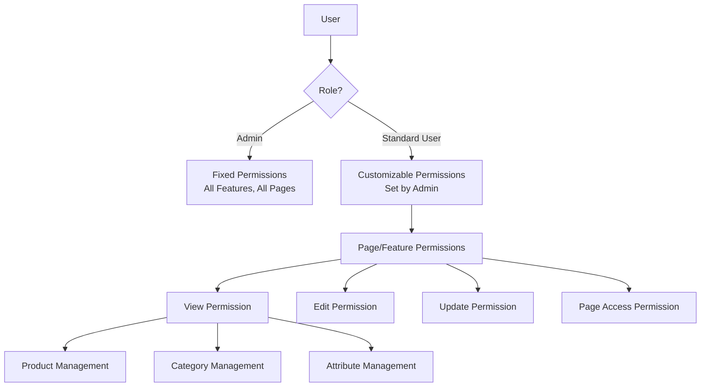
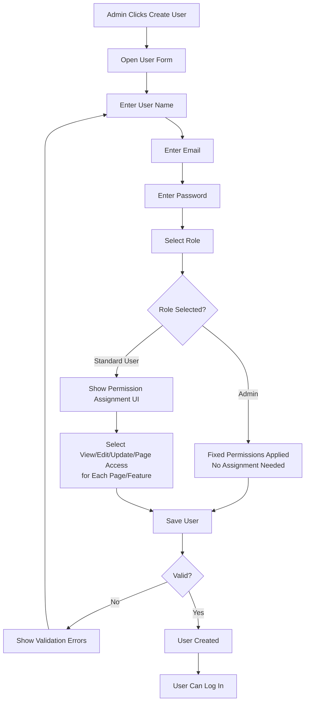
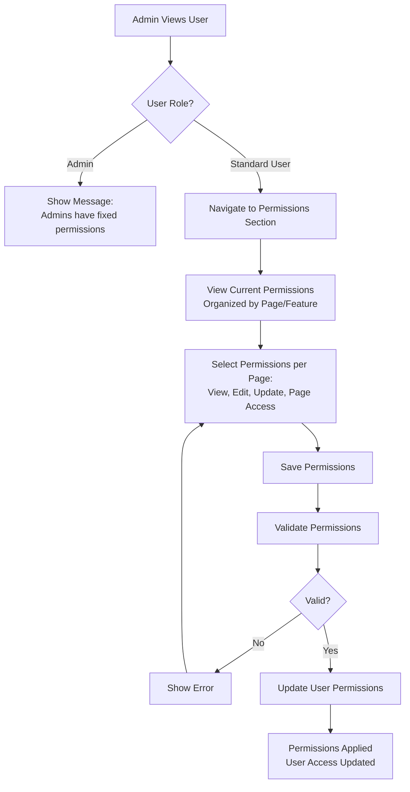
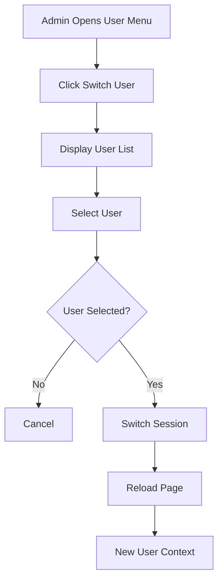

# PRD-09: User Management & Permissions

**Version:** 1.0  
**Date:** 2025-01-20  
**Author:** Product Team  
**Related Documents:** PRD-00, PRD-08

---

## 1. Document Information

### Version History
| Version | Date | Author | Changes |
|---------|------|--------|---------|
| 1.0 | 2025-01-20 | Product Team | Initial PRD creation |

### Related Documents
- PRD-00: System Overview

---

## 2. Overview

### Purpose
The User Management & Permissions module enables user account management, role-based access control, and permission assignment. The system is structured around two user types: Admins (with fixed, identical permissions) and Standard Users (with customizable permissions set by admins).

### Scope
This PRD covers:
- Two user types: Admin and Standard User
- Admin permissions (fixed and identical for all admins)
- Standard User permission customization (set by admins)
- Permission types: edit, update, view, and page access
- User creation and management
- Permission assignment interface
- Page-level permissions
- User switching functionality

### Business Goals
1. Ensure proper access control
2. Enable flexible permission management
3. Maintain security through role-based access
4. Facilitate user administration
5. Support multi-user accounts

### Success Metrics
- Permission enforcement accuracy > 99%
- User creation time < 5 minutes
- Permission assignment accuracy > 99%
- Security incidents < 0.1%

---

## 3. User Roles & Personas

The system supports two types of users: **Admin** and **Standard User**.

### Admin
**Primary Use Cases**:
- Create and manage users
- Assign roles and permissions
- View all users
- Switch between users (for testing)

**Key Goals**:
- Maintain user database
- Ensure proper access control
- Support user management

### Standard User
**Primary Use Cases**:
- View own profile
- View assigned permissions
- Access permitted features and pages
- Perform actions based on assigned permissions (view, edit, update)

**Key Goals**:
- Access system features based on admin-assigned permissions
- Understand own access level
- Use system effectively within assigned permissions

---

## 4. User Stories

### Admin Stories
1. **As an admin**, I want to create standard users so that I can add new accounts
2. **As an admin**, I want to assign permissions to standard users so that I can control their access
3. **As an admin**, I want to set view, edit, update, and page access permissions so that I can customize what each user can do
4. **As an admin**, I want to view all users so that I can manage them
5. **As an admin**, I want to switch users so that I can test different access levels
6. **As an admin**, I want to modify standard user permissions so that I can adjust access as needed

---

## 5. Functional Requirements

### 5.1 User Roles

#### FR-1.1: Role Definition
- **Description**: System supports two user types with different permission models
- **User Types**:
  - **Admin**: Fixed and identical permissions for all admins. Full system access, can manage all aspects of the system including users, products, categories, attributes, and settings. All admins have the same permissions - no customization needed or allowed.
  - **Standard User**: Customizable permissions set by admins. Limited access based on permissions assigned by admins. Permissions can vary per user and include: view, edit, update, and access to specific pages.
- **Role Hierarchy**: Admin > Standard User
- **Role Assignment**: One role per user (either Admin or Standard User)
- **Permission Model**:
  - Admins: Fixed permissions (same for all admins, cannot be changed)
  - Standard Users: Customizable permissions (set and modified by admins)

#### FR-1.2: Role-Based Access
- **Description**: Access controlled by user type and assigned permissions
- **Admin Access** (Fixed - Same for all admins):
  - Full access to all features
  - User management (create, edit, delete users, assign permissions)
  - System settings
  - All products (create, edit, update, delete, change status)
  - Category management (create, edit, delete, map to channels)
  - Attribute management (create, edit, delete, map to channels)
  - Channel management
  - All pages and features
  - User switching functionality
- **Standard User Access** (Customizable - Set by admins):
  - Access to features and pages based on assigned permissions
  - Permission types that can be assigned:
    - **View**: Can view content (products, categories, attributes, etc.)
    - **Edit**: Can edit content
    - **Update**: Can update content (including status changes)
    - **Page Access**: Can access specific pages (Product Management, Category Management, etc.)
  - Permissions are granular and can be set per feature/page
  - No access to user management or system settings

### 5.2 User Creation

#### FR-2.1: Create User
- **Description**: Admin creates new user account
- **Required Fields**:
  - User name
  - Email
  - Password
  - Role (Admin or Standard User)
- **Optional Fields**:
  - Title
  - Avatar
- **Process**:
  1. Click "Create User"
  2. Fill user form
  3. Assign role (Admin or Standard User)
  4. If Standard User: Assign permissions (view, edit, update, page access)
  5. If Admin: Permissions are automatically set (fixed, no assignment needed)
  6. Set password
  7. Save user
- **Validation**:
  - Email unique
  - Password strength requirements
  - Role required
- **Business Rules**:
  - Admins automatically get fixed permissions (no assignment needed)
  - Standard Users require permission assignment during creation

### 5.3 User Management

#### FR-3.1: User List View
- **Description**: Display all users with comprehensive list management
- **Columns**:
  - User name
  - Email
  - Role
  - Status
  - Last login
  - Actions
- **Search**: By name, email
- **Filtering**: By role, status, last login date
- **Sorting**: By name, email, role, last login
- **Pagination**: Configurable items per page (default 20)

#### FR-3.2: User Search
- **Description**: Search users by name or email
- **Search Fields**:
  - User name
  - Email
- **Search Behavior**:
  - Case-insensitive
  - Partial matching
  - Real-time search results
- **Performance**: Results returned in < 300ms

#### FR-3.3: User Filtering
- **Description**: Filter users by various criteria
- **Filter Options**:
  - By role (Admin, Standard User)
  - By status (Active, Inactive)
  - By last login date range
  - By creation date range
- **Filter Behavior**:
  - Multiple filters can be applied simultaneously
  - Filters are additive (AND logic)
  - Filter state persists during session
  - Clear filters button resets all filters

#### FR-3.4: User Sorting
- **Description**: Sort user lists
- **Sort Options**:
  - Name (A-Z, Z-A)
  - Email (A-Z, Z-A)
  - Role
  - Last login (newest, oldest)
  - Created date (newest, oldest)
- **Default Sort**: Name (A-Z)

#### FR-3.5: User Pagination
- **Description**: Paginate user lists for performance
- **Configuration**:
  - Items per page: Configurable (default 20, options: 10, 20, 50, 100)
  - Page navigation: First, Previous, Page numbers, Next, Last
  - Total count display
  - Jump to page functionality
- **Behavior**:
  - Pagination state persists during session
  - Works with search, filter, and sort
  - Shows current page and total pages

#### FR-3.6: Edit User
- **Description**: Admin edits user information
- **Editable Fields**:
  - User name
  - Email
  - Role (can change between Admin and Standard User)
  - Status (active/inactive)
  - Permissions (only for Standard Users)
- **Process**: Edit form with save
- **Business Rules**:
  - If user is Admin: Permissions are fixed and cannot be edited
  - If user is Standard User: Permissions can be modified
  - Changing role from Admin to Standard User: Requires permission assignment
  - Changing role from Standard User to Admin: Permissions automatically set to fixed admin permissions

#### FR-3.7: Delete User
- **Description**: Admin deletes user account
- **Process**:
  1. Select user
  2. Click "Delete"
  3. Confirm deletion
  4. User removed
- **Business Rules**:
  - Cannot delete currently logged-in user
  - Deletion requires confirmation

### 5.4 Permission System

#### FR-4.1: Permission Model
- **Description**: Two-tier permission model
- **Admin Permissions**:
  - Fixed and identical for all admins
  - Cannot be customized or modified
  - Automatically granted when user role is set to Admin
  - Includes full access to all features, pages, and actions
- **Standard User Permissions**:
  - Customizable per user
  - Set and modified by admins only
  - Granular control over access

#### FR-4.2: Permission Types
- **Description**: Types of permissions that can be assigned to Standard Users
- **Permission Types**:
  - **View**: Can view content (read-only access)
  - **Edit**: Can edit content (modify existing content)
  - **Update**: Can update content (including status changes, stock updates, etc.)
  - **Page Access**: Can access specific pages (Product Management, Category Management, Attribute Management, etc.)
- **Permission Granularity**:
  - Permissions can be assigned per page/feature
  - Example: User can have "View" and "Edit" on Product Management, but only "View" on Category Management
  - Permissions are additive (having "Update" implies "Edit" and "View")

#### FR-4.3: Permission Assignment
- **Description**: Assign permissions to Standard Users (only)
- **Process**:
  1. View Standard User detail
  2. Navigate to Permissions section
  3. Select permissions per page/feature:
     - Check/uncheck View permission
     - Check/uncheck Edit permission
     - Check/uncheck Update permission
     - Check/uncheck Page Access
  4. Save permissions
- **Display**: Permission matrix or checkbox list organized by page/feature
- **Business Rules**:
  - Only Standard Users can have permissions assigned
  - Admins cannot have permissions assigned (they have fixed permissions)
  - At least one permission must be assigned for Standard Users to access the system

#### FR-4.3: Permission Enforcement
- **Description**: System enforces permissions
- **Enforcement Points**:
  - Page access
  - Feature access
  - Action buttons
  - API endpoints
- **Behavior**: Hide/disable unauthorized features

### 5.5 Page-Level Permissions

#### FR-5.1: Page Access Control
- **Description**: Control access to specific pages for Standard Users
- **Implementation**:
  - Check page access permission before page load
  - Admins: Always allowed (no check needed)
  - Standard Users: Check if page access permission is granted
  - Redirect if unauthorized
  - Show error message
- **Pages with Permissions**:
  - Product Management
  - Category Management
  - Attribute Management
  - Settings (Admin only - Standard Users cannot access)
- **Business Rules**:
  - Admins have access to all pages automatically
  - Standard Users need explicit page access permission
  - Settings page is Admin-only (cannot be granted to Standard Users)

#### FR-5.2: Dynamic UI Based on Permissions
- **Description**: UI adapts based on permissions
- **Behavior**:
  - Hide unauthorized menu items
  - Hide unauthorized buttons
  - Show permission denied messages
- **User Experience**: Seamless permission enforcement

### 5.6 User Switching

#### FR-6.1: Switch User
- **Description**: Admin can switch to different user account
- **Use Case**: Testing, support, demonstration
- **Process**:
  1. Click user menu
  2. Select "Switch User"
  3. Choose user from list
  4. System switches to selected user
- **Business Rules**:
  - Only admin can switch users
  - Original user session preserved (optional)
  - Clear indication of switched user

#### FR-6.2: User Switcher UI
- **Description**: User selection interface
- **Display**: Dropdown or modal with user list
- **Filtering**: By role, name
- **Selection**: Click to switch


---

## 6. Non-Functional Requirements

### Performance
- User list load: < 1 second
- Permission check: < 50ms
- User switching: < 500ms
- Permission assignment: < 500ms

### Security
- Role-based access enforced
- Permission checks on all secured endpoints
- Password security requirements
- Session management
- Audit logging of permission changes

### Usability
- Intuitive permission assignment
- Clear permission indicators
- Easy user creation
- Clear access denied messages

### Data Integrity
- User data consistency
- Permission data integrity
- Role assignments valid
- No orphaned permissions

---

## 7. User Interface Requirements

### 7.1 User Management Page

#### Header Section
- Page title
- Create User button

#### Search & Filter Section
- Search bar (prominent, always visible)
- Filter button (opens filter panel)
- Sort dropdown
- Clear filters button
- Items per page selector

#### User List Table
- User columns (sortable headers)
- Role badges
- Status indicators
- Action buttons (Edit, Delete, Switch User)
- Pagination controls (bottom of page)

#### User Form Modal
- User name input
- Email input
- Password input
- Role selector
- Permissions section
- Save/Cancel buttons

### 7.2 Permission Management

#### Permission Assignment Interface
- **For Standard Users Only**:
  - Permission matrix organized by page/feature
  - Each page/feature shows checkboxes for:
    - View permission
    - Edit permission
    - Update permission
    - Page Access permission
  - Clear visual indication of permission hierarchy
  - Save button to apply permissions
- **For Admins**:
  - Display message: "Admins have fixed permissions - no assignment needed"
  - No permission assignment interface shown

### 7.3 User Switcher

#### User Dropdown
- Current user display
- User list
- Role indicators
- Switch button

---

## 8. Data Model

### User Object Structure

```javascript
{
  id: number,                    // Unique user ID
  name: string,                   // User name
  email: string,                  // User email (unique)
  password: string,               // Hashed password
  role: 'admin' | 'standard_user', // User role
  status: 'active' | 'inactive',  // User status
  permissions: {                   // Only for Standard Users (null for Admins)
    [pageId: string]: {            // Permissions per page/feature
      view: boolean,               // Can view content
      edit: boolean,               // Can edit content
      update: boolean,             // Can update content (status, stock, etc.)
      pageAccess: boolean          // Can access the page
    }
  } | null,                        // null for Admins (they have fixed permissions)
  lastLogin: string | null,       // ISO date string
  createdAt: string,             // ISO date string
  updatedAt: string              // ISO date string
}
```

### Permission Structure



---

## 9. Workflows

### 9.1 User Creation Workflow



### 9.2 Permission Assignment Workflow



### 9.3 User Switching Workflow



---

## 10. Acceptance Criteria

### User Creation
- [ ] Admin can create users
- [ ] Email uniqueness validated
- [ ] Password requirements enforced
- [ ] Role assignment works

### User Management
- [ ] User list displays correctly
- [ ] Users can be edited
- [ ] Users can be deleted
- [ ] User status can be changed

### Permission System
- [ ] Permissions can be assigned
- [ ] Permissions are enforced
- [ ] Unauthorized access is blocked
- [ ] UI adapts to permissions

### User Switching
- [ ] Admin can switch users
- [ ] User switch works correctly
- [ ] Switched user context is correct
- [ ] Switched user indicated in UI


---

## 11. Future Considerations

### Potential Enhancements
1. **Multi-Factor Authentication**: 2FA/MFA support
2. **SSO Integration**: Single Sign-On integration
3. **Advanced Permissions**: More granular permission control
4. **Permission Templates**: Pre-defined permission sets
5. **User Groups**: Group-based permission assignment
6. **Activity Logging**: User activity tracking
7. **Password Policies**: Configurable password requirements
8. **Session Management**: Advanced session controls
9. **API Access Tokens**: Token-based API access
10. **User Roles Customization**: Custom role creation

### Scalability Notes
- Current implementation uses in-memory data
- Future should support:
  - Database for user data
  - Authentication service integration
  - Permission caching for performance
  - Session management service
  - Audit logging database
  - Integration with identity providers

---

## 12. User Stories (Detailed)

### Story 1: Create User
**As an** admin  
**I want to** create new user accounts  
**So that** users can access the system

**Acceptance Criteria:**
- [ ] User creation form is accessible
- [ ] All required fields are available
- [ ] Role can be selected (Admin or Standard User)
- [ ] If Admin selected: Fixed permissions automatically applied, no assignment UI shown
- [ ] If Standard User selected: Permission assignment UI is displayed
- [ ] Permission assignment allows setting View, Edit, Update, Page Access per page/feature
- [ ] Password requirements are enforced
- [ ] Email uniqueness is validated
- [ ] User is created successfully
- [ ] User appears in user list

**Tasks:**
1. Create user creation form
2. Add role selector (Admin/Standard User)
3. Implement conditional permission UI (shown only for Standard Users)
4. Create permission assignment interface organized by page/feature
5. Add checkboxes for View, Edit, Update, Page Access permissions
6. Implement password validation
7. Add email uniqueness check
8. Implement user save API/service
9. Update user list

### Story 2: Assign Permissions to Standard Users
**As an** admin  
**I want to** assign permissions to standard users  
**So that** I can control what they can access

**Acceptance Criteria:**
- [ ] Permission assignment interface is accessible for Standard Users only
- [ ] Admins show message that they have fixed permissions (no assignment needed)
- [ ] Permission assignment UI shows permissions organized by page/feature
- [ ] Can set View, Edit, Update, and Page Access permissions per page/feature
- [ ] Permissions are saved successfully
- [ ] Permissions are enforced immediately
- [ ] User access is updated based on permissions

**Tasks:**
1. Create permission assignment UI (for Standard Users only)
2. Implement permission matrix organized by page/feature
3. Add checkboxes for View, Edit, Update, Page Access per page
4. Implement permission save functionality
5. Add validation for permission assignments
6. Implement permission enforcement logic
7. Update user access based on permissions
4. Add permission save logic
5. Implement permission enforcement

### Story 3: Switch User
**As an** admin  
**I want to** switch to different user accounts  
**So that** I can test different access levels

**Acceptance Criteria:**
- [ ] User switcher is accessible
- [ ] User list is displayed
- [ ] User can be selected
- [ ] Session switches successfully
- [ ] UI reflects new user context

**Tasks:**
1. Create user switcher component
2. Display user list
3. Implement user switching logic
4. Update session context
5. Refresh UI for new user

### Story 4: View User List
**As an** admin  
**I want to** see all users  
**So that** I can manage user accounts

**Acceptance Criteria:**
- [ ] User list page is accessible
- [ ] All users are displayed
- [ ] Users can be filtered by role
- [ ] Users can be sorted
- [ ] User details are accessible

**Tasks:**
1. Create user list page
2. Implement user loading
3. Add role filtering
4. Add sorting functionality
5. Add user detail links

---

## 13. Implementation Tasks

### Phase 1: User Data Model (Week 1)
- [ ] **Task 1.1**: Design user data structure
- [ ] **Task 1.2**: Implement user storage
- [ ] **Task 1.3**: Add role definitions
- [ ] **Task 1.4**: Implement permission structure

### Phase 2: User CRUD (Week 2)
- [ ] **Task 2.1**: Create user creation form
- [ ] **Task 2.2**: Implement user save API/service
- [ ] **Task 2.3**: Create user list page
- [ ] **Task 2.4**: Implement user editing
- [ ] **Task 2.5**: Implement user deletion
- [ ] **Task 2.6**: Add user validation

### Phase 3: Permission System (Week 3-4)
- [ ] **Task 3.1**: Design permission structure (fixed for Admins, customizable for Standard Users)
- [ ] **Task 3.2**: Implement fixed admin permissions (no assignment needed)
- [ ] **Task 3.3**: Create permission management UI (for Standard Users only)
- [ ] **Task 3.4**: Implement permission assignment interface (View, Edit, Update, Page Access per page/feature)
- [ ] **Task 3.5**: Implement permission assignment logic
- [ ] **Task 3.6**: Add permission enforcement (check permissions before access)
- [ ] **Task 3.7**: Implement page-level permission checks
- [ ] **Task 3.8**: Implement action-level permission checks (View/Edit/Update)

### Phase 4: User Switching (Week 5)
- [ ] **Task 4.1**: Create user switcher component
- [ ] **Task 4.2**: Implement user switching logic
- [ ] **Task 4.3**: Update session management
- [ ] **Task 4.4**: Refresh UI context

### Phase 5: Access Control (Week 6)
- [ ] **Task 5.1**: Implement role-based access control
- [ ] **Task 5.2**: Add permission checks to pages
- [ ] **Task 5.3**: Hide unauthorized features
- [ ] **Task 5.4**: Add access denied messages

### Phase 6: Testing and Polish (Week 7)
- [ ] **Task 6.1**: Write unit tests
- [ ] **Task 6.2**: Write integration tests
- [ ] **Task 6.3**: Test permission enforcement
- [ ] **Task 6.4**: Perform user acceptance testing
- [ ] **Task 6.5**: Fix bugs and polish UI

---

## 14. Glossary

- **Admin**: User type with fixed, identical permissions for all admins
- **Standard User**: User type with customizable permissions set by admins
- **Fixed Permissions**: Admin permissions that are the same for all admins and cannot be changed
- **Customizable Permissions**: Standard User permissions that can be set and modified by admins
- **View Permission**: Permission to view content (read-only access)
- **Edit Permission**: Permission to edit content (modify existing content)
- **Update Permission**: Permission to update content (including status changes, stock updates, etc.)
- **Page Access Permission**: Permission to access a specific page/feature
- **Permission Assignment**: Process of setting permissions for Standard Users by admins
- **Permission Enforcement**: System checking and enforcing permissions before allowing access
- **Access Control**: System controlling user access based on role and assigned permissions
- **User Switching**: Admin ability to switch user context for testing

