# PRD-10: Settings & Configuration

**Version:** 1.3  
**Date:** 2025-12-22  
**Author:** Product Team  
**Related Documents:** PRD-00, PRD-01, PRD-06, PRD-07, PRD-09

---

## 1. Document Information

### Version History
| Version | Date | Author | Changes |
|---------|------|--------|---------|
| 1.0 | 2025-01-20 | Product Team | Initial PRD creation |
| 1.1 | 2025-12-19 | Product Team | Added Channel Management section (FR-5.1 to FR-5.16) |
| 1.2 | 2025-12-19 | Product Team | Enhanced Channel Management documentation:
- Expanded FR-5.5 (Channel Category Structure Management) with detailed operations, import/export options, search/filter features, dependency management, and UI features
- Expanded FR-5.6 (Channel Attribute List Management) with detailed operations, import/export options, search/filter features, attribute type support, dependency management, and UI features
- Enhanced FR-5.9 (Value Mapping) with bulk operations, CSV import/export details, and UI features
- Enhanced FR-5.10 (Bulk Category Mapping) with detailed CSV format, validation, error handling, and export features
- Enhanced FR-5.11 (Bulk Attribute Mapping) with detailed CSV format, type compatibility checks, validation, error handling, and export features
- Added comprehensive UI requirements (sections 7.3-7.7) for all channel management interfaces
- Added new workflows (9.7-9.11) for import/export and bulk operations
- Expanded acceptance criteria with detailed test cases for all channel management features |
| 1.3 | 2025-12-22 | Product Team | UI/UX and Feature Enhancements:
- Simplified Channel Management UI with dropdown-based channel selection
- Added Custom Validation Rules feature (FR-5.17) for channel mapping validation
- Updated FR-5.13 with custom validation rule support
- Added new validation rule types: category, attribute, value, completeness, type-compatibility, custom
- Enhanced pagination to be always visible by default across all list pages |

### Related Documents
- PRD-00: System Overview
- PRD-01: Product Management
- PRD-06: Category Management
- PRD-07: Attribute Management
- PRD-09: User Management & Permissions

---

## 2. Overview

The Settings & Configuration module enables system-wide configuration management, including API keys, validation rules, general system preferences, and channel management. It provides centralized control over system behavior, policies, and multi-channel publishing configuration.

### Scope
This PRD covers:
- API key management
- System preferences
- Validation rules
- Channel management (sales channels, category mapping, attribute mapping, value mapping)


### Business Goals
1. Centralize system configuration
2. Enable policy management
3. Support API integrations
4. Maintain data quality standards
5. Provide flexible system customization
6. Enable multi-channel product publishing
7. Streamline channel mapping workflows
8. Ensure accurate channel-specific data translation

### Success Metrics
- Configuration accuracy > 99%
- Settings update time < 1 second
- API key security > 99%
- Channel mapping accuracy > 99%
- Product export success rate > 95%
- Mapping validation pass rate > 90%

---

## 3. User Roles & Personas

### Admin
**Primary Use Cases**:
- Manage API keys
- Set validation rules

- Manage sales channels
- Configure channel mappings (category, attribute, value)
- Export products to channels

**Key Goals**:
- Maintain system configuration
- Ensure security
- Enforce policies
- Enable multi-channel publishing
- Ensure accurate channel data mapping

---

## 4. User Stories

### Admin Stories
1. **As an admin**, I want to create API keys so that I can enable API access
2. **As an admin**, I want to set validation rules so that I can ensure data quality

4. **As an admin**, I want to define sales channels so that I can publish products to multiple marketplaces
5. **As an admin**, I want to map master categories to channel categories so that products appear in correct categories on each channel
6. **As an admin**, I want to map master attributes to channel attributes so that product specifications are correctly translated for each channel
7. **As an admin**, I want to map attribute values to channel-specific values so that product data matches channel requirements
8. **As an admin**, I want to validate channel mappings so that I can ensure products will export correctly
9. **As an admin**, I want to export products to channels so that I can sell on multiple platforms

---

## 5. Functional Requirements

### 5.1 API Key Management

#### FR-1.1: Create API Key
- **Description**: Generate API keys for system access
- **Fields**:
  - API key name
  - Description
  - Permissions (read, write, admin)
  - Expiration date (optional)
- **Process**:
  1. Click "Create API Key"
  2. Enter key name and description
  3. Select permissions
  4. Set expiration (optional)
  5. Generate key
  6. Display key (show once, cannot retrieve later)
- **Security**:
  - Key generated securely (random, long)
  - Key stored hashed
  - Key shown only once
  - Copy-to-clipboard functionality

#### FR-1.2: List API Keys
- **Description**: View all API keys with list management features
- **Display**:
  - Key name
  - Description
  - Permissions
  - Created date
  - Last used date
  - Status (active, expired, revoked)
  - Actions
- **Search**: By key name, description
- **Filter**: By status, permissions, creation date
- **Sort**: By name, created date, last used date, status
- **Pagination**: Items per page (default 20)
- **Security**: Actual keys not displayed (masked or hidden)

#### FR-1.2a: API Key Search
- **Description**: Search API keys by name or description
- **Search Fields**:
  - Key name
  - Description
- **Search Behavior**:
  - Case-insensitive
  - Partial matching
  - Real-time search results

#### FR-1.2b: API Key Filtering
- **Description**: Filter API keys by various criteria
- **Filter Options**:
  - By status (active, expired, revoked)
  - By permissions (read, write, admin)
  - By creation date range
  - By last used date range
- **Filter Behavior**:
  - Multiple filters can be applied simultaneously
  - Clear filters button resets all filters

#### FR-1.2c: API Key Sorting
- **Description**: Sort API key lists
- **Sort Options**:
  - Name (A-Z, Z-A)
  - Created date (newest, oldest)
  - Last used date (newest, oldest)
  - Status
- **Default Sort**: Created date (newest first)

#### FR-1.2d: API Key Pagination
- **Description**: Paginate API key lists
- **Configuration**:
  - Items per page: Configurable (default 20, options: 10, 20, 50)
  - Page navigation controls
  - Total count display

#### FR-1.3: Revoke API Key
- **Description**: Disable API key
- **Process**:
  1. Select API key
  2. Click "Revoke"
  3. Confirm revocation
  4. Key disabled
- **Business Rules**:
  - Revoked keys cannot be used
  - Revocation is permanent
  - Revocation requires confirmation

### 5.2 Validation Rules

#### FR-4.1: Product Validation Rules
- **Description**: Configure product data validation
- **Rules**:
  - Required fields
  - Field length limits
  - Format requirements
  - Value ranges
- **Configuration**: Set rules per field type

#### FR-4.2: Request Validation Rules
- **Description**: Configure request validation
- **Rules**:
  - Required fields for requests
  - Request size limits
  - File upload limits (for images)
- **Configuration**: Set rules per request type


### 5.4 Channel Management

#### FR-5.1: Create/Define Sales Channel
- **Description**: Define sales channels for multi-channel product publishing
- **Channel Properties**:
  - Channel ID (unique identifier, e.g., 'amazon', 'ebay', 'shopify')
  - Channel name (display name)
  - Channel type (marketplace, e-commerce, retail, etc.)
  - Channel description
  - Channel logo/icon
  - Active status (enabled/disabled)
  - Configuration settings (API endpoints, credentials, etc.)
- **Process**:
  1. Click "Add Channel"
  2. Enter channel ID (unique, lowercase, no spaces)
  3. Enter channel name
  4. Select channel type
  5. Add description and logo (optional)
  6. Set active status
  7. Configure channel-specific settings
  8. Save channel
- **Business Rules**:
  - Channel ID must be unique
  - Channel name required
  - At least one channel should be active for export functionality
  - Channels can be disabled but not deleted if mappings exist
- **Success Criteria**: Channel created and available for mapping

#### FR-5.2: List Channels
- **Description**: View all configured sales channels
- **Display**: Table/grid showing:
  - Channel logo/icon
  - Channel name
  - Channel type
  - Active status
  - Number of mapped categories
  - Number of mapped attributes
  - Last sync date
  - Actions (Edit, Enable/Disable, Configure Mappings)
- **Search**: By channel name, type
- **Filter**: By status (active/inactive), type
- **Sort**: By name, type, created date
- **Pagination**: Items per page (default 20)

#### FR-5.3: Edit/Update Channel
- **Description**: Modify existing channel configuration
- **Fields**: All fields from FR-5.1 (except Channel ID)
- **Process**:
  1. Select channel from list
  2. Click "Edit"
  3. Modify channel properties
  4. Save changes
- **Validation**: Required fields must be filled
- **Business Rules**: Channel ID cannot be changed

#### FR-5.4: Enable/Disable Channel
- **Description**: Activate or deactivate a channel
- **Process**:
  1. Select channel
  2. Toggle active status
  3. Confirm action
- **Business Rules**:
  - Disabled channels cannot be used for export
  - Existing mappings remain intact when disabled
  - Can re-enable channel at any time
- **Impact**: Disabling affects product export to that channel

#### FR-5.5: Channel Category Structure Management
- **Description**: Define and manage channel-specific category taxonomies
- **Category Structure**:
  - Each channel has its own category tree/hierarchy
  - Channel categories are separate from master categories
  - Import channel category structure (API/CSV/Manual)
- **Operations**:
  - View channel category tree (expandable/collapsible hierarchy)
  - Add root channel categories (manual)
  - Add child channel categories (manual, with parent selection)
  - Edit channel categories (name, parent, properties)
  - Delete channel categories (with dependency check - cannot delete if mapped or has children)
  - Search channel categories (by name, path, ID)
  - Filter channel categories (by level, parent)
  - Export channel category structure (CSV, JSON)
  - Import channel category structure (CSV, JSON, API)
  - Bulk operations (bulk delete, bulk edit)
- **Category Properties**:
  - Category ID (channel-specific, auto-generated or manual)
  - Category name (required)
  - Parent category ID (null for root categories)
  - Category path (auto-generated from hierarchy)
  - Category level (0 for root, increments for each level)
  - Additional channel-specific fields (custom properties)
- **Import Options**:
  - CSV import with category hierarchy:
    - Format: Category_ID, Category_Name, Parent_Category_ID, Level, Path
    - Supports hierarchical import (parent categories imported first)
    - Validation: Checks for circular references, duplicate IDs
  - API integration (if channel provides API):
    - Connect to channel API endpoint
    - Fetch category structure automatically
    - Sync with channel's latest category taxonomy
    - Handle API rate limits and errors
  - Manual entry for custom channels:
    - Add categories one by one
    - Build hierarchy interactively
- **Export Options**:
  - Export to CSV (with hierarchy)
  - Export to JSON (full structure with relationships)
  - Export filtered/selected categories only
- **Search & Filter**:
  - Search by category name (case-insensitive, partial match)
  - Search by category path
  - Search by category ID
  - Filter by level (show only root, level 1, level 2, etc.)
  - Filter by parent category
  - Real-time search results
- **Dependency Management**:
  - Cannot delete category if it has child categories
  - Cannot delete category if it's mapped to master category
  - Warning shown before deletion if dependencies exist
  - Option to delete with children (cascading delete)
- **UI Features**:
  - Expandable/collapsible tree view
  - Breadcrumb navigation
  - Visual hierarchy indicators
  - Category count per level
  - Quick add child category button
  - Drag-and-drop reordering (optional, future enhancement)

#### FR-5.6: Channel Attribute List Management
- **Description**: Define and manage channel-specific attribute lists
- **Attribute Structure**:
  - Each channel has its own attribute definitions
  - Channel attributes are separate from master attributes
  - Import channel attribute list (API/CSV/Manual)
- **Attribute Properties**:
  - Attribute ID (channel-specific, auto-generated or manual)
  - Attribute name (required)
  - Attribute type (text, number, select, multiselect, boolean, date, url)
  - Required/optional flag (isRequired: boolean)
  - Allowed values (for select/multiselect types, comma-separated or array)
  - Default value (optional)
  - Validation rules (min/max length, min/max value, pattern)
  - Additional channel-specific properties (custom fields)
- **Operations**:
  - View channel attribute list (table/list view)
  - Add channel attributes (manual or import)
  - Edit channel attributes (all properties editable)
  - Delete channel attributes (with dependency check - cannot delete if mapped)
  - Search channel attributes (by name, type, ID)
  - Filter channel attributes (by type, required status)
  - Sort channel attributes (by name, type, required status)
  - Export channel attribute list (CSV, JSON)
  - Import channel attribute list (CSV, JSON, API)
  - Bulk operations (bulk delete, bulk edit, bulk import)
  - Duplicate channel attributes
- **Import Options**:
  - CSV import with attribute definitions:
    - Format: Attribute_ID, Attribute_Name, Type, Required, Allowed_Values
    - Supports multiple attributes in one import
    - Validation: Checks for duplicate IDs, valid types, required fields
  - API integration (if channel provides API):
    - Connect to channel API endpoint
    - Fetch attribute list automatically
    - Sync with channel's latest attribute definitions
    - Handle API rate limits and errors
  - Manual entry for custom channels:
    - Add attributes one by one via form
    - Configure all properties interactively
- **Export Options**:
  - Export to CSV (with all properties)
  - Export to JSON (full attribute definitions)
  - Export filtered/selected attributes only
- **Search & Filter**:
  - Search by attribute name (case-insensitive, partial match)
  - Search by attribute ID
  - Filter by attribute type (text, number, select, etc.)
  - Filter by required status (required only, optional only, all)
  - Filter by has allowed values (select/multiselect only)
  - Real-time search results
  - Clear filters button
- **Attribute Type Support**:
  - Text: Single-line text input
  - Number: Numeric input with min/max validation
  - Select: Single selection from allowed values
  - Multiselect: Multiple selections from allowed values
  - Boolean: True/false checkbox
  - Date: Date picker
  - URL: URL validation
- **Dependency Management**:
  - Cannot delete attribute if it's mapped to master attribute
  - Warning shown before deletion if dependencies exist
  - Option to view mappings before deletion
- **UI Features**:
  - Table view with sortable columns
  - Form view for add/edit
  - Type-specific input controls
  - Allowed values editor (for select/multiselect)
  - Validation rules configuration
  - Attribute usage count (how many mappings use this attribute)

#### FR-5.7: Master to Channel Category Mapping
- **Description**: Map master categories to channel-specific categories
- **Mapping Rules**:
  - One master category maps to exactly ONE channel category per channel
  - Same master category can map to different categories across different channels
  - One-to-one mapping per channel (master → channel per channel)
- **Process**:
  1. Select master category
  2. Select target channel
  3. Browse/search channel category tree
  4. Select channel category
  5. Save mapping
  6. Mapping becomes active
- **Mapping Properties**:
  - Master category ID
  - Channel ID
  - Channel category ID
  - Active status
  - Mapped date
  - Mapped by (user)
  - Last updated
- **Business Rules**:
  - One master category can only map to one channel category per channel
  - Mapping can be updated (change target channel category)
  - Mapping can be deactivated without deletion
  - Must select channel before mapping
- **Success Criteria**: Master category successfully mapped to channel category

#### FR-5.8: Unified Attribute and Value Mapping
- **Description**: Unified interface to map channel attributes and their values to master attributes and values
- **Workflow**:
  1. Select channel attribute (from channel attribute list)
  2. If channel attribute is select/multiselect type, select channel attribute value
  3. Select master attribute (filtered by type compatibility)
  4. If master attribute is select/multiselect type, select master attribute value
  5. Save mapping (attribute mapping and/or value mapping)
- **Mapping Rules**:
  - Channel attribute maps to master attribute (one-to-one or one-to-many)
  - Channel attribute value maps to master attribute value (for select/multiselect types)
  - Same channel attribute can map to different master attributes across different workflows
  - Multiple channel attributes can map to same master attribute
- **Process Flow**:
  - **Step 1**: Select channel attribute
    - View all channel attributes for selected channel
    - See which attributes are already mapped (visual indicator)
    - Filter by type, required status
  - **Step 2**: Select channel attribute value (if select/multiselect type)
    - View allowed values for selected channel attribute
    - See which values are already mapped (visual indicator)
    - Select value to map
  - **Step 3**: Select master attribute
    - View master attributes (filtered by type compatibility)
    - See which attributes are already mapped to selected channel attribute
    - Select master attribute
  - **Step 4**: Select master attribute value (if select/multiselect type)
    - View allowed values for selected master attribute
    - See which values are already mapped to selected channel value
    - Select value to map
  - **Step 5**: Save mapping
    - Creates attribute mapping if not exists
    - Creates value mapping if values selected
- **Mapping Properties**:
  - Channel attribute ID
  - Channel attribute value (optional, for select/multiselect)
  - Master attribute ID
  - Master attribute value (optional, for select/multiselect)
  - Channel ID
  - Active status
  - Mapped date
  - Mapped by (user)
  - Last updated
- **Business Rules**:
  - Channel attribute must exist in channel attribute list
  - Master attribute must exist
  - Attribute types should be compatible (validation warning if not)
  - For value mapping, attribute mapping must exist first
  - Value mapping requires both channel and master values
  - Can create attribute mapping without value mapping
  - Can create value mapping only if attribute mapping exists
- **UI Features**:
  - Step-by-step wizard interface
  - Visual indicators for mapped attributes/values
  - Real-time validation
  - Preview of mapping before save
  - Existing mappings display
  - Export mappings to CSV
- **Success Criteria**: Channel attribute and values successfully mapped to master attribute and values

#### FR-5.9: Unified Attribute Mapping Interface (Merged with FR-5.8)
- **Note**: This requirement has been merged with FR-5.8 into a unified interface. See FR-5.8 for complete details.
- **Rationale**: Combining attribute mapping and value mapping into a single workflow improves user experience by:
  - Reducing navigation between separate interfaces
  - Providing context-aware value selection
  - Streamlining the mapping process
  - Making it easier to understand relationships between channel and master attributes/values

#### FR-5.10: Bulk Category Mapping
- **Description**: Map multiple master categories to channel categories at once
- **Process**:
  1. Select channel
  2. Upload CSV with mappings (Master Category ID, Channel Category ID)
  3. System validates mappings
  4. Review validation results (errors, warnings, success count)
  5. Fix errors if any
  6. Review and confirm mappings
  7. Apply bulk mappings
  8. Show success report with mapping count
- **CSV Format**:
  ```
  Master_Category_ID, Master_Category_Name, Channel_Category_ID, Channel_Category_Name, Active
  1, Electronics, amazon_cat_123, Electronics & Computers, true
  2, Clothing, amazon_cat_456, Apparel, true
  ```
- **CSV Import Features**:
  - Support for Master Category ID or Name (name lookup)
  - Support for Channel Category ID or Name (name lookup)
  - Header row detection (auto-detect or manual)
  - Preview before import
  - Validation report before import
  - Skip invalid rows option
  - Update existing mappings option
- **Validation**:
  - Master category exists
  - Channel category exists
  - No duplicate mappings (one master category per channel)
  - Channel category belongs to selected channel
  - Active status is valid (true/false)
- **Error Handling**:
  - Invalid master category ID/name → Error with row number
  - Invalid channel category ID/name → Error with row number
  - Duplicate mapping → Warning (option to update or skip)
  - Missing required fields → Error with row number
- **Success Criteria**: Multiple categories mapped successfully
- **Export Existing Mappings**:
  - Export current mappings to CSV template
  - Include all mapping properties
  - Can be edited and re-imported

#### FR-5.11: Bulk Attribute Mapping
- **Description**: Map multiple master attributes to channel attributes at once
- **Process**:
  1. Select channel
  2. Upload CSV with mappings (Master Attribute ID, Channel Attribute IDs)
  3. System validates mappings
  4. Review validation results (errors, warnings, success count)
  5. Fix errors if any
  6. Review and confirm mappings
  7. Apply bulk mappings
  8. Show success report with mapping count
- **CSV Format**:
  ```
  Master_Attribute_ID, Master_Attribute_Name, Channel_Attribute_IDs, Channel_Attribute_Names, Active
  attr_1, Color, "chan_attr_1,chan_attr_2", "Color,Primary Color", true
  attr_2, Size, "chan_attr_3", "Size", true
  ```
- **CSV Import Features**:
  - Support for Master Attribute ID or Name (name lookup)
  - Support for Channel Attribute IDs or Names (comma-separated, name lookup)
  - Header row detection (auto-detect or manual)
  - Preview before import
  - Validation report before import
  - Skip invalid rows option
  - Update existing mappings option
  - Support one-to-many mappings (multiple channel attributes per master)
- **Validation**:
  - Master attribute exists
  - Channel attributes exist
  - Attribute types compatible (warnings for incompatible types)
  - Channel attributes belong to selected channel
  - Active status is valid (true/false)
  - No duplicate channel attributes in same mapping
- **Type Compatibility Checks**:
  - Text ↔ Text: Compatible
  - Number ↔ Number: Compatible
  - Select ↔ Select: Compatible (with value mapping recommendation)
  - Multiselect ↔ Multiselect: Compatible
  - Boolean ↔ Boolean: Compatible
  - Incompatible types: Warning (user can proceed or fix)
- **Error Handling**:
  - Invalid master attribute ID/name → Error with row number
  - Invalid channel attribute ID/name → Error with row number
  - Type incompatibility → Warning with row number
  - Missing required fields → Error with row number
  - Duplicate channel attributes → Warning with row number
- **Success Criteria**: Multiple attributes mapped successfully
- **Export Existing Mappings**:
  - Export current mappings to CSV template
  - Include all mapping properties
  - Can be edited and re-imported
  - Handles one-to-many mappings correctly

#### FR-5.12: View Channel Mappings
- **Description**: View all mappings for a specific channel
- **Category Mappings View**:
  - List of master categories with their channel category mappings
  - Show mapping status (active/inactive)
  - Filter by mapped/unmapped categories
  - Quick edit/delete mapping actions
- **Attribute Mappings View**:
  - List of master attributes with their channel attribute mappings
  - Show value mappings per attribute
  - Filter by mapped/unmapped attributes
  - Quick edit/delete mapping actions
- **Summary Statistics**:
  - Total categories mapped
  - Total attributes mapped
  - Total value mappings
  - Unmapped categories count
  - Unmapped attributes count
- **Export**: Export mappings to CSV for backup/review

#### FR-5.13: Mapping Validation
- **Description**: Validate mappings before product export using built-in and custom rules
- **Built-in Validation Checks**:
  - Required category mappings exist
  - Required attribute mappings exist
  - Value mappings exist for select/enum attributes
  - Attribute types are compatible
  - No broken references
- **Custom Validation Rules** (see FR-5.17):
  - User-defined rules per channel or global
  - Configurable severity (error/warning/info)
  - Pattern matching, range checks, custom expressions
- **Validation Report**:
  - List of validation errors
  - List of validation warnings
  - Suggested fixes
  - Rule-by-rule breakdown
- **Process**:
  - Run validation from Channel Management page
  - View validation results with rule details
  - Fix identified issues
  - Re-run validation
- **Success Criteria**: All required mappings valid and complete

#### FR-5.17: Custom Validation Rules
- **Description**: Create and manage custom validation rules for channel mappings
- **Rule Properties**:
  - Name: Descriptive rule name
  - Type: category, attribute, value, completeness, type-compatibility, custom
  - Severity: error, warning, info
  - Channel: Channel-specific or global (applies to all channels)
  - Active status: Enable/disable rule
- **Condition Configuration**:
  - Check Type: required, format, range, pattern, custom
  - Target: category, attribute, value, mapping
  - Pattern: Regex pattern for pattern matching
  - Min/Max: Range validation values
  - Custom Expression: Custom validation logic
- **Message Template**:
  - Customizable validation message
  - Placeholder support: {productName}, {attributeName}, {categoryName}, {value}
- **CRUD Operations**:
  - Create new validation rule
  - Edit existing rule
  - Delete rule (with confirmation)
  - Toggle rule active/inactive
- **UI Features**:
  - Validation rules list in Validation tab
  - Rule form modal for create/edit
  - Visual severity indicators (badges)
  - Global rule indicator
- **Process**:
  1. Navigate to Channel Management → Validation tab
  2. Click "New Rule" or "Add Rule" button
  3. Configure rule properties and conditions
  4. Set validation message template
  5. Save rule
  6. Rule is applied during validation runs
- **Business Rules**:
  - Global rules apply to all channels
  - Channel-specific rules only apply to that channel
  - Multiple rules can exist per channel
  - Rules with "error" severity block export
  - Rules with "warning" severity allow export with warning

#### FR-5.14: Product Export with Channel Mapping
- **Description**: Export products to channels using configured mappings
- **Export Process**:
  1. Select products to export
  2. Select target channel
  3. System applies category mappings
  4. System applies attribute mappings
  5. System applies value mappings
  6. Generate channel-specific product data
  7. Validate exported data
  8. Send to channel (API or file export)
- **Mapping Application**:
  - Master category → Channel category (from category mapping)
  - Master attributes → Channel attributes (from attribute mapping)
  - Master values → Channel values (from value mapping)
  - If mapping missing, use fallback rules or skip
- **Export Options**:
  - API export (direct integration)
  - File export (CSV, JSON, XML)
  - Preview before export
  - Validate before export
- **Export Log**:
  - Track export history
  - Show success/failure status
  - Log errors and warnings
  - Provide export statistics
- **Business Rules**:
  - Only complete products can be exported
  - Channel must be active
  - Required mappings must exist
  - Validation must pass
- **Success Criteria**: Products successfully exported with correct channel-specific data

#### FR-5.15: Channel Sync/Update
- **Description**: Sync channel category and attribute structures with external sources
- **Sync Options**:
  - Manual sync (admin-triggered)
  - Automatic sync (scheduled)
  - API sync (if channel provides API)
- **Sync Process**:
  1. Connect to channel API or data source
  2. Fetch latest category/attribute structure
  3. Compare with existing structure
  4. Show differences (new, updated, removed)
  5. Confirm changes
  6. Update channel structure
  7. Review impact on existing mappings
- **Impact Analysis**:
  - Show affected mappings
  - Warn about broken mappings
  - Suggest remapping
- **Success Criteria**: Channel structure updated without breaking existing mappings

#### FR-5.16: Channel Configuration Settings
- **Description**: Configure channel-specific settings
- **Settings per Channel**:
  - API credentials (if applicable)
  - API endpoints
  - Export format preferences (CSV, JSON, XML)
  - Export frequency (manual, scheduled)
  - Required fields configuration
  - Field length limits
  - Special rules and requirements
  - Language mapping (if channel uses different language codes)
- **Process**:
  1. Select channel
  2. Click "Configure"
  3. Enter channel-specific settings
  4. Test connection (if API)
  5. Save configuration
- **Validation**: Test API connection before saving
- **Security**: Credentials stored securely (encrypted)

---

## 6. Non-Functional Requirements

### Performance
- Settings page load: < 1 second
- Settings update: < 500ms
- API key generation: < 500ms

### Security
- API keys stored securely (hashed)
- API key access restricted
- Settings changes logged
- Configuration validation

### Usability
- Intuitive settings organization
- Clear settings descriptions
- Easy configuration
- Clear validation feedback

### Data Integrity
- Settings data consistency
- Configuration validation
- Settings changes logged
- Backup of critical settings

---

## 7. User Interface Requirements

### 7.1 Settings Page

#### Navigation
- Settings tabs:
  - General
  - API Keys
  - Validation Rules
  - Channels
  - Email

#### General Settings Tab
- Settings form
- Save button
- Reset to defaults button

#### API Keys Tab
- Create API Key button
- Search bar
- Filter panel
- Sort dropdown
- Items per page selector
- API keys table (sortable columns)
- Pagination controls
- Revoke actions

#### Validation Rules Tab
- Rules configuration form
- Rule categories
- Save button

- Exchange rate configuration
- Symbol and format configuration

#### Channels Tab
- Add Channel button
- Channel cards/list display
- Channel status toggle
- Channel configuration button
- View Mappings button per channel
- Search and filter channels
- Channel details panel

### 7.2 Channel Management Page

#### Channel List Section
- Channel cards/grid layout
- Each card shows:
  - Channel logo/icon
  - Channel name and type
  - Active/inactive badge
  - Mapping statistics (categories, attributes mapped)
  - Last sync date
  - Actions dropdown (Edit, Configure, View Mappings, Sync, Enable/Disable)

#### Channel Detail/Edit Section
- Channel information form
- Channel ID (display only if existing)
- Channel name input
- Channel type dropdown
- Description textarea
- Logo/icon upload
- Active status toggle
- Save/Cancel buttons

#### Channel Configuration Section
- Configuration tabs per channel
- API Settings tab:
  - API endpoint URL
  - API credentials (encrypted storage)
  - Authentication method
  - Test connection button
- Export Settings tab:
  - Export format (CSV, JSON, XML)
  - Export frequency (manual, scheduled)
  - Field mappings configuration
- Requirements tab:
  - Required fields list
  - Field length limits
  - Special rules
  - Validation settings

### 7.3 Channel Category Structure Management Interface

#### Category Tree View
- Expandable/collapsible tree structure
- Visual hierarchy indicators (indentation, icons)
- Category level badges
- Category path display
- Breadcrumb navigation
- Search bar (filters tree in real-time)
- Filter by level dropdown

#### Category Actions
- Add Root Category button
- Add Child Category button (per category)
- Edit Category button (opens form)
- Delete Category button (with confirmation)
- Expand All / Collapse All buttons
- Export Categories button (CSV/JSON)
- Import Categories button (CSV/JSON/API)

#### Category Form
- Category name input (required)
- Parent category selector (dropdown/tree)
- Category ID input (optional, auto-generated)
- Additional properties section
- Save / Cancel buttons
- Validation feedback

#### Import/Export Interface
- File upload area (drag & drop)
- Format selector (CSV, JSON)
- Import preview table
- Validation results display
- Import button (disabled if errors)
- Cancel button
- Export format selector
- Export button

### 7.4 Channel Attribute List Management Interface

#### Attribute List View
- Table layout with columns:
  - Attribute Name
  - Type (badge)
  - Required (badge)
  - Allowed Values
  - Usage Count (mappings)
  - Actions
- Search bar (filters table)
- Filter dropdowns (Type, Required status)
- Sort dropdown (Name, Type, Required)
- Add Attribute button
- Import Attributes button
- Export Attributes button
- Bulk Actions dropdown

#### Attribute Form
- Attribute name input (required)
- Attribute type selector (required)
- Required checkbox
- Allowed values input (for select/multiselect)
- Default value input (optional)
- Validation rules section
- Save / Cancel buttons
- Duplicate button (optional)

#### Import/Export Interface
- File upload area (drag & drop)
- Format selector (CSV, JSON)
- Import preview table
- Validation results display
- Import button (disabled if errors)
- Cancel button
- Export format selector
- Export button

### 7.5 Channel Category Mapping Interface

#### Master Category Selection
- Category tree browser (master categories)
- Search master categories (real-time filter)
- Select master category (highlighted)
- Display current mapping status per channel (badge/indicator)
- Expandable/collapsible tree
- Filter mapped/unmapped categories

#### Channel Selection
- Channel dropdown/selector
- Filter active/inactive channels
- Show mapping statistics per channel
- Channel cards with mapping counts

#### Channel Category Browser
- Channel category tree display
- Search channel categories (real-time filter)
- Expandable/collapsible tree
- Select channel category (highlighted)
- Breadcrumb navigation
- Filter by level
- Show mapped categories indicator

#### Mapping Management Section
- Current mappings table/list
- Columns:
  - Master Category (with path)
  - Channel
  - Channel Category (with path)
  - Status (Active/Inactive badge)
  - Mapped Date
  - Mapped By
  - Actions (Edit, Delete, Activate/Deactivate)
- Add Mapping button
- Edit Mapping inline (opens category selector)
- Delete with confirmation
- Bulk mapping upload (CSV)
- Export mappings button (CSV)
- Filter mappings (by status, channel, mapped/unmapped)
- Search mappings

#### Mapping Actions
- Save Mapping button
- Cancel button
- Validate Mappings button
- Export Mappings (CSV)
- Import Mappings (CSV)

### 7.6 Unified Attribute and Value Mapping Interface

#### Step 1: Channel Attribute Selection
- Channel attribute grid/list display
- Each card shows:
  - Channel attribute name
  - Attribute type (badge)
  - Required indicator (if required)
  - Mapped status indicator (if already mapped)
  - Number of master attributes mapped to
- Visual indicators:
  - Green highlight for mapped attributes
  - Primary highlight for selected attribute
- Click to select channel attribute

#### Step 2: Channel Attribute Value Selection (if select/multiselect)
- Value grid display (only shown if channel attribute is select/multiselect)
- Each value card shows:
  - Channel attribute value
  - Mapped indicator (checkmark if mapped)
  - Mapped master value preview (if exists)
- Visual indicators:
  - Blue highlight for values with existing mappings
  - Primary highlight for selected value
- Click to select channel attribute value

#### Step 3: Master Attribute Selection
- Master attribute grid/list display
- Filtered by type compatibility:
  - If channel attribute is select/multiselect, only show select/multiselect master attributes
  - Type compatibility indicators
- Each card shows:
  - Master attribute name (TR/EN)
  - Attribute type (badge)
  - Already mapped indicator (if mapped to selected channel attribute)
- Visual indicators:
  - Green highlight for already mapped attributes
  - Primary highlight for selected attribute
- Click to select master attribute

#### Step 4: Master Attribute Value Selection (if select/multiselect)
- Value grid display (only shown if master attribute is select/multiselect)
- Each value card shows:
  - Master attribute value
  - Mapped indicator (checkmark if mapped)
  - Mapped channel value preview (if exists)
- Visual indicators:
  - Blue highlight for values with existing mappings
  - Primary highlight for selected value
- Click to select master attribute value

#### Mapping Summary and Actions
- Preview section showing:
  - Channel attribute → Channel value (if selected)
  - Master attribute → Master value (if selected)
- Save buttons:
  - "Save Attribute Mapping" (if only attributes selected)
  - "Save Value Mapping" (if both attributes and values selected)
- Cancel button to reset selections

#### Existing Mappings Display
- Two sections:
  - **Attribute Mappings**: List of channel attribute to master attribute mappings
    - Shows channel attribute name
    - Shows mapped master attribute(s)
    - Delete action
  - **Value Mappings**: List of value mappings (shown when channel attribute selected)
    - Shows channel value → master value
    - Shows associated attributes
    - Delete action
- Export CSV button (exports both attribute and value mappings)

#### UI Features
- Step-by-step wizard flow
- Visual progress indicators
- Context-aware filtering
- Real-time validation
- Existing mapping indicators
- Export functionality
- Responsive grid layouts

### 7.6 Channel Mapping Validation Interface

#### Validation Dashboard
- Run Validation button
- Select channel to validate
- Validation status indicator
- Last validation date/time

#### Validation Results
- Errors section (red):
  - List of critical errors
  - Missing required mappings
  - Broken references
  - Type incompatibilities
- Warnings section (yellow):
  - List of warnings
  - Recommended mappings
  - Optional improvements
- Success section (green):
  - Successfully mapped categories
  - Successfully mapped attributes
  - Validation passed indicators

#### Validation Actions
- Fix Issues button (navigates to mapping interface)
- Re-run Validation button
- Export Validation Report (CSV/PDF)
- View Details per error/warning

### 7.7 Product Export Interface

#### Product Selection
- Product list with checkboxes
- Select All option
- Filter products (status, category, etc.)
- Show export eligibility status per product

#### Export Configuration
- Channel selector dropdown
- Export format options (API, CSV, JSON, XML)
- Preview export data checkbox
- Validate before export checkbox

#### Export Preview
- Show channel-specific product data
- Display mapped categories
- Display mapped attributes and values
- Highlight any missing mappings
- Show validation warnings/errors

#### Export Actions
- Export button
- Cancel button
- Save as Draft button
- Schedule Export button (if applicable)

#### Export Log/History
- Export history table
- Columns:
  - Export Date/Time
  - Channel
  - Products Count
  - Status (Success/Failed/Partial)
  - Errors/Warnings Count
  - Actions (View Details, Download, Re-export)

---

## 8. Data Model

### Settings Object Structure

```javascript
{
  // API Keys
  apiKeys: [
    {
      id: number,
      name: string,
      description: string,
      keyHash: string,           // Hashed API key
      permissions: string[],
      createdAt: string,
      lastUsedAt: string | null,
      expiresAt: string | null,
      status: 'active' | 'expired' | 'revoked'
    }
  ],
  
  // Validation Rules
  validation: {
    product: {
      requiredFields: string[],
      fieldLengths: {
        [fieldName: string]: number
      },
      valueRanges: {
        [fieldName: string]: {
          min: number,
          max: number
        }
      }
    },
    request: {
      maxFileSize: number,
      maxImageCount: number
    }
  },
  
  // System Preferences
  preferences: {
    defaultLanguage: 'tr' | 'en',
    dateFormat: string,
    timezone: string,
    itemsPerPage: number,
    emailNotifications: boolean
  },
  
  // Channels (for multi-channel publishing)
  channels: [
    {
      id: string,                // Channel ID (e.g., 'amazon', 'ebay', 'shopify')
      name: string,              // Channel name
      type: string,              // Channel type (marketplace, e-commerce, retail, etc.)
      description: string,       // Channel description
      logoUrl: string | null,    // Channel logo/icon URL
      isActive: boolean,         // Channel active status
      configuration: {           // Channel-specific configuration
        apiEndpoint: string | null,
        apiCredentials: {
          key: string,           // Encrypted
          secret: string         // Encrypted
        } | null,
        authMethod: string | null,
        exportFormat: 'csv' | 'json' | 'xml' | 'api',
        exportFrequency: 'manual' | 'scheduled',
        requirements: {
          requiredFields: string[],
          fieldLengths: {
            [fieldName: string]: number
          },
          specialRules: string[]
        }
      },
      categoryTree: ChannelCategory[],  // Channel-specific category structure
      attributeList: ChannelAttribute[], // Channel-specific attribute list
      lastSyncAt: string | null, // Last sync date (ISO string)
      createdAt: string,         // ISO date string
      updatedAt: string          // ISO date string
    }
  ]
}
```

### Channel Category Object Structure

```javascript
{
  id: string,                    // Channel category ID (channel-specific)
  channelId: string,             // Parent channel ID
  name: string,                  // Channel category name
  parentId: string | null,       // Parent category ID (null for root)
  level: number,                 // Depth level (0 for root)
  path: string,                  // Full path
  children: ChannelCategory[] | null, // Child categories
  additionalFields: {            // Channel-specific additional fields
    [fieldName: string]: any
  },
  createdAt: string,             // ISO date string
  updatedAt: string              // ISO date string
}
```

### Channel Attribute Object Structure

```javascript
{
  id: string,                    // Channel attribute ID (channel-specific)
  channelId: string,             // Parent channel ID
  name: string,                  // Channel attribute name
  type: 'text' | 'number' | 'select' | 'multiselect' | 'boolean' | 'date',
  isRequired: boolean,           // Required for this channel
  allowedValues: string[] | null, // For select/multiselect types
  additionalProperties: {        // Channel-specific additional properties
    [propName: string]: any
  },
  createdAt: string,             // ISO date string
  updatedAt: string              // ISO date string
}
```

### Category Mapping Object Structure

```javascript
{
  id: number,                    // Mapping ID
  masterCategoryId: number,      // Master category ID
  channelId: string,             // Target channel ID
  channelCategoryId: string,     // Channel category ID (one per channel)
  isActive: boolean,             // Mapping active status
  mappedAt: string,              // ISO date string
  mappedBy: number,              // User ID who created mapping
  updatedAt: string              // ISO date string
}
```

### Attribute Mapping Object Structure

```javascript
{
  id: number,                    // Mapping ID
  masterAttributeId: string,     // Master attribute ID
  channelId: string,             // Target channel ID
  channelAttributeIds: string[], // Channel attribute IDs (one-to-many support)
  isActive: boolean,             // Mapping active status
  transformationRules: {         // Optional transformation rules
    [rule: string]: any
  } | null,
  mappedAt: string,              // ISO date string
  mappedBy: number,              // User ID who created mapping
  updatedAt: string              // ISO date string
}
```

### Attribute Value Mapping Object Structure

```javascript
{
  id: number,                    // Mapping ID
  masterAttributeId: string,     // Master attribute ID
  masterValue: string | number,  // Master attribute value
  channelId: string,             // Target channel ID
  channelAttributeId: string,    // Channel attribute ID (from attribute mapping)
  channelValue: string | number, // Channel-specific value
  isActive: boolean,             // Mapping active status
  mappedAt: string,              // ISO date string
  mappedBy: number,              // User ID who created mapping
  updatedAt: string              // ISO date string
}
```

### Export Log Object Structure

```javascript
{
  id: number,                    // Export log ID
  channelId: string,             // Target channel ID
  productIds: number[],          // Exported product IDs
  exportFormat: 'api' | 'csv' | 'json' | 'xml',
  status: 'success' | 'failed' | 'partial',
  errorCount: number,            // Number of errors
  warningCount: number,          // Number of warnings
  errors: {                      // Error details
    productId: number,
    errorMessage: string,
    errorType: string
  }[],
  warnings: {                    // Warning details
    productId: number,
    warningMessage: string
  }[],
  exportedBy: number,            // User ID who initiated export
  exportedAt: string,            // ISO date string
  completedAt: string | null,    // ISO date string (null if in progress)
  exportData: any | null         // Exported data (optional, for review)
}
```

---

## 9. Workflows

### 9.1 API Key Creation Workflow

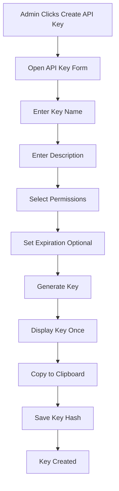

### 9.2 Settings Update Workflow

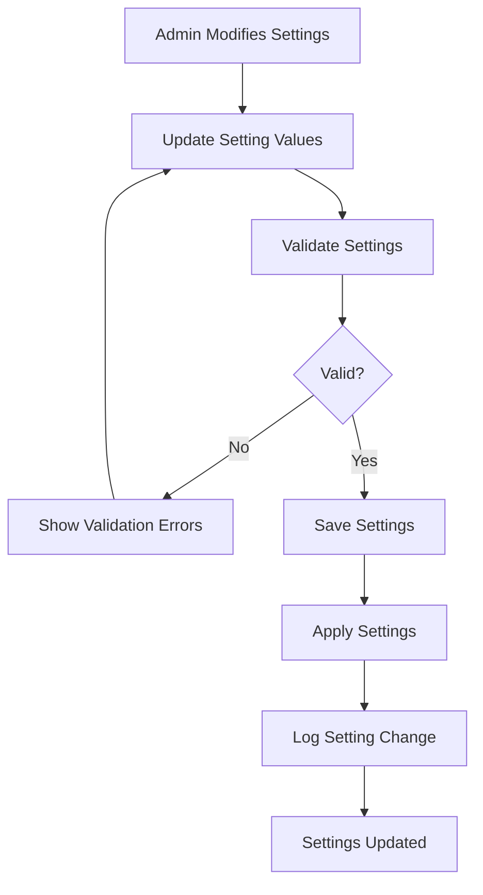

### 9.3 Channel Creation Workflow

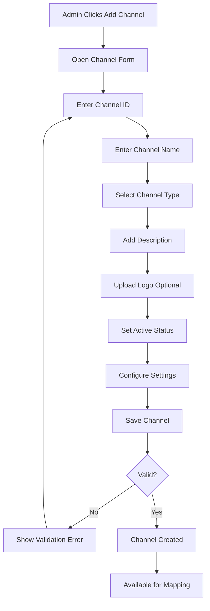

### 9.4 Category Mapping Workflow

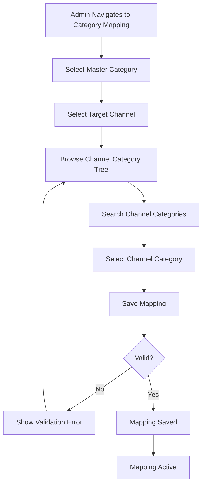

### 9.5 Attribute Mapping Workflow

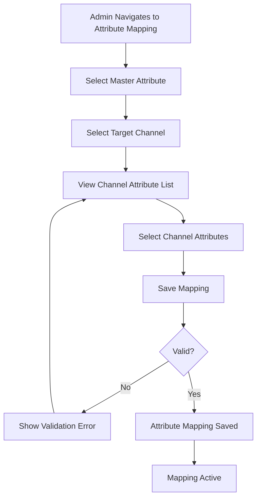

### 9.6 Channel Category Structure Import Workflow

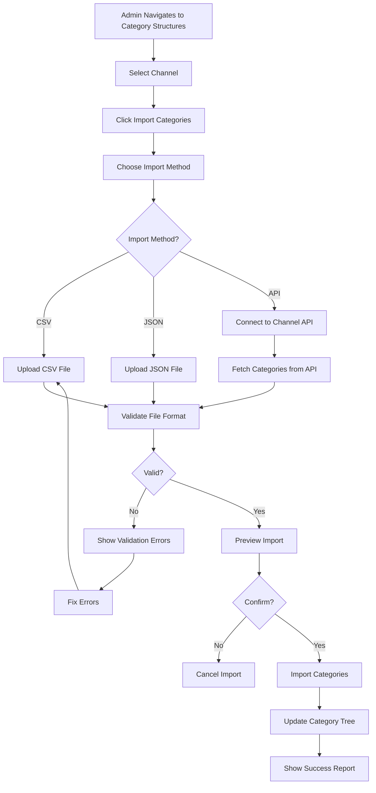

### 9.7 Channel Attribute List Import Workflow

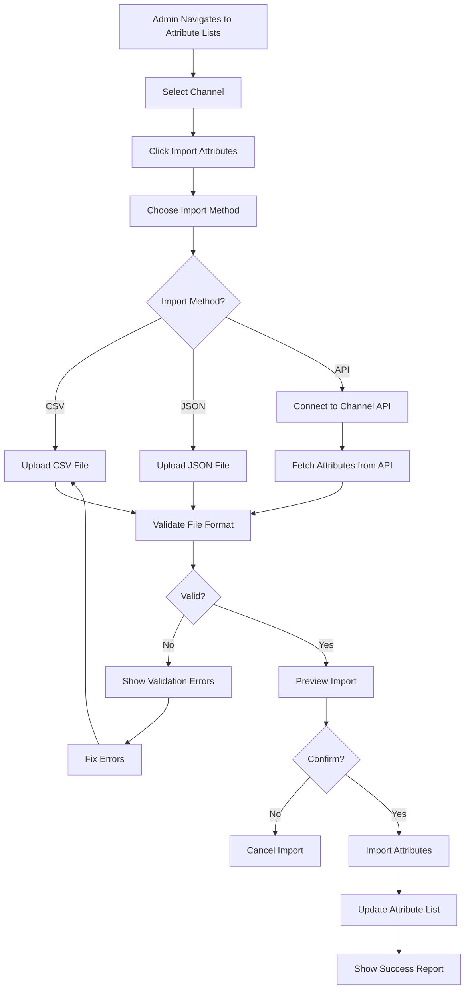

### 9.8 Bulk Category Mapping Workflow

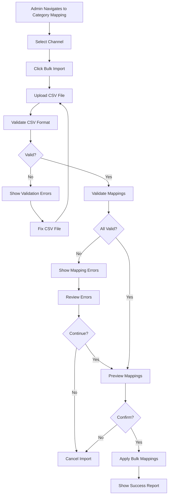

### 9.9 Bulk Attribute Mapping Workflow

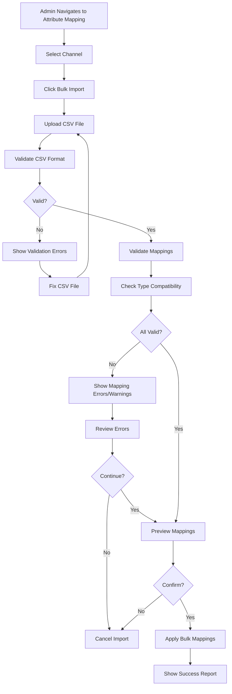

### 9.10 Bulk Value Mapping Workflow

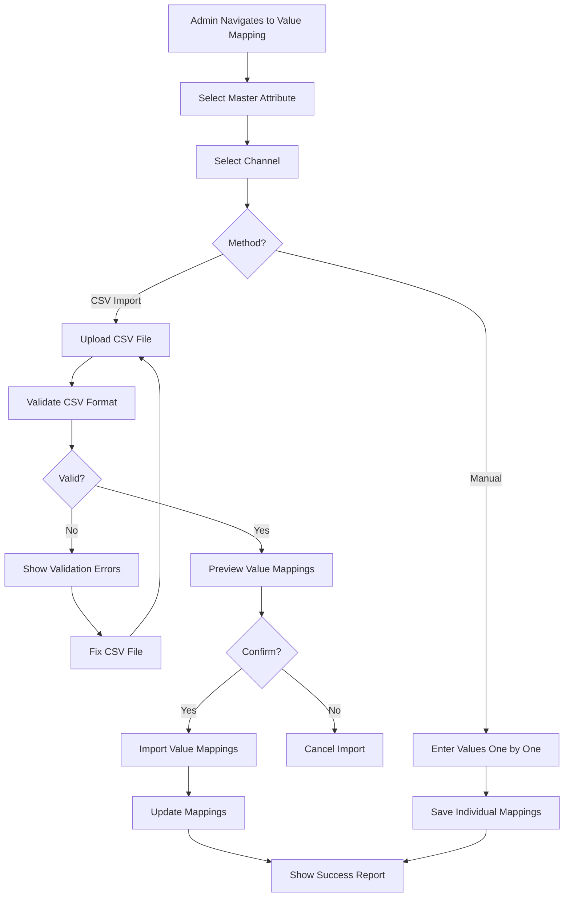

### 9.11 Product Export with Mapping Workflow

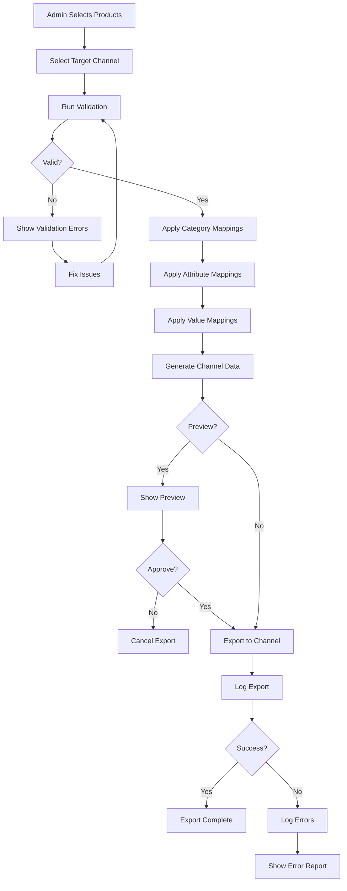

---

## 10. Acceptance Criteria

### API Key Management
- [ ] API keys can be created
- [ ] API keys are generated securely
- [ ] API keys are displayed only once
- [ ] API keys can be revoked
- [ ] API key list displays correctly

### Validation Rules
- [ ] Validation rules can be configured
- [ ] Rules are applied to validation
- [ ] Rules are saved correctly

### System Preferences
- [ ] General settings can be configured
- [ ] Settings are saved correctly
- [ ] Settings are applied system-wide
- [ ] Exchange rates can be configured

### Channel Management
- [ ] Channels can be created and configured
- [ ] Channel list displays correctly with filtering and search
- [ ] Channels can be enabled/disabled
- [ ] Channel configuration settings can be saved
- [ ] API credentials are stored securely

### Channel Category Structure Management
- [ ] Channel category tree can be viewed with expand/collapse
- [ ] Root categories can be added manually
- [ ] Child categories can be added with parent selection
- [ ] Categories can be edited (name, parent, properties)
- [ ] Categories can be deleted (with dependency checks)
- [ ] Categories can be searched and filtered
- [ ] Category structure can be imported from CSV
- [ ] Category structure can be imported from JSON
- [ ] Category structure can be imported from API (if available)
- [ ] Category structure can be exported to CSV
- [ ] Category structure can be exported to JSON
- [ ] Dependency checks prevent deletion of mapped categories
- [ ] Dependency checks prevent deletion of categories with children
- [ ] Bulk operations work correctly

### Channel Attribute List Management
- [ ] Channel attribute list can be viewed in table format
- [ ] Attributes can be added manually with all properties
- [ ] Attributes can be edited (name, type, required, allowed values)
- [ ] Attributes can be deleted (with dependency checks)
- [ ] Attributes can be searched and filtered
- [ ] Attributes can be sorted by name, type, required status
- [ ] Attribute list can be imported from CSV
- [ ] Attribute list can be imported from JSON
- [ ] Attribute list can be imported from API (if available)
- [ ] Attribute list can be exported to CSV
- [ ] Attribute list can be exported to JSON
- [ ] Type-specific input controls work correctly
- [ ] Allowed values editor works for select/multiselect types
- [ ] Dependency checks prevent deletion of mapped attributes
- [ ] Bulk operations work correctly

### Category Mapping
- [ ] Master categories can be mapped to channel categories
- [ ] One-to-one mapping per channel is enforced
- [ ] Category mappings can be viewed and edited
- [ ] Category mappings can be deactivated
- [ ] Bulk category mapping via CSV works
- [ ] CSV import validates master and channel categories
- [ ] CSV import shows validation errors before import
- [ ] CSV import supports name lookup (not just IDs)
- [ ] Category mappings can be exported to CSV
- [ ] Unmapped categories are identified
- [ ] Mapping status is displayed clearly
- [ ] Search and filter work for mappings

### Attribute Mapping
- [ ] Master attributes can be mapped to channel attributes
- [ ] One-to-many attribute mapping works (multiple channel attributes per master)
- [ ] Attribute mappings can be viewed and edited
- [ ] Attribute mappings can be deactivated
- [ ] Bulk attribute mapping via CSV works
- [ ] CSV import validates master and channel attributes
- [ ] CSV import shows validation errors before import
- [ ] CSV import supports name lookup (not just IDs)
- [ ] CSV import handles one-to-many mappings correctly
- [ ] Attribute mappings can be exported to CSV
- [ ] Type compatibility warnings are shown
- [ ] Type compatibility checks work correctly
- [ ] Mapping status is displayed clearly
- [ ] Search and filter work for mappings

### Value Mapping
- [ ] Master attribute values can be mapped to channel values
- [ ] Value mappings can be viewed and edited
- [ ] Value mappings can be deactivated
- [ ] Bulk value mapping via CSV works
- [ ] CSV import validates attribute mappings exist
- [ ] CSV import shows validation errors before import
- [ ] CSV import supports name lookup (not just IDs)
- [ ] Value mappings can be exported to CSV
- [ ] Default fallback to master value works when no mapping
- [ ] Master attribute selector filters to mapped attributes only
- [ ] Value mapping form shows channel attribute from mapping
- [ ] Existing mappings are displayed clearly
- [ ] Inline editing works for value mappings

### Mapping Validation
- [ ] Validation can be run per channel
- [ ] Validation errors are displayed clearly
- [ ] Validation warnings are displayed
- [ ] Validation report can be exported
- [ ] Missing mappings are identified

### Product Export
- [ ] Products can be exported to active channels
- [ ] Category mappings are applied correctly during export
- [ ] Attribute mappings are applied correctly during export
- [ ] Value mappings are applied correctly during export
- [ ] Export validation prevents invalid exports
- [ ] Export preview shows channel-specific data correctly
- [ ] Export log tracks success/failures
- [ ] Export errors are logged with details
- [ ] Export supports multiple formats (API, CSV, JSON, XML)

---

## 11. Future Considerations

### Potential Enhancements
1. **Settings Import/Export**: Import/export configuration
2. **Settings Versioning**: Track setting changes over time
3. **Environment-Specific Settings**: Different settings for dev/staging/prod
4. **Settings Templates**: Pre-defined setting configurations
5. **Advanced API Key Management**: Key rotation, usage analytics
6. **Custom Validation Rules**: User-defined validation rules
8. **Settings API**: API for programmatic settings management
9. **Settings Audit Log**: Complete audit trail of changes
10. **Settings Backup/Restore**: Backup and restore configurations

### Channel Management Future Enhancements
1. **AI-Powered Mapping Suggestions**: Machine learning to suggest category/attribute mappings
2. **Automatic Sync Scheduling**: Scheduled automatic sync with channel APIs
3. **Real-Time Channel Status**: Real-time monitoring of channel connectivity
4. **Channel Analytics**: Export success rates, error patterns, performance metrics
5. **Multi-Language Channel Support**: Support for channels in different languages
6. **Channel Templates**: Pre-configured channel templates for popular marketplaces
7. **Mapping Versioning**: Track mapping changes over time with rollback capability
8. **Batch Export Scheduling**: Schedule product exports during off-peak hours
9. **Channel-Specific Pricing**: Automatic pricing adjustments per channel
10. **Product Feed Generation**: Generate standardized product feeds for channels
11. **Channel Inventory Sync**: Two-way inventory synchronization
12. **Order Import**: Import orders from channels back to PIM
13. **Channel Performance Dashboard**: Analytics dashboard per channel
14. **Smart Attribute Mapping**: Auto-detect similar attributes across channels
15. **Mapping Conflict Resolution**: Intelligent conflict detection and resolution

### Scalability Notes
- Current implementation uses in-memory data
- Future should support:
  - Database for settings storage
  - Settings caching for performance
  - Environment-specific configuration
  - Settings encryption for sensitive data
  - Integration with configuration management systems
  - **Channel-specific considerations:**
    - Distributed export processing for large product catalogs
    - Queue-based export system for reliability
    - Caching of channel structures for performance
    - Webhook support for real-time channel updates
    - Rate limiting for channel API calls
    - Retry logic for failed exports
    - Parallel export to multiple channels

---

## 12. User Stories (Detailed)

### Story 1: Create API Key
**As an** admin  
**I want to** create API keys  
**So that** I can enable API access

**Acceptance Criteria:**
- [ ] API key creation form is accessible
- [ ] Key name and description can be entered
- [ ] Permissions can be selected
- [ ] Expiration date can be set (optional)
- [ ] Key is generated securely
- [ ] Key is displayed once
- [ ] Key can be copied to clipboard

**Tasks:**
1. Create API key form component
2. Implement key generation logic
3. Add permission selection
4. Add expiration date picker
5. Implement secure key storage
6. Add key display (one-time)
7. Add copy to clipboard functionality

### Story 2: Configure Validation Rules
**As an** admin  
**I want to** set validation rules  
**So that** data quality is maintained

**Acceptance Criteria:**
- [ ] Validation rules page is accessible
- [ ] Rules can be configured per field type
- [ ] Rules are saved successfully
- [ ] Rules are applied during validation
- [ ] Validation errors display correctly

**Tasks:**
1. Create validation rules page
2. Add rule configuration UI
3. Implement rule save logic
4. Integrate rules with validation system
5. Update error messages

### Story 3: Configure System Preferences
**As an** admin  
**I want to** configure system preferences  
**So that** the system behaves according to business requirements

**Acceptance Criteria:**
- [ ] Default language can be set
- [ ] Date format can be configured
- [ ] Timezone can be set
- [ ] Email notifications can be enabled/disabled

**Tasks:**
1. Create system preferences page
2. Add preference configuration UI
3. Implement preference save logic
4. Apply preferences system-wide

### Story 4: Manage Multi-Currency Support
**As an** admin  
**I want to** configure currencies and exchange rates  
**So that** products can be priced in multiple currencies

**Acceptance Criteria:**
- [ ] Base currency can be set (default: TRY)
- [ ] Supported currencies can be added/edited/deleted
- [ ] Currency details (code, name, symbol, exchange rate) can be configured
- [ ] Currencies can be activated/deactivated
- [ ] Currency display settings (symbol position, decimal places) can be configured
- [ ] Exchange rates are optional (manual pricing supported)
- [ ] At least one currency must be active
- [ ] Base currency cannot be deactivated

**Tasks:**
1. Create currency management interface
2. Add currency CRUD operations
3. Implement currency activation/deactivation
4. Add exchange rate management (optional)
5. Configure currency display settings
6. Integrate with product pricing system

### Story 5: Define Sales Channels
**As an** admin  
**I want to** define and configure sales channels  
**So that** I can publish products to multiple marketplaces

**Acceptance Criteria:**
- [ ] Channel creation form is accessible
- [ ] Channel ID, name, and type can be entered
- [ ] Channel logo can be uploaded
- [ ] Channel status (active/inactive) can be set
- [ ] Channel configuration settings can be saved
- [ ] Channel list displays all configured channels
- [ ] Channels can be edited and enabled/disabled

**Tasks:**
1. Create channel management interface
2. Add channel creation form
3. Implement channel CRUD operations
4. Add channel list with filtering
5. Implement channel activation/deactivation
6. Add channel configuration settings

### Story 6: Map Categories to Channels
**As an** admin  
**I want to** map master categories to channel-specific categories  
**So that** products appear in correct categories on each channel

**Acceptance Criteria:**
- [ ] Category mapping interface is accessible
- [ ] Master category can be selected
- [ ] Target channel can be selected
- [ ] Channel category tree can be browsed
- [ ] One-to-one mapping per channel is enforced
- [ ] Mappings can be saved and viewed
- [ ] Bulk category mapping via CSV works

**Tasks:**
1. Create category mapping UI
2. Implement master category selector
3. Add channel category browser
4. Implement mapping save logic
5. Add bulk mapping import (CSV)
6. Display existing mappings

### Story 7: Map Attributes to Channels
**As an** admin  
**I want to** map master attributes to channel-specific attributes  
**So that** product specifications are correctly translated for each channel

**Acceptance Criteria:**
- [ ] Attribute mapping interface is accessible
- [ ] Master attribute can be selected
- [ ] Channel attribute list displays
- [ ] One-to-many mapping is supported
- [ ] Type compatibility is checked
- [ ] Mappings can be saved and viewed
- [ ] Bulk attribute mapping via CSV works

**Tasks:**
1. Create attribute mapping UI
2. Implement attribute selector
3. Add channel attribute browser
4. Implement one-to-many mapping logic
5. Add type compatibility validation
6. Implement bulk mapping import

### Story 8: Map Attribute Values to Channel Values
**As an** admin  
**I want to** map master attribute values to channel-specific values  
**So that** product data matches channel requirements

**Acceptance Criteria:**
- [ ] Value mapping interface is accessible
- [ ] Master values display for selected attribute
- [ ] Channel values can be entered per master value
- [ ] Value mappings can be saved
- [ ] Bulk value mapping via CSV works
- [ ] Fallback to master value works when no mapping exists

**Tasks:**
1. Create value mapping UI
2. Display master values
3. Add channel value input fields
4. Implement value mapping save logic
5. Add bulk value mapping import
6. Implement fallback logic

### Story 9: Validate Channel Mappings
**As an** admin  
**I want to** validate channel mappings before product export  
**So that** I can ensure products will export correctly

**Acceptance Criteria:**
- [ ] Validation can be triggered from UI
- [ ] Validation checks all required mappings
- [ ] Validation errors are displayed clearly
- [ ] Validation warnings are shown
- [ ] Validation report can be exported
- [ ] Issues can be fixed from validation report

**Tasks:**
1. Create validation UI
2. Implement validation logic
3. Display validation results (errors/warnings)
4. Add validation report export
5. Link to mapping interfaces for fixes

### Story 10: Export Products to Channels
**As an** admin  
**I want to** export products to channels with correct mappings  
**So that** products are published with channel-specific data

**Acceptance Criteria:**
- [ ] Product export interface is accessible
- [ ] Products can be selected for export
- [ ] Target channel can be selected
- [ ] Category mappings are applied during export
- [ ] Attribute mappings are applied during export
- [ ] Value mappings are applied during export
- [ ] Export preview works
- [ ] Export validation prevents invalid exports
- [ ] Export log tracks success/failures

**Tasks:**
1. Create product export UI
2. Implement product selection
3. Apply category mappings
4. Apply attribute mappings
5. Apply value mappings
6. Add export validation
7. Implement export preview
8. Add export log tracking

---

## 13. Implementation Tasks

### Phase 1: Settings Data Model (Week 1)
- [ ] **Task 1.1**: Design settings data structure
- [ ] **Task 1.2**: Implement settings storage
- [ ] **Task 1.3**: Add API key structure
### Phase 2: API Key Management (Week 2)
- [ ] **Task 2.1**: Create API key form
- [ ] **Task 2.2**: Implement key generation
- [ ] **Task 2.3**: Add key list display
- [ ] **Task 2.4**: Implement key revocation
- [ ] **Task 2.5**: Add key security (hashing)

### Phase 3: Validation Rules (Week 4)
- [ ] **Task 4.1**: Create validation rules page
- [ ] **Task 4.2**: Add rule configuration UI
- [ ] **Task 4.3**: Implement rule save logic
- [ ] **Task 4.4**: Integrate with validation system

### Phase 5: System Preferences (Week 5-6)
- [ ] **Task 5.1**: Create general settings page
- [ ] **Task 5.2**: Add preference options (language, date, timezone, etc.)
- [ ] **Task 5.3**: Implement settings save logic
- [ ] **Task 5.4**: Apply settings system-wide

### Phase 5: Channel Management Foundation (Week 7-8)
- [ ] **Task 6.1**: Design channel data model
- [ ] **Task 6.2**: Create channel management page
- [ ] **Task 6.3**: Implement channel CRUD operations
- [ ] **Task 6.4**: Add channel list with search and filtering
- [ ] **Task 6.5**: Implement channel activation/deactivation
- [ ] **Task 6.6**: Add channel configuration interface
- [ ] **Task 6.7**: Implement secure credential storage
- [ ] **Task 6.8**: Add channel category structure management
- [ ] **Task 6.9**: Add channel attribute list management
- [ ] **Task 6.10**: Implement channel sync functionality (API/CSV import)

### Phase 6: Category Mapping (Week 9-10)
- [ ] **Task 7.1**: Design category mapping data model
- [ ] **Task 7.2**: Create category mapping interface
- [ ] **Task 7.3**: Implement master category selector
- [ ] **Task 7.4**: Add channel category tree browser
- [ ] **Task 7.5**: Implement one-to-one mapping logic per channel
- [ ] **Task 7.6**: Add mapping save/update/delete operations
- [ ] **Task 7.7**: Display existing mappings with status
- [ ] **Task 7.8**: Implement bulk category mapping (CSV upload)
- [ ] **Task 7.9**: Add unmapped category identification
- [ ] **Task 7.10**: Implement mapping search and filtering

### Phase 7: Attribute Mapping (Week 11-12)
- [ ] **Task 8.1**: Design attribute mapping data model
- [ ] **Task 8.2**: Create attribute mapping interface
- [ ] **Task 8.3**: Implement master attribute selector
- [ ] **Task 8.4**: Add channel attribute browser
- [ ] **Task 8.5**: Implement one-to-many mapping logic
- [ ] **Task 8.6**: Add type compatibility checking
- [ ] **Task 8.7**: Add mapping save/update/delete operations
- [ ] **Task 8.8**: Display existing attribute mappings
- [ ] **Task 8.9**: Implement bulk attribute mapping (CSV upload)
- [ ] **Task 8.10**: Add unmapped attribute identification

### Phase 8: Attribute Value Mapping (Week 13-14)
- [ ] **Task 9.1**: Design value mapping data model
- [ ] **Task 9.2**: Create value mapping interface
- [ ] **Task 9.3**: Display master attribute values
- [ ] **Task 9.4**: Add channel value input fields
- [ ] **Task 9.5**: Implement value mapping save logic
- [ ] **Task 9.6**: Add bulk value mapping (CSV upload)
- [ ] **Task 9.7**: Implement fallback to master value
- [ ] **Task 9.8**: Add value mapping search and filtering
- [ ] **Task 9.9**: Display existing value mappings
- [ ] **Task 9.10**: Add value mapping validation

### Phase 9: Mapping Validation (Week 15)
- [ ] **Task 10.1**: Design validation rules engine
- [ ] **Task 10.2**: Create validation interface
- [ ] **Task 10.3**: Implement validation logic (categories, attributes, values)
- [ ] **Task 10.4**: Add type compatibility validation
- [ ] **Task 10.5**: Check for missing required mappings
- [ ] **Task 10.6**: Display validation results (errors/warnings)
- [ ] **Task 10.7**: Add validation report generation
- [ ] **Task 10.8**: Implement export validation report (CSV/PDF)
- [ ] **Task 10.9**: Link validation results to mapping interfaces
- [ ] **Task 10.10**: Add validation history tracking

### Phase 10: Product Export with Mapping (Week 16-17)
- [ ] **Task 11.1**: Create product export interface
- [ ] **Task 11.2**: Implement product selection for export
- [ ] **Task 11.3**: Add channel selector
- [ ] **Task 11.4**: Implement category mapping application
- [ ] **Task 11.5**: Implement attribute mapping application
- [ ] **Task 11.6**: Implement value mapping application
- [ ] **Task 11.7**: Generate channel-specific product data
- [ ] **Task 11.8**: Add export preview functionality
- [ ] **Task 11.9**: Implement export validation before export
- [ ] **Task 11.10**: Add export to channel (API/file export)
- [ ] **Task 11.11**: Implement export log tracking
- [ ] **Task 11.12**: Add export error handling and retry logic
- [ ] **Task 11.13**: Support multiple export formats (CSV, JSON, XML, API)

### Phase 11: Testing and Polish (Week 18)
- [ ] **Task 12.1**: Write unit tests for all components
- [ ] **Task 12.2**: Write integration tests for mapping workflows
- [ ] **Task 12.3**: Test category mapping end-to-end
- [ ] **Task 12.4**: Test attribute mapping end-to-end
- [ ] **Task 12.5**: Test value mapping end-to-end
- [ ] **Task 12.6**: Test export with mappings
- [ ] **Task 12.7**: Test validation engine
- [ ] **Task 12.8**: Test bulk operations (CSV imports)
- [ ] **Task 12.9**: Perform user acceptance testing
- [ ] **Task 12.10**: Fix bugs and polish UI
- [ ] **Task 12.11**: Performance testing for large catalogs
- [ ] **Task 12.12**: Security testing for API credentials

---

## 14. Glossary

### General Settings Terms
- **API Key**: Token for API authentication
- **Validation Rule**: Rule for validating data input
- **System Preference**: General system configuration
- **Settings**: System-wide configuration options

### Channel Management Terms
- **Channel**: Sales channel or marketplace (e.g., Amazon, eBay, Shopify)
- **Channel ID**: Unique identifier for a channel
- **Channel Type**: Category of channel (marketplace, e-commerce, retail)
- **Channel Category**: Category structure specific to a channel
- **Channel Attribute**: Attribute definition specific to a channel
- **Channel Value**: Attribute value specific to a channel's format

### Mapping Terms
- **Master Category**: Internal category used in PIM system
- **Master Attribute**: Internal attribute definition used in PIM system
- **Master Value**: Internal attribute value used in PIM system
- **Category Mapping**: Association between master category and channel category
- **Attribute Mapping**: Association between master attribute and channel attribute(s)
- **Value Mapping**: Translation between master value and channel-specific value
- **One-to-One Mapping**: Single master item maps to single channel item
- **One-to-Many Mapping**: Single master item maps to multiple channel items
- **Mapping Validation**: Process of checking mapping completeness and correctness

### Export Terms
- **Product Export**: Process of sending products to a channel
- **Export Format**: Data format for export (CSV, JSON, XML, API)
- **Export Validation**: Checking products before export
- **Export Log**: Record of export attempts and results
- **Export Preview**: View of how product will appear on channel before export
- **Channel-Specific Data**: Product data customized for a specific channel
- **Transformation Rules**: Rules for converting master data to channel data

### Sync Terms
- **Channel Sync**: Process of updating channel structure (categories/attributes)
- **API Sync**: Automatic sync using channel's API
- **Manual Sync**: Admin-triggered sync operation
- **Sync Status**: Current state of sync operation (in progress, complete, failed)

### Additional Terms
- **Fallback**: Default behavior when mapping doesn't exist
- **Type Compatibility**: Matching of data types between master and channel
- **Bulk Operation**: Action performed on multiple items at once (e.g., bulk mapping)
- **Unmapped Item**: Category/attribute without a mapping to a channel
- **Validation Error**: Critical issue that blocks export
- **Validation Warning**: Non-critical issue that suggests improvement

